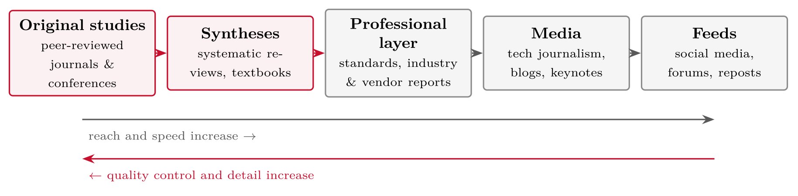
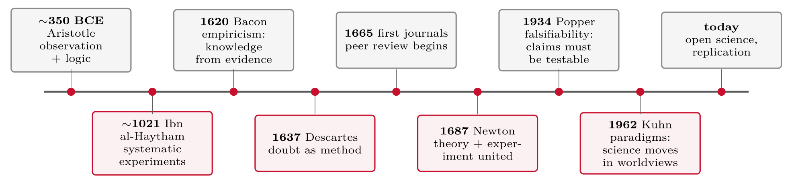

# Introduction {#sec-01-introduction}

::: {.callout-note appearance="simple" icon="false"}
**Session 1** · Thursday 10 September 2026 · reading: Oates, Chapter 1
:::

This chapter accompanies the first session. It does three things. First, it sets out how the course runs and how it is assessed: twelve Thursdays, one essay, and questions for discussion at the end of every session. Second, it answers the question that gives the course its direction --- what research is, and what it is not --- by tracing the definition through the history that produced it. Third, it introduces the reading material: one textbook, and one published study that serves as a map of the whole course. The chapter ends, like every chapter, with the questions for discussion and the sources used.

## What this course is for {#sec-01-what-this-course-is-for}

IKT448 is a methods course with one product: an essay that plans or evaluates a piece of research in cyber security. Everything in the twelve sessions serves that product, and everything in this script follows the order in which the essay is built. The course runs on Zoom on twelve Thursdays, each with a lecture in three blocks and a final block of questions for discussion. Participation in those discussions counts for 20 % of the grade, a small group project for another 20 %, and the essay for 60 %, of which 40 % is the written report and 20 % its presentation and discussion in the oral exam.

The course description sets out six learning outcomes. Two of them frame the whole course: an understanding of the structure of scientific investigations, their breadth, depth and limitations (LO5), and the ability to choose a suitable method for a topic in cyber security, such as a master's thesis (LO6). The remaining four --- an overview of qualitative and quantitative methods with a cyber security emphasis (LO1), an understanding of formal methods and models and their validity (LO2), the ability to assess research-ethical aspects with an emphasis on privacy and social responsibility (LO3), and insight into how cyber security fits into an overall ICT setting (LO4) --- are served by particular sessions. The introduction serves LO5 and LO6; each later chapter states which outcomes it serves.

A word on where you stand. A bachelor's degree certifies that a graduate knows the foundations and methods of a field and can apply them with justification. A master's degree adds independence and specialisation: methods applied to new problems, and a thesis that must argue its own choices. A doctorate adds the creation of new knowledge. The steps are the same pipeline, scaled rather than replaced, and this course supplies the method side of the master's thesis: the strategies, the methods, and the justification the thesis must contain.

## The essay in one paragraph {#sec-01-the-essay-in-one-paragraph}

The essay has two possible layouts. Layout A plans work to be done: a proposed or possible master's topic is developed into an introduction and motivation, a problem and research questions, relevant work, a justified choice of methods with strengths, weaknesses and bias, ethics and privacy, and a conclusion. Layout B evaluates work already done: a published paper or master's thesis is summarised and its methods, research questions, limitations, bias, validity and ethics are assessed. Both layouts are about ten pages, may be written alone or in a group of two or three, in English or Norwegian, and must state which AI tools were used and for what. Nobody is expected to answer their research questions in the essay --- only to justify how they would.

The design of the course rests on one mechanism. The questions at the end of every session are building blocks of layout A. A student who answers them for his or her own topic, week by week, has most of the essay drafted before the deadline, and has the method chapter of the master's thesis in hand.

## What research is {#sec-01-what-research-is}

### Three claims and one question

Three claims circulate in every security organisation: that 95 % of breaches are caused by human error; that agentic AI will handle incident response autonomously; and that code review finds most defects before release. All three sound plausible, all three are repeated with confidence, and all three prompt the same question, which this course trains you to ask as a matter of habit: *how do they know?*

The question has a structure. Information reaches us through a supply chain that begins with original studies in peer-reviewed journals and conferences, passes through syntheses such as systematic reviews and textbooks, continues through the professional layer of standards, industry and vendor reports, and ends in media and social feeds. Reach and speed increase along the chain; quality control and detail decrease. A qualified finding becomes a headline, and a headline becomes a slogan. Most claims reach us from the right end of the chain, and the task is to trace them back to the left.

{#fig-01-1}

Each step to the right compresses and simplifies: a qualified finding becomes a headline, and a headline becomes a slogan. Most claims reach us from the **right end** of the chain; the task is to trace them back to the left.

Four questions do the tracing: (1) is there a primary source, as opposed to a retelling; (2) who produced it, with what independence, funding and incentive to reach this result; (3) how do they know --- with which method, sample and comparison; and (4) what was actually claimed, as opposed to what the repost says. Applied to the first claim, the trail runs from a LinkedIn post to a keynote slide to a vendor report and ends there, without a method section; the claim is unverifiable as stated. Applied to the second, the trail reaches a peer-reviewed review (Sapkota, Roumeliotis & Karkee, 2025) whose method is visible --- a literature search and a conceptual taxonomy --- but in which incident response appears as an illustrative scenario, not as an evaluation. The same four questions therefore lead to different conclusions, and the difference lies not in the confidence of the claim but in the traceability of the evidence.

### A working definition

::: {.callout-note}
## Research (working definition for this course)

Research refers to the creation of new knowledge through a systematic process of collecting and analysing data, whose methods and findings are communicated so that others can evaluate and criticise them.
:::

Three conditions follow, and removing any one of them means that what remains is no longer research. First, an original contribution: the study adds something not previously known --- at master's level, new to the field, or a known method applied to a new problem, with justification. Secondly, a systematic process: planned methods rather than anecdotes. Thirdly, openness to criticism: documentation that allows others to inspect the work. Oates, Griffiths and McLean (2022, Chapter 1) list the same three marks and contrast them with everyday thinking. For this audience the contrast is concrete: a penetration-test report satisfies the second and third conditions but rarely the first, because it produces knowledge about one client rather than knowledge beyond it.

### Where the definition comes from

The definition is not arbitrary. Each of its parts was established against resistance over roughly 2,400 years: evidence over authority, method over intuition, and published, criticisable work over private conviction. The timeline runs from Aristotle's observation and logic through Ibn al-Haytham's systematic experiments, Bacon's empiricism, Descartes' doubt as method, the first scientific journals of 1665 and Newton's union of theory and experiment, to Popper's falsifiability in 1934, Kuhn's paradigms in 1962 and today's open science and replication movements.

{#fig-01-2}

The definition on the previous slide is not arbitrary. Each of its parts was established against resistance: evidence over authority, method over intuition, and published, **criticisable** work over private conviction.

Every rule in this course --- justify, document, cite, state limitations --- is a condensed lesson from this history. Empiricism reappears as your data (Sessions 8--9), method and doubt as the research process (Session 3), journals and peer review as the literature review (Session 5), falsifiability as questions and hypotheses (Session 4), paradigms as approaches (Session 2), and the replication crisis as protocols and limitations (Sessions 5 and 11). The history also produced the field this course belongs to: information systems, which grew out of both the technical and the social sciences.

### Where this course sits

Laudon and Laudon (2022, section 1-3) describe the study of information systems as a multidisciplinary field with two traditions. The technical approach emphasises mathematically based models and the physical technology and formal capabilities of systems; its disciplines are computer science, management science and operations research. The behavioural approach is concerned with the issues that arise in the development and long-term use of systems --- strategic integration, design, implementation, utilisation and management; its disciplines are sociology, psychology and economics, and its focus is on attitudes, policy and behaviour rather than technical solutions. The sociotechnical view combines the two: optimal performance is achieved by jointly optimising the social and the technical system.

Information systems research therefore studies technology in organisations and draws on both traditions. Cyber security sits on the same seam, with technical controls on one side and human behaviour and organisational practice on the other. Most master's theses in this field need methods from both, which is why Sessions 8 and 9 cover quantitative and qualitative data.

### Who decides what counts as knowledge

For most of history the decisive question was not whether a claim was true but whether it was permitted. Galileo was forced to recant in 1633; the Catholic Church acknowledged the error in 1992. The Enlightenment made openness to criticism a virtue: claims earn trust by withstanding scrutiny, not by being licensed. Today the filter has moved a second time. Publication is unrestricted, and evaluation has become the scarce resource: millions of papers appear each year, no individual can verify more than a small fraction of them, and trust therefore attaches to a system rather than to persons. Disinformation and organised opposition to evidence-based science operate in the third position of this sequence --- content ranked by engagement, not by evidence.

::: {.callout-note}
## Peer review

Peer review refers to the assessment of a manuscript, before publication, by independent experts in the same field, usually anonymously: is the method sound, does the evidence support the claims, and is the contribution new?
:::

Peer review guarantees a minimum standard --- the method was examined by independent experts before anyone else saw it --- but it does not guarantee truth. Errors, and occasionally fraud, pass review, which is why replication and reading the method yourself still matter. In this course you take both roles: as an author, whose essay is defended in the oral exam, and as a reviewer, in the small project and the discussions.

### Why trust science, if it is never complete

The distinguishing mark of science is not being right but changing in response to evidence. The round-earth theory was refined by every new measurement, from Eratosthenes' circumference to Newton's predicted flattening, the oblate spheroid confirmed by expeditions, the geoid measured by satellites, and the GPS that works because of it. The flat-earth claim has stood still since antiquity. Science revises its claims when evidence contradicts them, makes risky and checkable predictions, and states its own limits; pseudo-science is immune to evidence, explains everything after the fact, and claims certainty.

Three consequences follow. First, in science a theory denotes the highest status a claim can attain --- extensively evidenced --- and not "just a guess". Secondly, science is never complete, and neither will your research be; it must be honest, documented, and one step forward. Thirdly, the question to ask of any claim is not whether it is certain but whether it changes under evidence, and whether you can check how.

### Claims, and when they are testable

::: {.callout-note}
## Claim (thesis)

A claim refers to a statement that asserts something is the case and that can, in principle, be true or false.
:::

A claim is testable when three conditions hold: its terms are precise, it predicts something observable, and evidence could in principle refute it. "Agentic AI shortens incident response time" is testable once response time and a baseline are defined; "our architecture is elegant" is not testable as stated, because elegance predicts nothing observable; "zero trust is better" is not testable yet, and becomes so once "better" is operationalised as fewer successful lateral movements or lower incident cost. A claim that fails one of the three conditions is not wrong; it is unfinished. Session 4 turns this into craft: a research question is a testable claim in the form of a question.

### What research is not

Four familiar statements mark the boundary. "I built a tool and it works" has no question, no systematic evaluation and no new knowledge. "I searched the web and summarised" collects opinions rather than generating evidence. "Our penetration test found twelve vulnerabilities" is valuable practice without a generalisable knowledge claim. "Everyone on the team agrees" offers consensus, which is not evidence. However, each of these can become research: build the tool and evaluate it systematically, or turn the penetration test into a study of why those vulnerabilities recur. Oates calls this the step from "just developing a system" to design and creation research (Session 6), and many cyber security master's theses lie on exactly this line.

## Relevance {#sec-01-relevance}

::: {.callout-note}
## Evidence-based practice

Evidence-based practice refers to making professional decisions on the basis of the best available evidence --- from research and from systematically collected data --- rather than on habit, authority or marketing.
:::

Security is already an evidence-based field: threat-intelligence reports, vulnerability research, incident statistics and post-incident reviews are its everyday material. It performs well when it runs on evidence and poorly when it runs on fear. This course teaches you to produce such evidence and to judge it, and there are three situations in which you will need both. First, your master's thesis: the essay written in this course can become its method chapter. Secondly, reading claims critically --- vendor white papers, benchmark blogs and "studies show" headlines --- with the question *how do they know?* as a habit. Thirdly, arguing at work: "we should migrate to X" is persuasive when you can design the small study that would settle it.

## Reading material {#sec-01-reading-material}

The course uses one book. Oates, Griffiths and McLean's *Researching Information Systems and Computing* (2nd edition, 2022) is written for our field --- every example comes from information systems and computing --- and is organised around the 6Ps of research (Session 3). Every strategy and every method has its own chapter, and every chapter ends with evaluation criteria, which are the lens through which your essay and small project are graded. Chapter references in this script follow the second edition, the one available through the UiA library; a third edition (2025/26) is almost identical and mainly adds material on AI in research. Read the assigned chapter before the session: the first slides of every session ask questions the reading answers, and the cost of skipping grows every week, because each session builds on terms the reading introduced.

One published study serves as a map of the course. Sapkota, Roumeliotis and Karkee (2025) address a problem --- the terms "AI agent" and "agentic AI" are used interchangeably, which leads to conceptual ambiguity and misaligned system design --- with a method, a conceptual review based on a literature search across twelve platforms and a comparative analysis along dimensions such as autonomy, coordination, memory and interaction. Their finding is a taxonomy: AI agents are single, task-specific, tool-augmented systems, whereas agentic AI denotes systems of several specialised agents with orchestration, shared memory and goal decomposition. The implication is a shared vocabulary for design and evaluation, with causality, coordination failure and security as open challenges. The pattern problem → method → finding → implication recurs in every paper you will read this semester, and in your own essay.

The components of that study map onto the sessions of this course: purpose and problem (Session 3), research question (Session 4), literature (Session 5), strategy (Sessions 6--7), data and analysis (Sessions 8--9), ethics (Session 10) and write-up (Session 11). Every session is one row of this table, applied to your own essay and master's thesis. The same project can be run twice --- as a development project that ships a password-manager onboarding flow, and as a research project that ships the same flow and investigates where users abort, and why. The research version is more useful to the client, not less, because it explains why the numbers move; and it is what a master's thesis requires.

## Worked examples and tables {#sec-01-worked-examples-and-tables}

The examples of the session are reproduced here in the form used on the slides, so that they can be reread without the deck.

### Tracing two claims to their source

The four questions of Section 1.3 applied to two of the three claims. The same procedure yields different conclusions, and the difference lies in the traceability of the evidence, not in the confidence of the claim.

Four questions to ask of any claim:

1.  **Primary source?** --- locate the original document, not a retelling

2.  **Who produced it?** --- independence, funding, and the incentive to reach this result

3.  **How do they know?** --- method, sample, comparison

4.  **What was actually claimed?** --- as opposed to what the repost says

::: {#tbl-01-1}
  **"95 % of breaches are human error"**                                                  **"Agentic AI will handle incident response"**
  --------------------------------------------------------------------------------------- --------------------------------------------------------------------------------------------------------------------------------------------------------------------------------------------------------
  LinkedIn post → keynote slide → vendor report → **no method section**: the trail ends   Vendor blog → peer-reviewed review (Sapkota et al., 2025) → method visible: literature search and conceptual taxonomy; incident response appears as an **illustrative scenario**, not as an evaluation
  Assessment: unverifiable as stated                                                      Assessment: a documented design proposal; the empirical evidence is still to be produced

Tracing two claims to their source with the four questions
:::

*The same four questions lead to different conclusions. The difference lies not in the confidence of the claim but in the **traceability** of the evidence.*

### Science and pseudo-science

The demarcation in practical clothes. The table is Popper's argument reduced to three rows; the three consequences below it are what the argument means for a master's thesis.

::: {#tbl-01-2}
  **Science**                                                                                              **Pseudo-science**
  -------------------------------------------------------------------------------------------------------- ----------------------------------------------------------------------------------
  Revises its claims when evidence contradicts them                                                        Immune to evidence --- always the same answer
  Makes risky, checkable predictions (GPS works *because* the earth's shape was refined for 2,000 years)   Explains everything *after* the fact (the flat earth never moved under evidence)
  States its own limits and uncertainty                                                                    Claims certainty

Science and pseudo-science: Popper's argument in three rows
:::

Three consequences:

1.  In science, **theory** denotes the *highest* status a claim can attain --- extensively evidenced --- not "just a guess".

2.  Science is **never complete**; neither will your research be, nor mine. It must be honest, documented, and one step forward: **research progresses over time**.

3.  The question to ask of any claim is therefore not "is it certain?" but **"does it change under evidence --- and can I check how?"**

### Testable and untestable claims

Three claims from a security workplace, tested against the three conditions of precision, observability and refutability.

::: {#tbl-01-3}
  ---------------------------------------------- -------------------------------------------------------------------------------------------------------------------------------------------
  "Agentic AI shortens incident response time"   **Testable** --- once response time and a baseline are defined. Sapkota et al. (2025) propose the scenario; nobody has measured it yet
  "Our architecture is elegant"                  **Not testable** as stated --- "elegant" predicts nothing observable
  "Zero trust is better"                         **Not testable *yet*** --- it becomes testable once "better" is operationalised: fewer successful lateral movements? lower incident cost?
  ---------------------------------------------- -------------------------------------------------------------------------------------------------------------------------------------------

Three workplace claims, tested for precision, observability and refutability
:::

*Session 4 turns this into craft: a research question is a testable claim in the form of a question.*

### What research is not

::: {#tbl-01-4}
  **This alone...**                                 **...is not research, because...**
  ------------------------------------------------- ------------------------------------------------------------
  "I built a tool and it works"                     No question, no systematic evaluation, no new knowledge
  "I searched the web and summarised"               Collecting opinions is not generating evidence
  "Our penetration test found 12 vulnerabilities"   Valuable practice --- but no generalisable knowledge claim
  "Everyone on the team agrees"                     Consensus is not evidence

What research is not: activities that meet some of the conditions of research but not all
:::

::: {.callout-note}
## However

Each of these can **become** research: build the tool *and* evaluate it systematically; turn the penetration test into a study of *why* those vulnerabilities recur. Oates calls this the step from "just developing a system" to **design and creation research** --- session 6. Many cyber security master's theses lie on exactly this line.
:::

### The components of any study

The study of Sapkota et al. (2025) decomposed into the components that the sessions of this course treat one by one.

::: {#tbl-01-5}
  **Component**         **In Sapkota et al. (2025)**                                                        **In this course**
  --------------------- ----------------------------------------------------------------------------------- --------------------
  Purpose and problem   Two terms conflated; a taxonomy is needed                                           Session 3
  Research question     How do AI agents and agentic AI differ in architecture, autonomy and application?   Session 4
  Literature            Search across twelve platforms, Boolean queries                                     Session 5
  Strategy              Conceptual review; comparative taxonomy                                             Sessions 6--7
  Data and analysis     Comparison tables across dimensions; application cases                              Sessions 8--9
  Ethics                AI writing assistance declared; funding disclosed; open access                      Session 10
  Write-up              The *Information Fusion* article itself                                             Session 11

The components of any study, in Sapkota et al. (2025) and in the sessions of this course
:::

Every session of this course is one row of this table --- applied to **your own** essay and master's thesis.

### The same project, twice

::: {#tbl-01-6}
  **As a development project**                                    **As a research project**
  --------------------------------------------------------------- -------------------------------------------------------------------------------------------
  "We build a password manager onboarding flow for the client."   "We build the flow --- *and investigate* where users abort, and why."
  Success = it ships and works                                    Success = it ships *and* we can say something new and evidenced about onboarding drop-off
  Report: what we built and how                                   Report: what we built, how we studied it, what we found, what it means beyond this client

The same project, twice: as a development project and as a research project
:::

Same code, same client, same semester. The right column is what this course adds, and what a master's thesis requires. The research version is *more* useful to the client, not less: it explains *why* the numbers move.

## Questions for discussion {#sec-01-questions-for-discussion .unnumbered}

::: {#exr-01-the-three-claims}
## The three claims

**The three claims** from the start --- human error, agentic AI, code review: which one would you accept, and what would it take to check it?
:::

::: {#exr-01-your-thesis}
## Your thesis

**Your thesis** --- what could it investigate, and how would anyone know the answer?
:::

::: {#exr-01-access}
## Access

**Access** --- does unrestricted access to information democratise knowledge, or bury it?
:::

## Interactive exercises {#sec-01-interactive-exercises .unnumbered}

Sort, order and pick: every exercise below is answerable from this chapter and checks itself.



## Key points {#sec-01-key-points .unnumbered}

-   Research = new knowledge, systematic, open to criticism

-   Evidence-based practice: *how do they know?*

-   Course literature: Oates, Griffiths & McLean (2022)

-   Assessment: participation 20, small project 20, essay 60

**Six terms from this session:** research · evidence-based practice · original contribution · rigour · relevance · essay layout A (the research proposal in all but name)

## Sources {#sec-01-sources .unnumbered}

-   Oates, B. J., Griffiths, M., & McLean, R. (2022). *Researching information systems and computing* (2nd ed.). SAGE. --- Chapter 1.

-   Sapkota, R., Roumeliotis, K. I., & Karkee, M. (2025). AI agents vs. agentic AI: A conceptual taxonomy, applications and challenges. *Information Fusion*, *126*, 103599. <https://doi.org/10.1016/j.inffus.2025.103599>

-   Oates, B. J., Griffiths, M., & McLean, R. (2022). *Researching information systems and computing* (2nd ed.). SAGE. --- Chapters 19 (Philosophical paradigms: positivism) and 20 (Alternative philosophical paradigms).

-   Laudon, K. C., & Laudon, J. P. (2022). *Management information systems: Managing the digital firm* (17th ed., Global ed.). Pearson. --- Chapter 1, section 1-3.
