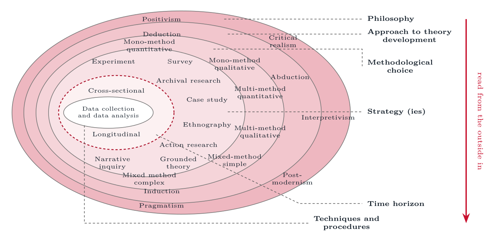
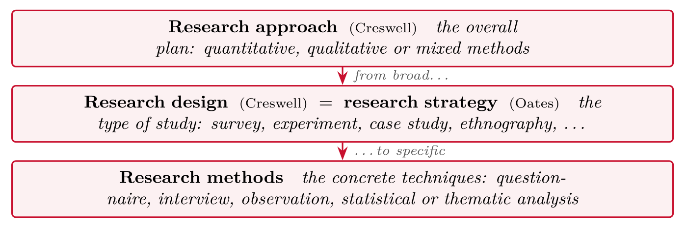
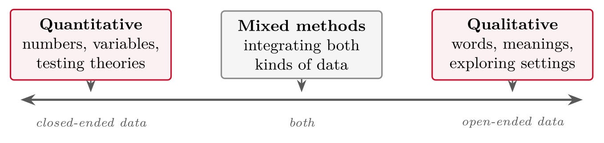
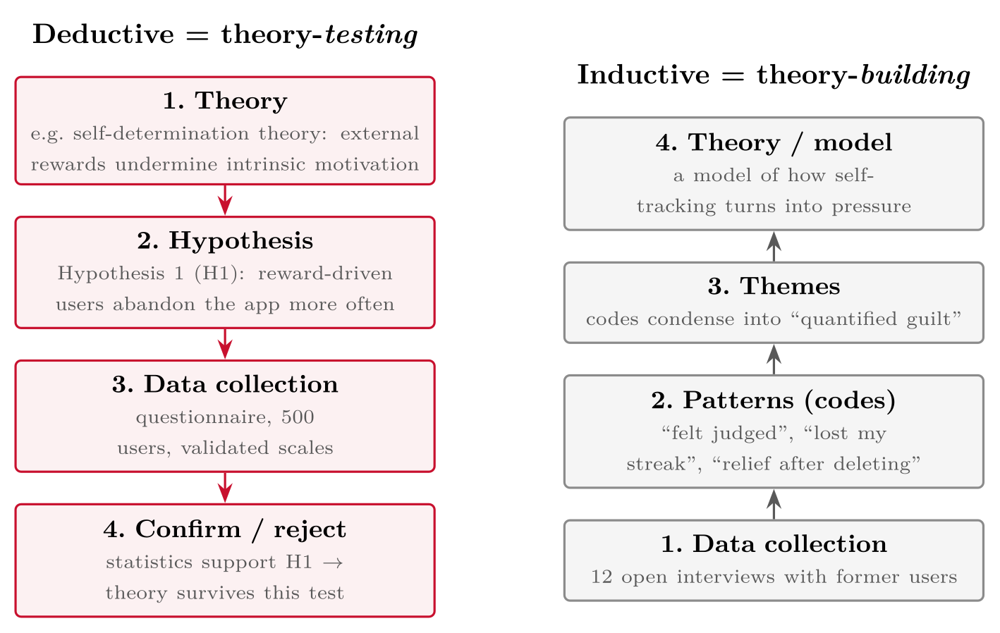
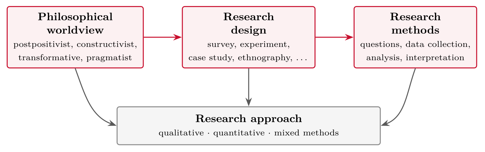
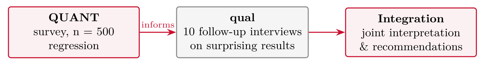

# Approaches to Research {#sec-02-approaches-to-research}

::: {.callout-note appearance="simple" icon="false"}
**Session 2** · Thursday 17 September 2026 · reading: Oates, Chapters 19--20
:::

Every study rests on assumptions about what can be known and how. This chapter makes those assumptions visible. It distinguishes the quantitative, qualitative and mixed approaches, presents the worldviews behind them, and orders all of the decisions a study requires with the research onion. Two guidelines for mixed methods research and four current studies of ChatGPT adoption serve as examples. The chapter matters for Part III of the essay: the approach you choose must be justified, and this chapter supplies the vocabulary for the justification.

## Warm-up {#sec-02-warm-up}

A headline such as "fitness apps make people healthier" can be approached in at least four ways, and each carries assumptions about what evidence is. Sending a questionnaire to hundreds of users counts, compares and generalises. Interviewing people who quit asks what happened and why. Looking at the usage logs and seeing when people drop off measures behaviour. Doing a bit of all three combines them. These are not just different methods; they are different assumptions about what knowledge is, and that is what the word "approach" means in research.

Last session settled that research is the creation of new knowledge through a systematic process, open to criticism. This session asks how that process is set up, and the answer depends on the question. Part III of the essay --- the choice of methods --- has to justify the approach, and this chapter supplies the vocabulary.

## Three approaches {#sec-02-three-approaches}

::: {.callout-note}
## Quantitative research

Quantitative research refers to an approach for testing objective theories by examining the relationships among measurable variables, yielding numerical data that are analysed with statistics.
:::

::: {.callout-note}
## Qualitative research

Qualitative research refers to an approach for exploring and understanding the meaning that individuals or groups ascribe to a social or human problem, with data collected in the participants' setting and analysed inductively.
:::

::: {.callout-note}
## Mixed methods research

Mixed methods research refers to an approach that collects both quantitative and qualitative data and integrates the two, so that the combined understanding exceeds what either strand provides alone.
:::

Creswell's point is that these are not two boxes but the ends of a continuum: a study sits somewhere on it, and it tends towards one end more than the other. The core ideas differ. A quantitative study works deductively, from theory to hypothesis to measurement to test, and aims at generalisation and replication; its typical questions are which factors, how many, and whether one thing affects another. A qualitative study works inductively, from data in a real setting towards concepts and explanation, and aims at depth and meaning; its typical questions are how people do something and what it means to them. A mixed-methods study combines the two deliberately, for instance in an explanatory sequential design that runs a survey first and then interviews a smaller sample to explain the pattern.

Four recent studies illustrate the ends of the continuum. Biloš and Budimir (2024) surveyed 694 Generation Z respondents in Croatia with an extended UTAUT2 model, analysed the data with factor analysis and hierarchical regression, and found that performance expectancy, social influence, hedonic motivation, habit and personal innovativeness predict the intention to use ChatGPT, whereas effort expectancy, facilitating conditions and price value do not. Huy et al. (2024) surveyed 671 ChatGPT users in Vietnam with UTAUT2 integrated with task--technology fit, used covariance-based structural equation modelling, and found that most factors affect use while effort expectancy, social influence and trust do not, and that use drives continuance and recommendation. Both are deductive and postpositivist; the same theory family, two samples, and partly different results --- which is what replication looks like in practice.

In contrast, Mayer, Baygi and Buwalda (2025) studied one consultancy with semi-structured interviews, first with entry-level professionals and later with senior consultants and managers, using job crafting as a theoretical lens. They found that entry-level professionals use generative AI to craft tasks, relationships and the meaning of their work, and that a new form appears --- signal crafting, the use of AI to shape how others perceive the value of one's work. The study is inductive and set in a real context, with meaning as its object; the theory is a lens rather than a hypothesis, and the study extends it rather than tests it.

Mixed methods have their own guidelines in our field. Venkatesh, Brown and Bala (2013) ask three questions: whether a mixed methods approach is appropriate for the question at all; how meta-inferences --- the conclusions that integrate both strands --- are developed; and how their quality is validated. They list seven purposes for combining the strands: complementarity, completeness, developmental sequencing, expansion, corroboration or confirmation, compensation, and diversity. Venkatesh, Brown and Sullivan (2016) turn the guidelines into fourteen design properties with a decision tree, from the research questions and the paradigm stance to the mixing strategy, the timing of the strands and the validation of inferences. For your essay the consequence is simple: a mixed-methods proposal states its purpose in these terms, the sequence of the strands, which strand has priority, and where the two are integrated. Without these four decisions it is two studies, not one.

## Worldviews {#sec-02-worldviews}

Every study rests on assumptions about what exists and how it can be known, whether or not the author states them. Creswell calls these assumptions worldviews; Oates (Chapters 19--20) calls them philosophical paradigms.

::: {.callout-note}
## Worldview (paradigm)

A worldview refers to a basic set of beliefs that guide action: an ontology, or what exists, and an epistemology, or how we can know it. The assumptions are usually implicit; the essay makes them explicit.
:::

Four worldviews carry most of the weight. Postpositivism assumes an objective reality that can be measured imperfectly, favours deductive testing, and produces claims such as "which factors predict abandonment of fitness apps". Constructivism assumes multiple realities constructed through experience, favours inductive understanding, and produces claims about what quitting an app means to the person who quits. The transformative worldview starts from politics and power, researches with marginalised groups, and aims at change. Pragmatism starts from the problem, uses whatever works, and underlies most mixed-methods research. Creswell's framework connects the worldview to a research design and to methods: the three components together constitute the approach.

### The research onion

Saunders, Lewis and Thornhill (2019) order the decisions a study requires as layers of an onion, read from the outside in: philosophy, approach to theory development, methodological choice, strategy, time horizon, and techniques and procedures.

{#fig-02-1}

The first layer is the philosophy. Positivism assumes one observer-independent reality and leads to hypothesis testing with large samples; critical realism assumes real structures that are observable only indirectly and searches for generative mechanisms; interpretivism assumes socially constructed realities and reconstructs meaning through in-depth interviews; postmodernism treats reality as an effect of language and power; pragmatism judges reality by problem solving and lets the method follow the question. Oates covers positivism, interpretivism and critical research; Saunders adds the other three. The second layer is the approach to theory development --- deduction from theory to test, typical of UTAUT and TAM studies; induction from data to theory; abduction, moving between the two from a surprising observation. The third is the methodological choice: mono-method with a single type of data, multi-method with several types within one paradigm, and mixed-method combining quantitative and qualitative data, in a simple sequential form or a complex repeated one. The fourth layer holds the strategies --- experiment, survey, archival research, case study, ethnography, action research, grounded theory and narrative inquiry; the fifth the time horizon, cross-sectional or longitudinal; and the sixth the techniques of collection and analysis.

The purpose of the onion is methodological coherence: the outer layers constrain the inner ones, so that an interpretivist philosophy combined with a large-scale survey needs explaining. The dependency does not run through all six layers, however. Layers 4 and 5 are independent: a case study can be cross-sectional or longitudinal, and so can a survey. Overall, the onion makes decisions explicit and open to criticism, which is what separates research from everyday reasoning. It is not the method that makes a study scientific but the traceable justification of the choice --- and that justification is Part III of your essay, layer by layer.

## One question, three studies {#sec-02-one-question-three-studies}

The same question can be studied three ways, and the exercise shows how the question itself changes with the approach. Take "why do users abandon fitness apps?". Study A, quantitative and postpositivist, refines it to which factors predict abandonment, surveys 500 users, tests hypotheses about habit, price value and social influence, and reports odds ratios. Study B, qualitative and constructivist, refines it to how users experience abandoning an app, interviews twelve people who quit, and reports themes. Study C, mixed and pragmatist, runs the survey first and then interviews a sample of those who quit to explain the strongest predictor, in an explanatory sequential design. The refined question, the data, the analysis and the kind of knowledge produced differ in each case, and the essay must say which of the three it chooses and why.

Behind the surveys in this chapter stands one research programme. Venkatesh (2022) is a conceptual paper without data of its own: it identifies properties of AI tools, of the humans who work with them and of the operations settings that could hinder adoption, and uses UTAUT to propose research directions --- individual, technology and environmental characteristics, and interventions. A research agenda is a legitimate product of research, and reading it first shows where a study sits and where the gaps are. The ChatGPT studies above, and my own study of ChatGPT adoption among Big Four consultants, take their framework from this line of work.

## How to choose {#sec-02-how-to-choose}

Three criteria decide, in this order. First, the research problem: new or unexplored concepts call for a qualitative approach, known factors to test or compare for a quantitative one, and both for mixed methods. Secondly, the audience: who must be convinced --- a clinic that trusts outcomes, a design team that trusts stories, or a regulator that wants both. Thirdly, your own experience and resources: statistics skills, interview skills, access to participants, and time. Recognising these criteria in a client's wording --- "does it work, and how fast?" is postpositivist, "how do users experience it?" is constructivist --- is this chapter applied to your own thesis.

## Worked examples and tables {#sec-02-worked-examples-and-tables}

### The vocabulary --- one map, two sources

Creswell and Oates use different words for the same decisions. The map translates between them, and the essay uses one vocabulary consistently.

Creswell and Oates use **different words for similar layers**. This map holds for the whole course:

{#fig-02-2}

::: {.callout-important}
## Common essay mistake

"Our method is a case study." --- No: the case study is your **strategy/design**; interviews and document analysis are your **methods**.
:::

### Not two boxes --- a continuum

{#fig-02-3}

Creswell's point: qualitative and quantitative are the **ends of a continuum**. A study sits somewhere on it --- it tends toward one end more than the other. Mixed methods lives in the middle.

*Source: Creswell & Creswell (2018), Ch. 1*

### Deductive and inductive reasoning

The engine underneath the approaches: deduction runs from theory to test, induction from data to theory, and the same study can use both in sequence.

{#fig-02-4}

Deduction runs **top-down** from theory (typical for quantitative research); induction runs **bottom-up** from data (typical for qualitative research). In practice research **cycles**: induction proposes a theory, deduction then tests it.

### Two current quantitative studies

::: {#tbl-02-1}
             **Biloš & Budimir (2024)**                                                                                                                                                                                          **Huy et al. (2024)**
  ---------- ------------------------------------------------------------------------------------------------------------------------------------------------------------------------------------------------------------------- -----------------------------------------------------------------------------------------------------------------------------------------
  Sample     694 Generation Z respondents, Croatia; online questionnaire, seven-point Likert                                                                                                                                     671 ChatGPT users, Vietnam; questionnaire, face-to-face and online
  Theory     Extended UTAUT2                                                                                                                                                                                                     UTAUT2 integrated with task--technology fit; trust and curiosity added
  Analysis   Confirmatory and exploratory factor analysis; hierarchical regression                                                                                                                                               Reliability, EFA/CFA, then covariance-based SEM (AMOS): use → continuance intention → word of mouth; curiosity as moderator
  Result     Performance expectancy, social influence, hedonic motivation, habit and personal innovativeness predict intention; effort expectancy, facilitating conditions and price value do not (65 % of variance explained)   Most UTAUT2 and TTF factors affect use; effort expectancy, social influence and trust do not; use drives continuance and recommendation

Two current quantitative studies of ChatGPT adoption, side by side
:::

Both are deductive and postpositivist: theory → hypotheses → measurement → test. Same theory family, two samples, partly different results --- replication in practice.

### The seven purposes of mixed methods research

Mixed methods research combines quantitative and qualitative methods in the same inquiry. The guidelines address three questions: (1) is a mixed methods approach **appropriate**; (2) how are **meta-inferences** --- the conclusions that integrate both strands --- developed; (3) how is their quality **validated**.

::: {#tbl-02-2}
  **Purpose**                    **Why combine the two strands**
  ------------------------------ ---------------------------------------------------------------------------------------
  Complementarity                To gain complementary views of the same phenomenon or relationship
  Completeness                   To obtain a complete picture of a phenomenon
  Developmental                  Questions or hypotheses for one strand emerge from the inferences of the previous one
  Expansion                      To explain or expand the understanding obtained in a previous strand
  Corroboration / confirmation   To assess the credibility of inferences obtained from one strand
  Compensation                   To compensate for the weaknesses of one approach with the other
  Diversity                      To obtain divergent views of the same phenomenon

The seven purposes of mixed methods research (Venkatesh, Brown & Bala, 2013)
:::

*Purposes adapted from Venkatesh et al. (2013), Table 1. An essay that proposes mixed methods names its purpose in these terms.*

### Designing a mixed-methods study

The 2016 extension turns the guidelines into design decisions: 14 properties of a mixed-methods study, each with a question to answer and a decision tree that connects them. The ones that decide most:

**Foundations**

-   **Research questions** --- questions, aims or hypotheses; independent or dependent

-   **Purpose** --- one of the seven on the previous slide

-   **Paradigm stance** --- single or multiple; pragmatism, critical realism, dialectical

**Design strategies**

-   **Exploratory or confirmatory** --- develop or test theory

-   **Strands and phases** --- one study or several

-   **Mixing and timing** --- fully or partially mixed; concurrent or sequential

-   **Inference quality** --- how the meta-inferences are validated

*For your essay: a mixed-methods proposal states the purpose, the sequence of strands, which strand has priority, and where the two are integrated. Without these four decisions it is two studies, not one.*

### Three mini-studies to classify

Three short descriptions to classify along the way --- quantitative, qualitative or mixed, and why. The answers are given below the descriptions.

1.  A researcher analyses **six months of telemetry logs** from 50,000 app installs and models which onboarding events predict churn.

2.  A researcher spends **three weeks in a security operations centre (SOC)** observing how analysts handle the flood of automated alerts, then interviews eight of them.

3.  A researcher runs a **questionnaire** (n = 412) testing whether perceived usefulness predicts students' use of artificial intelligence (AI) chatbots, then **interviews ten students** to interpret an unexpected result.

*Answers: (1) quantitative --- measured behaviour, deductive modelling; (2) qualitative --- meanings in a real setting, inductive; (3) mixed methods --- explanatory sequential. In the discussion at the end you will make such calls yourselves, with justification.*

### Creswell's framework and the four worldviews

{#fig-02-5}

Approach = worldview + design + methods, made consistent. *Adapted from Creswell & Creswell (2018), Fig. 1.1*

::: {#tbl-02-3}
  **Worldview**        **Knowledge is...**                                 **Typical IT/health example**
  -------------------- --------------------------------------------------- ---------------------------------------------------------------------------
  **Postpositivism**   objective; found by measuring and testing causes    A/B test: which onboarding flow reduces app churn?
  **Constructivism**   constructed; multiple meanings in social settings   Interviews: what does "secure enough" *mean* to small-business sysadmins?
  **Transformative**   tied to power and change; research should empower   Co-designing an accessible web frontend *with* visually impaired users
  **Pragmatism**       whatever works to solve the problem                 Mixed-methods evaluation of a password manager

Creswell's four worldviews, with an IT or health example for each
:::

*Based on Creswell & Creswell (2018), Ch. 1*

### The layers of the onion

::: {#tbl-02-4}
  **Position**       **Ontology**                                  **Typical consequence**
  ------------------ --------------------------------------------- ------------------------------------------------
  Positivism         One observer-independent reality              Hypothesis testing, large samples
  Critical realism   Real structures, observable only indirectly   Search for generative mechanisms
  Interpretivism     Socially constructed realities                In-depth interviews, reconstruction of meaning
  Postmodernism      Reality as an effect of language and power    Deconstruction of dominant narratives
  Pragmatism         Reality judged by problem solving             Method follows the research question

Layer 1 of the onion: five philosophical positions and their typical consequences
:::

*Every subsequent layer depends on this choice. Oates (Ch. 19--20) covers positivism, interpretivism and critical research; Saunders adds critical realism, postmodernism and pragmatism.*

**Approach to theory development**

-   **Deduction** --- theory first, then test (typical of UTAUT and TAM studies)

-   **Induction** --- data first, theory as the outcome

-   **Abduction** --- moving between the two; the starting point is a surprising observation

**Methodological choice**

-   **Mono-method** --- a single type of data, quantitative or qualitative

-   **Multi-method** --- several types of data within one paradigm

-   **Mixed-method** --- quantitative and qualitative combined

    -   *simple*: one combination, usually sequential

    -   *complex*: repeated combination across several phases

**Research strategies**

-   Experiment

-   Survey

-   Archival research

-   Case study

-   Ethnography

-   Action research

-   Grounded theory

-   Narrative inquiry

**Time horizon**

-   Cross-sectional --- a snapshot

-   Longitudinal --- change over time

**Techniques and procedures**

-   Collection: questionnaire, interview, observation, secondary data

-   Analysis: descriptive and inferential statistics, SEM, thematic analysis, coding

 

*Sessions 6--7 take the strategies one by one; sessions 8--9 the techniques.*

### One question, three studies --- side by side

The three studies of Section 2.4 in one table: the refined question, the data, the analysis and the kind of knowledge each produces.

**Refined question:** *Which factors predict abandonment of fitness apps within 90 days?*

-   **Theory:** self-determination theory → hypotheses (hypothesis 1 (H1): external rewards → higher churn, ...)

-   **Data:** online questionnaire, n = 500 current/former users; validated scales

-   **Analysis:** logistic regression

::: {.callout-note}
## What you get

Generalisable pattern: e.g. goal-setting halves the odds of churn.
:::

::: {.callout-important}
## What you miss

*Why* goal-setting works, and everything you didn't think to ask about.
:::

**Refined question:** *How do former users describe the process of abandoning their fitness app?*

-   **Data:** 12 semi-structured interviews, 45--60 min, participants recruited until themes repeat (saturation)

-   **Analysis:** thematic analysis, inductive coding

-   **Result:** themes --- streak anxiety, life disruptions, "quantified guilt", quiet relief after quitting

::: {.callout-note}
## What you get

Deep understanding of the *experience*; concepts nobody had put in a questionnaire yet.
:::

::: {.callout-important}
## What you miss

How common each theme is; you cannot generalise to "users in general".
:::

**Refined question:** *Which factors predict abandonment --- and how do users explain the strongest ones?*

{#fig-02-6}

This is an **explanatory sequential design**: quantitative first, qualitative second to *explain* the numbers. Note the deliberate order and integration point --- that is what makes it a design, not a coincidence. *Notation:* CAPITAL letters (QUANT) mark the **dominant** component, lower-case (qual) the supporting one --- a standard convention in mixed methods research.

::: {#tbl-02-5}
               **Study A (quant)**          **Study B (qual)**             **Study C (mixed)**
  ------------ ---------------------------- ------------------------------ -----------------------
  Worldview    postpositivist               constructivist                 pragmatist
  Question     *which factors predict...*   *how do users experience...*   both, in sequence
  Sample       500, random                  12, purposive                  500 + 10
  Claim type   generalisable pattern        rich understanding             pattern + explanation
  Weakness     no "why"                     no "how many"                  cost, complexity

One question, three studies, side by side: quantitative, qualitative and mixed
:::

::: {.callout-important}
## The essay question behind every essay

Not "which approach is best?" --- but **"which approach fits *your* question, and can you argue it?"**
:::

### A study from my own research

::: {.callout-note}
## ChatGPT adoption in Big Four consulting firms (Amling, ongoing)

**Question:** why do consultants adopt --- or quietly avoid --- ChatGPT at work?\
**Design:** mixed methods. A survey based on the UTAUT2 technology- acceptance model, extended with *confidence*, analysed with structural equation modelling (quantitative) --- combined with qualitative interviews, with data from Germany and Norway.
:::

Why show you this? Because the pattern you just saw --- numbers for the *what*, interviews for the *why* --- is not a textbook idealisation. It is how technology-adoption research is actually done, including in your lecturer's ongoing work.

### How to choose

1.  **The research problem.**\
    New, unexplored concept → qualitative. Known factors to test or compare → quantitative. Numbers that need explaining → mixed.

2.  **Your audience.**\
    Who must be convinced --- a clinic that thinks in outcomes, or a design team that thinks in user stories?

3.  **Your own experience and resources.**\
    Statistics skills? Interview skills? Access to participants? Time?

*Based on Creswell & Creswell (2018), Ch. 1*

## Terms from this session {#sec-02-terms-from-this-session .unnumbered}

::: {#tbl-02-terms}
  -------------------------------- ------------------------------------------------------------------------------------------------
  **Research approach**            overall plan of a study: quantitative, qualitative or mixed methods
  **Research design / strategy**   the type of study (survey, experiment, case study, ...); Creswell: *design*, Oates: *strategy*
  **Research method**              concrete technique for collecting or analysing data (interview, questionnaire, ...)
  **Worldview / paradigm**         set of beliefs about reality and knowledge guiding the research
  **Ontology**                     assumptions about what reality is
  **Epistemology**                 assumptions about how we can know reality
  **Postpositivism**               one imperfectly knowable reality; test and refine theories by measurement
  **Constructivism**               multiple constructed realities; understand meanings in context
  **Deductive / inductive**        theory → data (testing) vs. data → theory (exploring)
  **Triangulation**                examining one phenomenon from several angles (methods, data, sources) to corroborate findings
  **Explanatory sequential**       mixed design: quantitative first, qualitative second to explain the numbers
  -------------------------------- ------------------------------------------------------------------------------------------------

Terms from Session 2
:::

*Keep this slide next to you while writing Part III of the essay.*

## Questions from the reading {#sec-02-questions-from-the-reading .unnumbered}

::: {#exr-02-positivism}
## Positivism

On which two assumptions does **positivism** rest, according to Oates?
:::

::: {#exr-02-interpretivism}
## Interpretivism

What does **interpretivism** set out to produce instead of universal laws?
:::

::: {#exr-02-critical-research}
## Critical research

What distinguishes **critical research** from interpretive research?
:::

::: {#exr-02-reading-question-4}
## Reading question 4

Which strategies does Oates link to which paradigm --- and which strategy fits any of them?
:::

## Questions for discussion {#sec-02-questions-for-discussion .unnumbered}

::: {#exr-02-your-topic}
## Your topic

**Your topic** --- write your question twice: once in a quantitative form (*which factors, how many, does X affect Y*) and once in a qualitative form (*how do, what does X mean to*). Which version is more interesting, and which is more feasible?
:::

::: {#exr-02-the-telemetry-study}
## The telemetry study

**The telemetry study** --- a company analyses usage logs of 40,000 users and then interviews twelve of them. Which approach, and which worldview?
:::

::: {#exr-02-your-client-s-question}
## Your client's question

**Your client's question** --- "does it work, and how fast?" versus "how do users experience it?" Which worldview does each carry?
:::

## Interactive exercises {#sec-02-interactive-exercises .unnumbered}

Sort, order and pick: every exercise below is answerable from this chapter and checks itself.



## Key points {#sec-02-key-points .unnumbered}

-   Three approaches: quantitative, qualitative, mixed --- a continuum, not a binary

-   Every study rests on a worldview --- and the research onion orders all six decisions, from philosophy to technique

-   Mixed methods: name the purpose (Venkatesh et al., 2013) and the design decisions (2016)

-   Two current ChatGPT studies, one research agenda --- and the justification your essay needs (Part III)

## Sources {#sec-02-sources .unnumbered}

-   Biloš, A., & Budimir, B. (2024). Understanding the adoption dynamics of ChatGPT among Generation Z: Insights from a modified UTAUT2 model. *Journal of Theoretical and Applied Electronic Commerce Research*, *19*(2), 863--879. <https://doi.org/10.3390/jtaer19020045>

-   Huy, L. V., Nguyen, H. T. T., Vo-Thanh, T., Thinh, N. H. T., & Tran, T. T. D. (2024). Generative AI, why, how, and outcomes: A user adoption study. *AIS Transactions on Human-Computer Interaction*, *16*(1), 1--27. <https://doi.org/10.17705/1thci.00198>

-   Presthus, W., & Munkvold, B. E. (2016). How to frame your contribution to knowledge? *NOKOBIT*, Bergen.

-   Venkatesh, V. (2022). Adoption and use of AI tools: A research agenda grounded in UTAUT. *Annals of Operations Research*, *308*(1), 641--652. <https://doi.org/10.1007/s10479-020-03918-9>

-   Venkatesh, V., Brown, S. A., & Bala, H. (2013). Bridging the qualitative--quantitative divide: Guidelines for conducting mixed methods research in information systems. *MIS Quarterly*, *37*(1), 21--54. <https://doi.org/10.25300/MISQ/2013/37.1.02>

-   Venkatesh, V., Brown, S. A., & Sullivan, Y. W. (2016). Guidelines for conducting mixed-methods research: An extension and illustration. *Journal of the Association for Information Systems*, *17*(7), 435--494. <https://doi.org/10.17705/1jais.00433>

-   Mayer, A.-S., Baygi, R. M., & Buwalda, R. (2025). Generation AI: Job crafting by entry-level professionals in the age of generative AI. *Business & Information Systems Engineering*, *67*(5), 595--613. <https://doi.org/10.1007/s12599-025-00959-x>

-   Saunders, M., Lewis, P., & Thornhill, A. (2019). *Research methods for business students* (8th ed.). Pearson.

-   Oates, B. J., Griffiths, M., & McLean, R. (2022). *Researching information systems and computing* (2nd ed.). SAGE. --- Chapters 19 (Philosophical paradigms: positivism) and 20 (Alternative philosophical paradigms).

-   Laudon, K. C., & Laudon, J. P. (2022). *Management information systems: Managing the digital firm* (17th ed., Global ed.). Pearson. --- Chapter 1, section 1-3 (technical and behavioural approaches).
