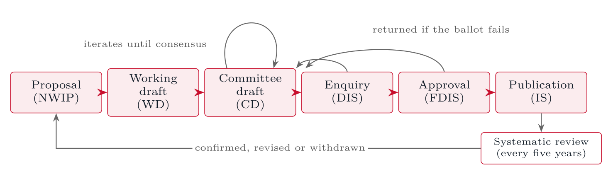
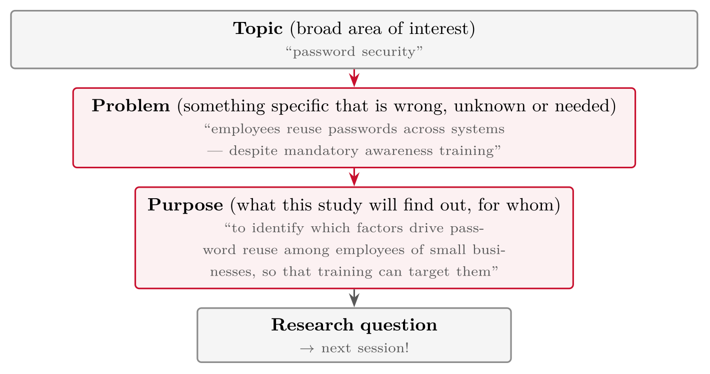
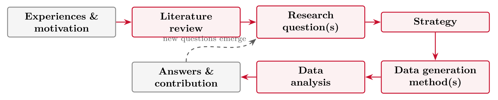

# Purpose and Products of Research {#sec-03-purpose-and-products}

::: {.callout-note appearance="simple" icon="false"}
**Session 3** · Thursday 24 September 2026 · reading: Oates, Chapters 1--3
:::

Why do people do research, and what does research produce? This chapter answers both questions with Oates' 6Ps --- purpose, products, process, participants, paradigm and presentation --- and walks one published study through all six. It then turns to the products: the forms a contribution to knowledge can take, from a taxonomy to a confirmed model, and the difference between descriptive and prescriptive knowledge. The last section contrasts research with the other system that produces the knowledge organisations actually use, standards and frameworks, and draws five rules for the method part of the essay.

## The 6Ps {#sec-03-the-6ps}

Oates organises the whole of research around six aspects that every study has, whether or not the author has thought about them: purpose, products, process, participants, paradigm and presentation. The purpose asks why the study is done; the products ask what comes out of it; the process describes the sequence of activities; the participants are the people involved and the way they are treated; the paradigm is the set of assumptions behind the study; and the presentation is the way in which the study is reported. The six are also the skeleton of the essay: purpose and questions belong to Part I, the process and the paradigm to Part III, the participants to Part IV, and the presentation is the essay itself, about ten pages and referenced.

A published study makes the six concrete. Huy et al. (2024) asked which factors drive ChatGPT use and whether use leads to continued use and recommendation; the gap was that UTAUT2 and task--technology fit had not been combined for generative AI and that curiosity was untested. Their products were an integrated model, a six-item scale for ChatGPT use, and evidence that most UTAUT2 and TTF factors matter while effort expectancy, social influence and trust do not. The process was deductive: literature, then model and hypotheses, then a questionnaire with five-point Likert items, back-translated and piloted, then exploratory and confirmatory factor analysis and covariance-based structural equation modelling. The participants were 671 ChatGPT users in Vietnam, a convenience sample recruited face to face in four cities and online, supplemented by twenty interviews and five AI professors who helped to develop the use scale. The paradigm was positivist --- constructs measured, hypotheses tested, one model for all respondents --- and the presentation is a journal article with introduction, theory and hypotheses, methodology, results and discussion. Note the twenty interviews inside a quantitative study: a developmental mixed-methods element, used to build the instrument rather than to answer the question.

## Purpose {#sec-03-purpose}

::: {.callout-note}
## Purpose

The purpose of a study refers to its reason for doing research: the topic of interest, why it is important or useful to study, and the specific research question or objectives that follow.
:::

Oates' reasons for doing research translate readily into the security field. To add to the body of knowledge: how do phishing tactics evolve over time? To solve a problem: reduce false positives in a security operations centre. To test or evaluate a method: does an API gateway actually reduce attack surface? To find out "what happens if": what if we push passkeys to all customers? To develop a model or tool: build a threat model for a hospital network. To contribute to personal development: it counts, but write the essay's motivation on one of the others. Most cyber security proposals pursue the second or third reason; the essay's purpose statement is the second half of the funnel that turns a topic into a problem and a problem into a purpose.

Research for practice has a long history in our field. McAfee and Brynjolfsson (2008) argued in the *Harvard Business Review* that competition in IT-intensive industries had accelerated since the mid-1990s --- winners pull away faster and leaders change more often --- because enterprise IT lets a firm replicate a better process across the whole organisation at once. The claim rested on the authors' own analyses of US industry data, published separately in peer-reviewed form and summarised for managers in the article. The same mechanism --- a technology that propagates good practice fast --- is the argument made for AI today, which makes the 2008 article a template for reading 2026 claims. An HBR article sits in the professional layer of the supply chain; it is useful precisely because it rests on research the reader can trace, and the trace should be checked before it is cited.

### From topic to problem to purpose

The funnel narrows in three steps. A topic is a broad area of interest, such as "password security". A problem is something specific that is wrong, unknown or contested within the topic --- "users reuse passwords despite training". A purpose statement says what the study will do about the problem and to what end --- "to identify the situational factors that predict reuse, so that training can target them". A purpose statement that needs two "and"s is still too wide; it names one problem, one owner and one intended use of the result, and it is Part I of the essay in miniature. Five drafts of the same statement, from "to look into cyber security in companies" to "to identify which password-reuse triggers a security awareness programme should address first, using interviews with 20 employees of one Norwegian SME", show the movement from a topic to a purpose with a population, a method and a use.

## Products {#sec-03-products}

::: {.callout-note}
## Products

The products of research refer to its outcomes, especially the contribution to knowledge: an answer to the research questions, but also unexpected findings.
:::

Oates lists the products research can produce: a new or improved product, a new theory, a re-interpretation of an existing theory, an in-depth analysis of a situation, an exploration of a topic, a critical analysis, a new research tool or technique, and a new or improved model. In IT terms these are an intrusion-detection component, a theory of why administrators ignore alerts, a critique of a maturity model, a security-awareness questionnaire, and so on. The contribution is what the world knows or has after the study that it did not know or have before.

Hevner (2021) adds a distinction that clarifies most master's theses. Science is both investigation (the process) and knowledge (the outcome), and the knowledge a study adds falls into one of two bases. Descriptive knowledge --- the "what" --- comprises phenomena and the regularities among them: observations, classifications, measurements, laws, patterns and theories. Prescriptive knowledge --- the "how" --- comprises human-built artefacts: constructs, models, methods and instantiations, together with design theories that state principles of form and function. A study shows its rigour and relevance by how it consumes existing knowledge and what it adds to these two bases. For your essay the consequence is one sentence: say which kind of knowledge your thesis will add --- a finding about how things are, or an artefact and the knowledge of how to build it. Most cyber security theses produce the second, and should say so.

Presthus and Munkvold (2016), writing at NOKOBIT for master's students and junior researchers, offer a taxonomy of the forms a contribution can take. Contributions to practice include lessons learned, experience reports, guidelines and roadmaps, heuristics, critical success factors and patterns. Theoretical contributions rise from building blocks upwards: concept, construct, rich insight and case description; framework or taxonomy, method and proposition; generative mechanism, hypothesis and model; and mid-range theory, design theory and grand theory. Four ways to contribute to an existing theory cover what most master's theses actually do: confirmation or replication, extension, contradiction and elimination. The authors consider this sufficient, provided the contribution is stated precisely, and give three pieces of advice: balance your own idea against what is already known; be critical of what you read and ask whether the field needs one more study on the topic; and decide the intended contribution before the study starts.

### What is expected at master's level

The essay guideline is explicit on three points. You are not expected to answer your research questions in the essay --- you are expected to justify how you would. Your topic should be relevant, well understood and well delimited: context matters, and so does feasibility. A good essay states its contribution to practice and, where applicable, to academia, and argues why the study is worth doing. Nobody expects a new attack class; "we evaluate passkey onboarding in a real organisation, with a justified method" is an excellent master's-level topic.

## Two systems of knowledge production {#sec-03-two-systems-of-knowledge-production}

A large share of the knowledge applied in security organisations does not come from research at all. Research makes descriptive and explanatory claims, asks what is the case and why, tests them through methodological transparency, replicability and peer review, and produces theories, models and effect sizes. Practice and standardisation make normative and prescriptive claims, ask what should be done, test them through expert consensus, committee votes and use in the field, and produce standards, frameworks and guidelines. Both produce knowledge, but they answer different questions and justify themselves in different ways.

The practice-based sources are familiar. Formal standardisation --- ISO/IEC 27001, ISO 31000 --- draws its legitimacy from the consensus of national standards bodies; government frameworks such as the NIST Cybersecurity Framework, NSM's grunnprinsipper and BSI IT-Grundschutz from a state mandate; professional bodies' frameworks such as COBIT from the profession and its certification; and consulting knowledge --- maturity models and frameworks --- from market adoption and references. These sources are normatively binding without having been tested empirically, and students cite them as if they were literature.

The ISO process shows why. A proposal becomes a working draft, a committee draft, an enquiry draft, a final draft and a published standard; the committee stage iterates until consensus, a failed ballot returns the draft, and a systematic review every five years confirms, revises or withdraws the document. The process does loop, but the loops are about consensus, not evidence. A standard holds because the procedure was followed; nothing in it tests whether the measures work.

{#fig-03-1}

-   The process does loop --- but the loops are about **consensus**, not about evidence.

-   A standard holds because the procedure was followed. Nothing in it tests whether the measures work.

Seven dimensions summarise the comparison. Research makes descriptive claims, validates them by evidence, replication and peer review, corrects errors by refutation, moves slowly, aims at generalisation, addresses the research community, and fails when a hypothesis is rejected. Standards make prescriptive claims, validate them by consensus, voting and uptake, correct errors through the document's revision cycle, move fast and market-driven, aim at applicability, address the organisation, the auditor and the regulator, and fail when the standard is not adopted. The error-correction row is the most interesting: a standard gets revised, but never refuted.

The two systems are connected in four ways. First, practice supplies the phenomena: RPA, agile, DevOps, zero trust, cloud governance and agentic AI all appeared in practice first, and research responds with a lag of two to four years against product cycles of months; some of the constructs research works with are taken from vendor material, and must be examined before operationalisation, or marketing vocabulary becomes a measurement. Secondly, research tests after the fact: does the prescribed measure work, under which conditions, with what effect size and side effects, and is the effect causal or self-selection? Standards assert effectiveness implicitly, through the authority of the procedure, and empirical evidence of effectiveness is neither required nor supplied. Thirdly, standards are themselves an object of research: Meyer and Rowan (1977) explain that structures are adopted for legitimacy and become decoupled from lived practice, and DiMaggio and Powell (1983) explain the spread of standards through coercive, mimetic and normative isomorphism --- which is why standards spread without evidence of effectiveness. Lastly, research feeds back into practice through Mode 2 knowledge production (Gibbons et al., 1994), design science research (Hevner et al., 2004; Peffers et al., 2007), engaged scholarship (Van de Ven & Johnson, 2006) and evidence-based management (Rousseau, 2006).

Five rules follow for the method part of the essay. Establish where the constructs come from --- theory or a vendor paper. Separate the normative from the descriptive: a standard is data, not a literature base. Treat standards as citable but not as evidence: they show what is required, not what works. Use the onion as a checklist and justify each layer explicitly, especially the step from philosophy to method. Lastly, proximity to practice is access to data, not an argument: relevance does not substitute for methodological rigour.

## The research process {#sec-03-the-research-process}

Oates' model of the research process runs from experiences and motivation through a literature review to research questions, a conceptual framework, one or more strategies, data generation methods, data analysis and the presentation of the results. The model is a map rather than a schedule: real projects loop back, and the literature review in particular is revisited when the question changes. The sessions of this course follow the model in order, and the essay's four parts do the same.

## Worked examples and tables {#sec-03-worked-examples-and-tables}

### The 6Ps as the essay's skeleton

::: {#tbl-03-1}
  **P**          **Where it appears in your essay**
  -------------- --------------------------------------------------------------
  Purpose        Part I: problem, aim, objective, research question
  Products       Part I & IV: expected contribution to practice/academia
  Process        Part II & III: literature plan, strategy, methods, data plan
  Participants   Part IV: ethics, SIKT approval, who provides data
  Paradigm       Part III: the (implicit) worldview behind your choices
  Presentation   the essay document itself: 10 pages, referenced

The 6Ps as the essay's skeleton
:::

If you can fill this table for your own project, your essay is essentially outlined.

### Oates' reasons, translated to IT

::: {#tbl-03-2}
  **Reason**                     **IT / security example**
  ------------------------------ ------------------------------------------------
  Add to the body of knowledge   how do phishing tactics evolve over time?
  Solve a problem                reduce alert fatigue in a security team
  Test or evaluate something     does our new API gateway actually scale?
  Find out "what happens if"     what if we drop passwords for passkeys?
  Personal development           learn threat modelling by studying it properly
  Qualification (you!)           pass this course; write your master's thesis

Oates' reasons for doing research, translated to IT
:::

Most real projects mix several reasons --- but **one** should dominate, because it decides what a "good answer" looks like. *Based on Oates et al. (2022), Ch. 2*

### The funnel

{#fig-03-2}

Each step **narrows**: fewer words about more specific things.

### Five purpose statements, rated

The same purpose statement in five drafts, from a topic to a statement with a population, a method and a use. The pattern of the good ones is stable: one problem, one owner, one intended use of the result.

::: {#tbl-03-3}
  **Draft**                                                                                                    **Assessment**
  ------------------------------------------------------------------------------------------------------------ ----------------------------------------------------------
  "to look into cyber security in companies"                                                                   no problem, no owner, no so-that
  "to make the client's website better"                                                                        a goal, not a purpose --- better *how*, for *whom*?
  "to study why developers ignore security warnings so that tooling can be redesigned"                         problem + so-that: workable
  "to prove that TypeScript reduces bugs"                                                                      "prove" presumes the answer --- investigate, don't prove
  "to identify onboarding steps where password-manager users abort, so that the client can prioritise fixes"   specific, owned, actionable: strong

Five purpose statements, rated
:::

The pattern of the good ones: *to **\[verb\]** \[specific thing\] so that \[someone\] can \[act\]*.

### Types of contribution, with IT examples

::: {#tbl-03-4}
  **Contribution type**               **Example**
  ----------------------------------- -------------------------------------------------------
  New or improved **product**         an accessible component library, evaluated
  New or improved **theory/model**    a model of why developers ignore security warnings
  New or improved **method**          a lighter threat-modelling method for small teams
  New **evidence**                    measured effect of security warnings on click-through
  Re-interpretation / **synthesis**   systematic review of passkey adoption studies
  **Tool/technique transfer**         applying A/B testing practice to security UX

Types of contribution, with IT examples
:::

*Based on Oates et al. (2022), Ch. 2; for framing your contribution, see Presthus & Munkvold (2016) --- short and written for juniors.*

### Two kinds of knowledge

Science is both **investigation** (the process) and **knowledge** (the outcome); rigorous IS research has to deliver on both. The knowledge a study adds falls into one of two bases:

::: {.callout-note}
## Descriptive knowledge (Ω) --- *what*

Phenomena and the regularities among them: observations, classifications, measurements, laws, patterns, theories. Added by discovering something that existed but was not yet understood.
:::

::: {.callout-important}
## Prescriptive knowledge (Λ) --- *how*

Knowledge of human-built artefacts: **constructs**, **models**, **methods**, **instantiations** --- and design theories that state principles of form and function.
:::

A study shows its rigour and relevance by how it *consumes* existing knowledge and what it *adds* to these two bases. For your essay: say which kind your thesis will add --- a finding about how things are, or an artefact and the knowledge of how to build it. Most cyber security theses produce the second, and should say so.

*Hevner (2021), building on Gregor & Hevner (2013) and Hevner et al. (2004).*

### Forms of contribution in IS

**Contributions to practice**

-   Lessons learned; experience report

-   Guidelines or roadmap; heuristics

-   Critical success factors; patterns

**Theoretical contributions**, from building blocks upwards

-   Concept, construct, rich insight, case description

-   Framework or taxonomy; method; proposition

-   Generative mechanism; hypothesis; model

-   Mid-range theory; design theory; grand theory

**Four ways to contribute to an existing theory**

-   **Confirmation** or replication --- it still holds, or holds in a new setting

-   **Extension** --- an added construct or relationship

-   **Contradiction** --- evidence against part of it

-   **Elimination** --- a part is obsolete in this setting

::: {.callout-note}
## Their advice

\(1\) Balance your own idea against what is already known; (2) be critical of what you read --- does the field need one more study on this?; (3) decide the intended contribution *before* the study starts.
:::

*Most master's theses confirm, extend or contradict an existing model --- sufficient, provided it is stated precisely. Munkvold: Department of Information Systems, UiA.*

### Practice-based knowledge production

::: {#tbl-03-5}
  **Type**                 **Examples**                                        **Source of legitimacy**
  ------------------------ --------------------------------------------------- ----------------------------------------
  Formal standardisation   ISO/IEC 27001, ISO 31000                            Consensus of national standards bodies
  Government frameworks    NIST CSF, NSM grunnprinsipper, BSI IT-Grundschutz   State mandate
  Professional bodies      COBIT (ISACA), IIA standards                        Profession and certification
  Consulting knowledge     Maturity models, frameworks                         Market adoption, references

Practice-based knowledge production: types, examples and their source of legitimacy
:::

*These sources are normatively binding without having been tested empirically.*

::: {#tbl-03-6}
  **Dimension**      **Research**                         **Standards and practice**
  ------------------ ------------------------------------ ----------------------------------
  Type of claim      Descriptive, explanatory             Prescriptive, normative
  Validation         Evidence, replication, peer review   Consensus, voting, uptake
  Error correction   Refutation, revision of theory       Revision cycle of the document
  Pace               Slow                                 Fast, market-driven
  Reach              Generalisation is the aim            Applicability is the aim
  Audience           The research community               Organisation, auditor, regulator
  Failure means      The hypothesis is rejected           The standard is not adopted

Research and standards compared: two systems of knowledge production
:::

### Huy et al. (2024) through the 6Ps

::: {#tbl-03-7}
  -------------- ------------------------------------------------------------------------------------------------------------------------------------------------------------------------------------------------
  Purpose        Which factors drive ChatGPT use, and does use lead to continued use and recommendation? Gap: UTAUT2 and task--technology fit not yet combined for generative AI; curiosity untested
  Products       An integrated model; a six-item scale for ChatGPT use; evidence that most UTAUT2 and TTF factors matter while effort expectancy, social influence and trust do not; implications for providers
  Process        Deductive: literature → model and hypotheses → questionnaire (five-point Likert, back-translated, piloted) → EFA/CFA, then covariance-based SEM
  Participants   671 ChatGPT users in Vietnam, convenience sample, face-to-face in four cities and online; 20 interviews and five AI professors to develop the use scale
  Paradigm       Positivist: constructs measured, hypotheses tested, one model for all respondents
  Presentation   Journal article: introduction, theory and hypotheses, methodology, results, discussion with contributions and limitations
  -------------- ------------------------------------------------------------------------------------------------------------------------------------------------------------------------------------------------

Huy et al. (2024) through the 6Ps
:::

Note the 20 interviews inside a quantitative study: a developmental mixed-methods element (session 2), used to build the instrument, not to answer the question.

### A model of the research process

{#fig-03-3}

Not a straight line in practice --- the dashed arrow is where real projects loop. Your **essay** describes one planned pass through this model. *Adapted from Oates et al. (2022), Ch. 3*

## Terms from this session {#sec-03-terms-from-this-session .unnumbered}

::: {#tbl-03-terms}
  ----------------------------- ------------------------------------------------------------------------------------------------------------
  **6Ps**                       Purpose, Products, Process, Participants, Paradigm, Presentation --- the aspects every study must consider
  **Purpose**                   why the study is done: topic, importance, question(s), objectives
  **Products**                  the outcomes, especially the contribution to knowledge
  **Topic vs. problem**         broad area of interest vs. a specific wrong/unknown/needed thing with an owner and a cost
  **Purpose statement**         one sentence: *to (find out X) so that (Y benefits)*
  **Output vs. contribution**   the thing produced vs. what the world knows or can do now
  **Research process**          literature → questions → strategy → data generation → analysis → answers
  **Master's expectation**      not original research --- methodology known, applied well, justified
  ----------------------------- ------------------------------------------------------------------------------------------------------------

Terms from Session 3
:::

## Questions from the reading {#sec-03-questions-from-the-reading .unnumbered}

::: {#exr-03-6ps}
## 6Ps

What are the **6Ps** --- and which two are the focus of Chapter 2?
:::

::: {#exr-03-reasons-for-doing-research}
## Reasons for doing research

Oates lists several **reasons for doing research**: which one applies most to you this semester?
:::

::: {#exr-03-output}
## Output

What is the difference between an **output** and a **contribution to knowledge**?
:::

::: {#exr-03-reading-question-4}
## Reading question 4

In Oates' model of the research process (Fig. 3.1): which component follows directly after the literature review?
:::

## Questions for discussion {#sec-03-questions-for-discussion .unnumbered}

::: {#exr-03-your-topic-through-the-funnel}
## Your topic through the funnel

**Your topic through the funnel** --- topic → problem (who has it, what does it cost?) → purpose statement (*to ... so that ...*). Can you say it in one sentence?
:::

::: {#exr-03-the-hardest-p}
## The hardest P

**The hardest P** --- in the phishing-warning study, which of the 6Ps is hardest to fill in from the description, and why?
:::

::: {#exr-03-your-contribution}
## Your contribution

**Your contribution** --- one sentence for practice and, if you can, one for academia. Who would act differently because of your result?
:::

## Interactive exercises {#sec-03-interactive-exercises .unnumbered}

Sort, order and pick: every exercise below is answerable from this chapter and checks itself.



## Key points {#sec-03-key-points .unnumbered}

-   The 6Ps: purpose, products, process, participants, paradigm, presentation --- Huy et al. (2024) as the worked example

-   From topic to problem to purpose --- the funnel

-   Contribution: descriptive or prescriptive knowledge (Hevner); the forms a junior researcher can target (Presthus & Munkvold)

-   Two systems of knowledge production: research tests, standards prescribe --- cite standards, do not treat them as evidence

## Sources {#sec-03-sources .unnumbered}

-   Hevner, A. R. (2021). The duality of science: Knowledge in information systems research. *Journal of Information Technology*, *36*(1), 72--76. <https://doi.org/10.1177/0268396220945714>

-   Huy, L. V., Nguyen, H. T. T., Vo-Thanh, T., Thinh, N. H. T., & Tran, T. T. D. (2024). Generative AI, why, how, and outcomes: A user adoption study. *AIS Transactions on Human-Computer Interaction*, *16*(1), 1--27. <https://doi.org/10.17705/1thci.00198>

-   Presthus, W., & Munkvold, B. E. (2016). How to frame your contribution to knowledge? A guide for junior researchers in information systems. *NOKOBIT*, *24*(1). Paper presented at NOKOBIT 2016, Bergen.

-   McAfee, A., & Brynjolfsson, E. (2008). Investing in the IT that makes a competitive difference. *Harvard Business Review*, *86*(7/8), 98--107.

-   DiMaggio, P. J., & Powell, W. W. (1983). The iron cage revisited: Institutional isomorphism and collective rationality in organizational fields. *American Sociological Review*, *48*(2), 147--160.

-   Gibbons, M., Limoges, C., Nowotny, H., Schwartzman, S., Scott, P., & Trow, M. (1994). *The new production of knowledge*. SAGE.

-   Hevner, A. R., March, S. T., Park, J., & Ram, S. (2004). Design science in information systems research. *MIS Quarterly*, *28*(1), 75--105.

-   Meyer, J. W., & Rowan, B. (1977). Institutionalized organizations: Formal structure as myth and ceremony. *American Journal of Sociology*, *83*(2), 340--363.

-   Peffers, K., Tuunanen, T., Rothenberger, M. A., & Chatterjee, S. (2007). A design science research methodology for information systems research. *Journal of Management Information Systems*, *24*(3), 45--77.

-   Rousseau, D. M. (2006). Is there such a thing as evidence-based management? *Academy of Management Review*, *31*(2), 256--269.

-   Saunders, M., Lewis, P., & Thornhill, A. (2019). *Research methods for business students* (8th ed.). Pearson.

-   Van de Ven, A. H., & Johnson, P. E. (2006). Knowledge for theory and practice. *Academy of Management Review*, *31*(4), 802--821.

-   Oates, B. J., Griffiths, M., & McLean, R. (2022). *Researching information systems and computing* (2nd ed.). SAGE. --- Chapters 1--3 (Introduction; The purpose and products of research; Overview of the research process).

-   Laudon, K. C., & Laudon, J. P. (2022). *Management information systems: Managing the digital firm* (17th ed., Global ed.). Pearson. --- Chapter 8 (Securing information systems) and Chapter 11 (Managing knowledge and artificial intelligence) as maps of possible topics.
