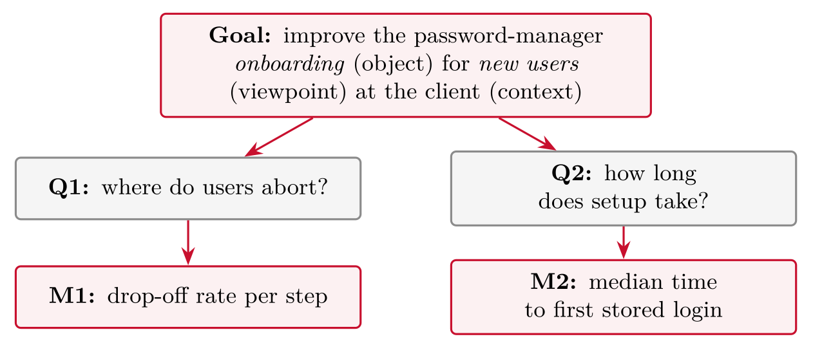
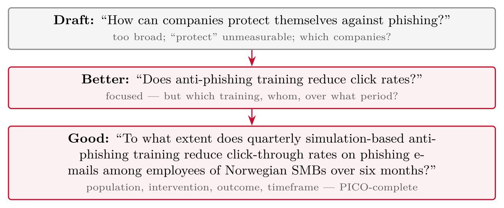
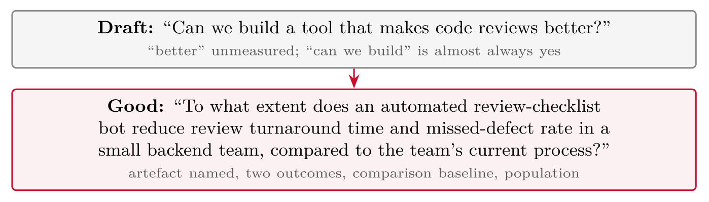
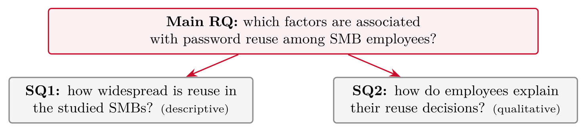

# Formulating Research Questions {#sec-04-research-questions}

::: {.callout-note appearance="simple" icon="false"}
**Session 4** · Thursday 1 October 2026 · reading: Oates, Chapter 2
:::

A research question is the pivot of the essay: it decides the approach, the strategy and the feasibility of the study. This chapter separates aim, objective, question and hypothesis, presents the shapes a question can take, and shows the five ways in which questions fail --- and how each failure is repaired. Real research questions from the papers read in this course serve as the reference; the chapter ends with the question--strategy fit that the following chapters develop.

## Anatomy {#sec-04-anatomy}

Four terms are often used as if they were one, and the essay must keep them apart.

::: {.callout-note}
## Aim, objective, research question, hypothesis

The aim refers to the overall intent of the study in one sentence. Objectives refer to the concrete, checkable steps towards the aim. A research question refers to the question the study answers. A hypothesis refers to a testable predicted answer to a quantitative question.
:::

An example makes the layers visible. The aim is to understand why employees reuse passwords; the objectives are to survey 150 employees, to interview twelve of them, and to compare the two; the research question is which factors are associated with password reuse among SME employees; and the hypothesis is that perceived account value is negatively associated with reuse. A qualitative study has no hypothesis; a quantitative study can have several.

::: {.callout-note}
## Research question

A research question refers to a question that is answerable through systematic investigation --- by collecting and analysing data --- within the resources of the study.
:::

Five criteria decide whether a draft qualifies. It must be anchored, following directly from the problem and purpose; focused, one thing at a time and not double-barrelled; researchable, so that data could actually answer it rather than only opinion, prophecy or morality; feasible with the resources of a three-month study; and open, in the sense that it is not trivially yes or no, and invites analysis.

Real research questions from the papers read in this course show the range. Presthus and Munkvold (2016) ask what forms of knowledge contribution can be targeted in information systems research --- a descriptive question answered by a taxonomy. Enholm et al. (2022) ask three review questions: what enables or inhibits AI use in organisations, what types of AI use exist, and through which mechanisms AI value is realised --- one topic, three facets. Woodruff et al. (2024) ask how knowledge workers expect generative AI to affect their industries --- exploratory and qualitative, answered by workshops. Boodraj et al. (2026) ask which skills and competencies are most in demand for cyber security project managers --- descriptive, answered from 161,000 job postings. Huy et al. (2024) state no question at all but a model with hypotheses; in quantitative work the hypothesis often replaces the question. Two observations follow: review and qualitative papers state their questions verbatim, and every question names its population and its phenomenon. Test your own draft against the same two markers.

## Question types {#sec-04-question-types}

Qualitative questions follow a script. They begin with "how" or "what", name a central concept, use exploratory verbs --- explore, understand, describe, discover --- and specify the participants and the setting: "how do security analysts make sense of alert fatigue in a Norwegian SOC?". Quantitative questions take one of three shapes. Descriptive questions ask how frequent or large something is: "how widespread is password reuse among SME employees?". Comparative questions ask whether groups differ: "do developers with security training produce fewer vulnerabilities than those without?". Relationship questions ask whether variables are associated: "is perceived account value associated with password reuse?". The relationship question often comes with a hypothesis, a predicted, testable answer derived from theory.

Two templates help when the question will not settle. PICO --- population, intervention, comparison, outcome --- turns "does security training help?" into "among SME employees (P), does quarterly phishing simulation (I), compared with annual e-learning (C), reduce click rates on phishing e-mails (O) within six months?". GQM --- goal, question, metric --- was developed for software engineering and works for any evaluation: the goal is stated, the questions that would show whether it is met are derived, and each question receives a measurable metric.

## From bad to good {#sec-04-from-bad-to-good}

Questions fail in five recognisable ways. Too broad: "how can cyber security be improved?" is a career, not a study. Trivial yes or no: "is phishing dangerous?" is answered before it is asked. Not researchable: "should companies be punished for breaches?" is a value judgement. Double-barrelled: "how do users choose and remember passwords?" is two studies. Lastly, assumption baked in: "why does TypeScript make developers happier?" assumes the effect before anyone has shown it. Every one of these is repaired the same way: define the terms, name the population, and turn the assumption into a sub-question. "Is zero trust better than perimeter security?" becomes "how does the adoption of zero-trust access controls affect the number of successful lateral movements in mid-sized organisations?" --- and the variables, the population and the comparison become visible.

A study usually has one main question that steers it and at most two sub-questions that decompose it. If the sub-questions could each be a study of their own, the main question is a topic, not a question. Design and creation questions carry an additional part: the artefact and its evaluation. "Can we build a tool that makes code review faster?" becomes "does an automated pre-review of pull requests reduce human review time without reducing defect detection, in a team of eight developers over three months?" --- the evaluation criteria, the population and the period are now part of the question.

## Fit check {#sec-04-fit-check}

The question decides more than the essay's first page. A "how widespread" question implies a survey; a "how do people make sense" question implies interviews or ethnography; a "does X cause Y" question implies an experiment; a "does the artefact work" question implies design and creation with an evaluation. The next two sessions take these strategies one by one, and the question written in this session is tested against each of them.

## Worked examples and tables {#sec-04-worked-examples-and-tables}

### The four layers

::: {#tbl-04-1}
  **Term**                **What it is**                                    **Example (password reuse)**
  ----------------------- ------------------------------------------------- -----------------------------------------------------------------------
  **Aim**                 the overall intent, one sentence                  understand why employees reuse passwords
  **Objective(s)**        concrete, checkable steps toward the aim          survey 150 employees; interview 8 of them
  **Research question**   the question the study will answer                which factors are associated with password reuse among SMB employees?
  **Hypothesis**          a testable predicted answer (quantitative only)   H1: perceived account value is negatively associated with reuse

The four layers of a question: aim, objective, research question and hypothesis, with a password-reuse example
:::

Aim = destination, objectives = milestones, question = what you ask the world, hypothesis = your predicted answer. *Based on Creswell & Creswell (2018), Ch. 7*

### Question types

Qualitative studies ask **one central question** plus a few sub-questions. Typical shape:

-   begins with **how** or **what** (not *why* --- too causal for an exploratory study)

-   uses exploratory verbs: *explore, understand, describe, discover*

-   names the **participants** and the **setting**

::: {.callout-note}
## Example

*What does "being secure" mean to system administrators in Norwegian small businesses?*\
Sub: How do they describe trade-offs between security and day-to-day operations?
:::

*Based on Creswell & Creswell (2018), Ch. 7*

::: {#tbl-04-2}
  **Shape**          **Template**                              **Example**
  ------------------ ----------------------------------------- -------------------------------------------------------------------------------
  **Descriptive**    how frequent/large is X in group G?       how widespread is password reuse among SMB employees?
  **Comparative**    does group A differ from group B on X?    do developers with security training reuse passwords less than those without?
  **Relationship**   is X associated with / does X affect Y?   does perceived account value affect password reuse?

Question types: shape, template and example
:::

Relationship questions often come with **hypotheses** --- predicted, testable answers derived from theory. Variables must be **measurable**, and the question names them explicitly. *Based on Creswell & Creswell (2018), Ch. 7*

### PICO and GQM

Two templates for questions that will not settle: PICO for evaluations with a comparison, GQM for evaluations of a goal through questions and metrics.

Four slots turn a vague comparison idea into a complete question:

::: {#tbl-04-3}
                     **Cyber**                        **Frontend**                   **Backend**
  ------------------ -------------------------------- ------------------------------ ---------------------
  **P**opulation     SMB employees                    junior developers              small on-call teams
  **I**ntervention   quarterly phishing simulations   accessible component library   pair programming
  **C**omparison     annual e-learning                plain HTML/CSS                 solo + review
  **O**utcome        click-through rate               task time, WCAG violations     defect density

PICO filled in for three domains: cyber security, frontend and backend
:::

Read any column top to bottom and the question assembles itself: *"Among \[P\], does \[I\], compared to \[C\], improve \[O\]?"* --- if a slot stays empty, the question is not yet a comparison, and PICO has told you exactly what is missing. *Schardt et al. (2007)*

**Goal** (object, purpose, viewpoint, context) → **Questions** → **Metrics**:

{#fig-04-1}

Second example, one line: *Goal:* CI pipeline reliability (developer viewpoint) → *Q:* how often do builds fail for non-code reasons? → *M:* share of failed builds with infrastructure causes. The discipline: **no metric without a question, no question without a goal**. *Basili (1994); Molléri & Petersen (2024)*

### The five failure modes, and their repairs

::: {#tbl-04-4}
  **Failure**           **Symptom**
  --------------------- -----------------------------------------------------------------------------
  Too broad             "How can cyber security be improved?" --- a career, not a study
  Trivial yes/no        "Is phishing dangerous?" --- answerable without data
  Not researchable      "Should companies be punished for breaches?" --- a value judgement
  Double-barreled       "How do users choose passwords and why do they reuse them?" --- two studies
  Assumption baked in   "Why does TypeScript make teams faster?" --- presumes the effect exists

The five failure modes of research questions, and their symptoms
:::

Every one of these appears in essay drafts every year. Learn to see them in **your own** questions.

{#fig-04-2}

{#fig-04-3}

For design & creation questions, the repair always adds the **evaluation**: outcomes and a baseline. "Can it be built" is a development milestone; "how well does it work, compared to what" is the research question.

### Hierarchies and hypotheses

{#fig-04-4}

Rules of thumb:

-   Sub-questions **decompose** the main question --- together they answer it; none reaches beyond it.

-   Two to three sub-questions are plenty at master's level.

-   Notice: SQ1 + SQ2 above quietly sketch a **mixed-methods** design --- the question hierarchy and the strategy must fit (sessions 6--7).

**Design & creation project**\
**Main:** how well does a review-checklist bot reduce turnaround in a small team?

-   SQ1: which checklist items catch the most defects? (log analysis)

-   SQ2: how do reviewers experience the bot? (short interviews)

**Case study project**\
**Main:** how does one SMB rebuild operational trust after a ransomware incident?

-   SQ1: which routines changed, and when? (documents, timeline)

-   SQ2: how do staff explain what made the changes stick? (interviews)

Same rule both times: sub-questions **decompose** the main question --- and each quietly names its data source, which is exactly what Parts III--IV will need.

::: {#tbl-04-5}
  **Hypothesis**                                                                  **Assessment**
  ------------------------------------------------------------------------------- -------------------------------------------------------------
  H1: employees with security training reuse fewer passwords than those without   testable: two groups, one measurable outcome
  H2: the new warning design is better                                            not testable --- "better" has no measure or direction
  H3: perceived account value is negatively associated with reuse                 testable: named variables, stated direction, theory-derived

Hypotheses assessed: which are testable, and why
:::

A hypothesis needs: **named variables**, a **direction**, and a route to **measurement**. And remember: hypotheses belong to quantitative questions --- a qualitative study states expectations, not hypotheses.

### The question decides more than you think

::: {#tbl-04-6}
  **If your question says...**                                       **...it implies**   **...and demands**
  ------------------------------------------------------------------ ------------------- -------------------------------------------
  *how many, to what extent, does X affect Y*                        quantitative        measurable variables, enough participants
  *how do people experience, what does X mean*                       qualitative         access to participants, interview time
  *what predicts X --- and how do people explain it*                 mixed methods       both of the above (cost!)
  *can an artefact that does X be built and how well does it work*   design & creation   build skills *and* an evaluation plan

The question decides more than you think: what a question's wording implies and demands
:::

Feasibility is a **quality criterion**, not an afterthought: a beautiful question your group cannot answer by June is a bad question *for this essay*.

## Terms from this session {#sec-04-terms-from-this-session .unnumbered}

::: {#tbl-04-terms}
  ----------------------- ----------------------------------------------------------------------------------------
  **Aim**                 the overall intent of the study, one sentence
  **Objective**           a concrete, checkable step toward the aim
  **Research question**   the question the study answers through systematic investigation
  **Hypothesis**          a testable predicted answer, derived from theory (quantitative)
  **Sub-question**        a component question that helps decompose and answer the main question
  **PICO**                Population, Intervention, Comparison, Outcome --- a template for comparative questions
  **GQM**                 Goal, Question, Metric --- a measurement-driven template from software engineering
  **Double-barreled**     a question that secretly asks two things at once --- split it
  ----------------------- ----------------------------------------------------------------------------------------

Terms from Session 4
:::

## Questions from the reading {#sec-04-questions-from-the-reading .unnumbered}

::: {#exr-04-reasons}
## Reasons

Oates lists several **reasons** for doing research. Name three that could apply to a master's thesis.
:::

::: {#exr-04-products}
## Products

Which **products** can research produce, according to Oates?
:::

::: {#exr-04-research-topics}
## Research topics

Where do **research topics** come from?
:::

::: {#exr-04-criteria}
## Criteria

Which **criteria** does Oates propose for judging a candidate topic?
:::

## Questions for discussion {#sec-04-questions-for-discussion .unnumbered}

::: {#exr-04-your-main-question}
## Your main question

**Your main question** --- draft it in one sentence, then run the five-point checklist: precise, feasible, researchable, single-barrelled, no assumption baked in. Which criterion fails first?
:::

::: {#exr-04-one-question-or-several}
## One question or several?

**One question or several?** --- your topic tempts you to ask three things. What does the hierarchy look like?
:::

::: {#exr-04-repair-a-neighbour-s-question}
## Repair a neighbour's question

**Repair a neighbour's question** --- "Is zero trust better than perimeter security?" Diagnose and rewrite.
:::

## Interactive exercises {#sec-04-interactive-exercises .unnumbered}

Sort, order and pick: every exercise below is answerable from this chapter and checks itself.



## Key points {#sec-04-key-points .unnumbered}

-   Aim, objective, question, hypothesis --- four layers that must not blur

-   Question types: qualitative scripts, quantitative shapes, PICO and GQM

-   The five failure modes --- and how to repair a question

-   The question decides the approach, the strategy and the feasibility

## Sources {#sec-04-sources .unnumbered}

-   Enholm, I. M., Papagiannidis, E., Mikalef, P., & Krogstie, J. (2022). Artificial intelligence and business value: A literature review. *Information Systems Frontiers*, *24*, 1709--1734. <https://doi.org/10.1007/s10796-021-10186-w>

-   Huy, L. V., Nguyen, H. T. T., Vo-Thanh, T., Thinh, N. H. T., & Tran, T. T. D. (2024). Generative AI, why, how, and outcomes: A user adoption study. *AIS Transactions on Human-Computer Interaction*, *16*(1), 1--27. <https://doi.org/10.17705/1thci.00198>

-   Presthus, W., & Munkvold, B. E. (2016). How to frame your contribution to knowledge? A guide for junior researchers in information systems. *NOKOBIT*, *24*(1). Paper presented at NOKOBIT 2016, Bergen.

-   Woodruff, A., Shelby, R., Kelley, P. G., Rousso-Schindler, S., Smith-Loud, J., & Wilcox, L. (2024). How knowledge workers think generative AI will (not) transform their industries. In *Proceedings of the CHI Conference on Human Factors in Computing Systems (CHI '24)*. ACM. <https://doi.org/10.1145/3613904.3642700>

-   Boodraj, M., Fairbanks, J., Davies, C., & Akcakaya, O. (2026). Beyond the firewall: The rise of the cybersecurity project manager. In *AMCIS 2026 Proceedings* (Emergent Research Forum paper). AIS. <https://aisel.aisnet.org/amcis2026/sig_itpm/sig_itpm/2>

-   Oates, B. J., Griffiths, M., & McLean, R. (2022). *Researching information systems and computing* (2nd ed.). SAGE. --- Chapter 2 (The purpose and products of research).
