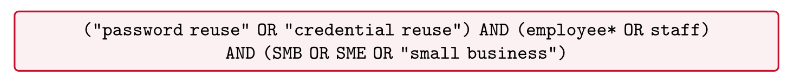
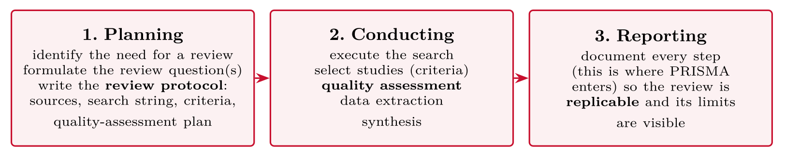

# Reviewing the Literature {#sec-05-reviewing-the-literature}

::: {.callout-note appearance="simple" icon="false"}
**Session 5** · Thursday 8 October 2026 · reading: Oates, Chapter 6
:::

A literature review does four jobs: it justifies the problem, avoids reinventing what exists, grounds the concepts, and informs the method. This chapter turns the review into a documented, repeatable procedure --- from the research question to a keyword table, a Boolean string, explicit screening criteria and a PRISMA flow --- and then into a synthesis rather than a summary. One published systematic review and my own review serve as worked examples. The chapter corresponds to Part II of the essay.

## Why review {#sec-05-why-review}

::: {.callout-note}
## Literature review

A literature review refers to a systematic examination of the existing knowledge relevant to a research question, undertaken both for the process of finding and evaluating it and for the written account that results.
:::

The review does four jobs for the essay. First, it justifies the problem: it shows the gap, or the conflict, that the study addresses. Secondly, it avoids reinventing what exists --- someone may already have answered your question, or shown that the obvious design fails. Thirdly, it grounds the concepts: the definitions and theories the study uses. Lastly, it informs the method: how others did similar studies, and what they learned about doing them. Part II of the essay asks for the keywords and search strings, the databases and dates, the inclusion and exclusion criteria, the initial results, and a table of the included studies --- everything on that list is a step in this chapter.

vom Brocke et al. (2009) describe the review as a five-phase framework: definition of the review scope, conceptualisation of the topic, the literature search, the analysis and synthesis, and the research agenda. Their argument is that the search must be documented in enough detail to be repeated, which is what turns a review from a reading list into evidence. The chapter follows the phases.

## Where to look {#sec-05-where-to-look}

Sources differ in quality, and the quality hierarchy is not the same as the ease of finding. Peer-reviewed journals --- for our field the AIS basket of eight, *IEEE Transactions on Information Forensics and Security*, *Computers & Security* --- and peer-reviewed conference proceedings --- ICIS, ECIS, USENIX Security, CCS --- form the core; books and textbooks add synthesis; grey literature such as NIST and ENISA reports, vendor white papers and industry surveys adds practice and data but must be labelled as what it is; blogs and vendor pages add currency and marketing. The databases of our field are the AIS eLibrary, IEEE Xplore, the ACM Digital Library, Scopus and Web of Science, with Google Scholar as a wide net and a poor filter. Every database has its own syntax for Boolean operators, wildcards and field limits, and a search log records which syntax was used where.

## Systematic search {#sec-05-systematic-search}

The search proceeds from the research question to a keyword table. Each concept in the question receives a column of synonyms and related terms; "password reuse" becomes "password reuse", "credential reuse" and "password management"; "employees" becomes "employees", "staff", "end users" and "knowledge workers". The concept with the most synonyms is usually the technical one, with tool names, acronyms and vendor terms, and it needs the longest OR block. Boolean operators build the string: OR joins synonyms within a concept, AND joins the concepts, NOT excludes a term and is used sparingly, and quotation marks and wildcards fix phrases and stems. A first string is tested in one database, the hit count is logged, and the string is adjusted --- which is the normal course of a search, not a failure.

Screening follows explicit criteria stated before the hits are read: inclusion criteria such as peer-reviewed publications in English from 2015 onwards that study organisational settings, and exclusion criteria such as purely technical measures without a human or organisational dimension. A criterion invented after reading the hits is not a criterion but a preference. Kitchenham and Charters (2007) set out the procedure for software engineering as a protocol written first; Kitchenham et al. (2009) reviewed how the procedure had been applied. The PRISMA 2020 statement (Page et al., 2021) supplies the reporting standard: a flow diagram that records how many records were identified, screened, assessed for eligibility and included, and why the others were excluded. The flow diagram is a template, and every review fills it in.

Enholm, Papagiannidis, Mikalef and Krogstie (2022) show the same procedure in a published review. They wrote a protocol first, following the Cochrane handbook; they asked three questions --- what enables or inhibits AI use in organisations, what types of AI use exist, and through which mechanisms AI value is realised; they combined two keyword sets with wildcards and searched Google Scholar and nine databases, including Scopus, IEEE Xplore and the AIS library, within a stated period in September 2020; they applied explicit inclusion and exclusion criteria; two authors assessed the quality of each paper independently for rigour, credibility and relevance; and they extracted the 43 included papers into a concept matrix and synthesised them in three parts and a research agenda. Everything Part II of your essay asks for is visible in one paper.

## Read and synthesise {#sec-05-read-and-synthesise}

Reading for a review is different from reading for interest. A paper is read in the right order --- abstract, conclusion, figures and tables, method, and only then the full text --- and read for extraction: what is the question, the method, the sample, the finding, and the limitation. The extraction goes into a concept matrix, which Webster and Watson (2002) introduced as the instrument of synthesis: one row per paper, one column per concept, and in each cell what the paper says about the concept. Watson and Webster (2020) extended the idea for the age of graph databases, in which the matrix becomes a network of concepts and relationships; Session 11 returns to both.

::: {.callout-note}
## Synthesis

Synthesis refers to constructing a new, integrated statement out of several sources --- a claim that no single source makes on its own, organised by concept rather than by paper.
:::

The matrix is read by column, and the column produces a paragraph: what the papers agree on, where they diverge, what explains the divergence --- method, setting, definition --- and what the divergence means for your own design. Three papers that disagree therefore appear in the essay not as three paragraphs, one per paper, but as one argument. Four moves make the argument: establish what is known, contrast where sources conflict, locate the gap, and point at the implication for the study. A review written paper by paper is a summary; a review written concept by concept is a synthesis, and the difference is visible in the first paragraph.

Two habits keep the review under control. The reference manager --- Zotero, free, with a browser button and plug-ins for Word and LaTeX --- is set up on the first day of the search, because reconstructing sources in November has ruined better essays than any examiner. And the search log, the keyword table and the concept matrix live in one spreadsheet, so that Part II can be written from the log rather than from memory.

## Worked examples and tables {#sec-05-worked-examples-and-tables}

### The five phases, walked through

::: {#tbl-05-1}
  **Phase**                 **What you decide / do**                                                 **Example**
  ------------------------- ------------------------------------------------------------------------ -------------------------------------------------------------------------------------
  1. Review scope           focus, goal, coverage, audience                                          empirical studies on workplace password behaviour, 2015--2026
  2. Conceptualisation      working definitions of the key terms; the concepts behind the question   what counts as "reuse"? candidate theories (security fatigue)? → your keyword table
  3. Search process         journals → databases → keywords → backward/forward → evaluation          the search log and criteria from today's steps 1--3
  4. Analysis & synthesis   extract by **concept**, not by paper                                     the concept matrix (later this session)
  5. Research agenda        what remains open --- and therefore your study                           the gap paragraph ending in your question

The five phases of a literature review, walked through
:::

*vom Brocke et al. (2009). Phase 5 is the bridge from Part II to Part I: the review *ends* where your question *begins*.*

### Source types and databases

::: {#tbl-05-2}
  **Source type**          **Examples**                                                     **Use for**
  ------------------------ ---------------------------------------------------------------- --------------------------------------
  Peer-reviewed journals   *IEEE TSE, Computers & Security*                                 core evidence
  Conference proceedings   ICSE, CHI, USENIX Security, CCS                                  core evidence (big in computing!)
  Books & textbooks        Oates; specialist monographs                                     concepts, methods
  Grey literature          standards (NIST, OWASP), industry reports (DORA, Verizon DBIR)   practice context --- flag it as grey
  Blogs, vendor pages      engineering blogs, marketing                                     leads only --- verify elsewhere

Source types: examples and what to use them for
:::

Computing is unusual: **top conferences are peer-reviewed and count as much as journals**. But a vendor whitepaper is not evidence --- session 1's "95 % human error" claim lives exactly there.

::: {#tbl-05-3}
  **Database**                  **What it is good for**
  ----------------------------- -------------------------------------------------------------------------------------------------
  **Oria**                      the library's front door --- searches most of the below
  **AIS eLibrary**              the information systems field's own library, incl. the "Senior Scholars" basket of top journals
  **ACM Digital Library**       computing conferences and journals
  **IEEE Xplore**               engineering and computer science
  **EBSCOhost**                 broad multidisciplinary coverage incl. business and IS
  **Scopus / Web of Science**   broad, curated, good citation chasing
  **Google Scholar**            broadest recall --- but no quality filter; use for snowballing
  **SAGE Research Methods**     not papers --- *methods*: look up any method you meet in this course

Databases and what each is good for
:::

Strategy: run your string in **two or three** databases, not ten --- and **snowball**: follow the reference lists (backward) and citations (forward) of your best hits. *(AIS eLibrary, EBSCOhost and the ACM DL are the three used in the real review later in this session.)*

### From question to string to criteria

The three steps of the systematic search on the running example: the keyword table, the Boolean string with its test log, and the screening criteria stated before reading.

Take the question apart into **concepts**, then collect **synonyms** per concept:

::: {#tbl-05-4}
  **Concept**      **Synonyms & variants**
  ---------------- ---------------------------------------------------------------------
  password reuse   password reuse, credential reuse, password sharing, password habits
  employees        employee\*, staff, worker\*, end user\*
  small business   SMB, SME, "small and medium-sized enterprise\*"

From question to search string: concepts, synonyms and variants
:::

Tricks of the trade: `*` truncation (`employee*` finds *employees*), `"quotation marks"` for exact phrases, and check the **keywords** of your first good hit --- authors hand you their vocabulary for free.

{#fig-05-1}

-   **OR** joins synonyms *within* a concept (widens the net)

-   **AND** joins the concepts *together* (narrows the net)

-   **NOT** excludes --- use sparingly; it silently removes good hits too

::: {.callout-important}
## Iterate and log

First string returns 4,000 hits? Add a concept. Returns 3? Drop one. **Write every attempt into the search log** --- that log is literally a deliverable of Part II.
:::

Decide **before** screening what counts:

**Inclusion (example)**

-   peer-reviewed, 2015 or later

-   empirical data on password behaviour

-   workplace context

-   English or Scandinavian language

**Exclusion (example)**

-   purely technical cracking papers

-   consumer-only context

-   opinion pieces, posters

-   no full text available

Screen in two passes: first **title + abstract** (fast), then **full text** for the survivors. Every decision is countable --- which is exactly what the PRISMA figure shows.

### Kitchenham's process and PRISMA 2020

{#fig-05-2}

The core idea: the protocol is written **before** the search --- so the criteria cannot quietly drift to fit the papers you happen to like. *Kitchenham et al. (2009)*

**The protocol (example contents)**

-   review question(s)

-   sources: AIS eLibrary, EBSCOhost, ACM DL

-   search string (documented verbatim)

-   inclusion / exclusion criteria

-   quality-assessment criteria and scoring

-   data-extraction fields (the matrix columns)

**Quality assessment (from the real review)**

-   five criteria: QA1 topic relevance, QA2 research context, QA3 methodological detail, QA4 data collection, QA5 analysis approach

-   scoring per criterion: 1 / 0.5 / 0

-   thresholds: high ≥ 4; medium 2.5 to \<4; low \<2.5 (excluded)

-   result: 32 high, 5 medium, 0 excluded

::: {.callout-important}
## For your essay

A proportionate protocol --- question, sources, string, criteria --- is precisely the "plan" that Part II asks you to develop and report.
:::

*Kitchenham et al. (2009); QA example: Amling et al. (under review)*

::: {.callout-note}
## PRISMA 2020 (Page et al., 2021)

A **reporting guideline** for systematic reviews: a **27-item checklist** covering everything from the search strategy and selection process to synthesis and limitations --- *plus* the well-known **flow diagram**.
:::

-   The flow diagram is only the **visible summary**; PRISMA thinking means **every decision is documented and countable**.

-   The full diagram has **two identification streams**: via *databases* --- and via *other methods* (forward/backward citation search, expert contacts).

-   It also tracks *reports not retrieved* --- honesty about what you could not get.

For your essay: the diagram plus documented criteria are the visible artefacts --- the next slide shows what the complete diagram looks like in a real, current review.

### A published systematic review, step by step

::: {#tbl-05-5}
  ----------- --------------------------------------------------------------------------------------------------------------------------------------------------------------------------------------------------------------------------------------------------------------------------------------------------------------
  Protocol    Written first, following the Cochrane handbook: questions, search strategy, criteria, quality assessment, synthesis method
  Questions   \(1\) What enables or inhibits AI use in organisations? (2) What are the types of AI use? (3) Through which mechanisms is AI value realised?
  Search      Two keyword sets (AI technologies; organisational perspective) combined with wildcards; Google Scholar plus Scopus, Business Source Complete, Emerald, Taylor & Francis, Springer, Web of Knowledge, ABI/Inform, IEEE Xplore, AIS library; 14--30 September 2020; separate search in the AIS basket of eight
  Screening   Explicit inclusion and exclusion criteria (English; peer-reviewed; organisational focus)
  Quality     Two authors independently: rigour, credibility, relevance
  Result      43 papers extracted into a **concept matrix**; synthesis in three parts (enablers and inhibitors, typologies of use, first- and second-order effects) and a research agenda
  ----------- --------------------------------------------------------------------------------------------------------------------------------------------------------------------------------------------------------------------------------------------------------------------------------------------------------------

A published systematic review (Enholm et al., 2022), step by step
:::

Everything Part II of your essay asks for is visible in one paper: protocol, strings, databases, dates, criteria, counts, matrix. Their Figure 1 is the PRISMA-style flow of the selection.

### Reading and the concept matrix

Nobody reads papers front to back. The efficient order:

1.  **Abstract** --- is this relevant at all? (30 seconds)

2.  **Conclusion** --- what do they claim to have found? (2 min)

3.  **Figures and tables** --- the evidence at a glance (2 min)

4.  **Method** --- *how* do they know? Only now decide whether to trust the conclusion (10 min)

5.  **Full read** --- only for the handful that survive steps 1--4

While reading, extract into your **literature table** --- or, one step better, a **concept matrix** (Webster & Watson, 2002): concepts as columns, papers as rows. It forces synthesis by concept instead of a paper-by-paper shopping list, and it goes straight into Part II.

Concepts as **columns** (from your conceptualisation, phase 2), papers as **rows**; a cell marks that the paper addresses the concept:

::: {#tbl-05-6}
             **Concept A**   **Concept B**   **Concept C**   **Concept D**
  --------- --------------- --------------- --------------- ---------------
  Paper 1          ×               ×                        
  Paper 2                          ×                               ×
  Paper 3          ×                               ×        
  Paper 4          ×               ×               ×               ×

The concept matrix: concepts as columns, papers as rows
:::

Two reading directions: a **row** shows what one paper covers; a **column** shows the state of evidence for one concept --- dense columns mean converging work, sparse columns mean thin evidence, empty columns mean a gap. Cells can carry more than a mark: a finding direction, a method tag, a context. *Webster & Watson (2002)*

The same structure filled in, with the P/N/B cell coding from the real review:

::: {#tbl-05-7}
                               **Security fatigue**   **Convenience**   **Risk perception**   **Training effect**
  --------------------------- ---------------------- ----------------- --------------------- ---------------------
  Smith (2021), survey                  N                    P                               
  Lee (2022), experiment                                     P                                         P
  Hansen (2023), interviews             N                                        B           
  Berg (2024), mixed                    N                    B                   N                     P

The concept matrix filled in, with P/N/B cell coding
:::

Cells: **P** = reaction/effect reported as positive, **N** = negative, **B** = both. Reading the columns: fatigue is consistently negative (converging evidence), convenience is mostly positive with one "both" (a tension to explain), risk perception is thin and mixed (a gap candidate). The matrix hands you the argument moves. *Webster & Watson (2002); Amling et al. (under review)*

### From synthesis to argument

Every good review paragraph makes the same four moves:

1.  **Establish** --- what converging sources agree on:\
    **"Survey studies consistently report that security fatigue drives password reuse (Smith, 2021; Lee, 2022)."**

2.  **Complicate** --- the conflict, exception or boundary:\
    **"However, the only field study found no such effect once account value was controlled (Hansen, 2023)."**

3.  **Locate the gap** --- what nobody has examined:\
    **"No study has examined this in small businesses, where IT support is minimal."**

4.  **Point at your study** --- the *therefore*:\
    **"We therefore ask which factors are associated with password reuse among SMB employees."**

-   **One block = one concept = one claim.** Plan the review as blocks taken from your matrix columns; if you cannot state a block's claim in one sentence, split it.

-   **Every claim carries evidence.** A claim without citations is an opinion; citations without a claim are a shopping list. The argument is the *combination*: claim + sources + your reasoning why they support it.

-   **Weigh, don't just count.** Three surveys and one field study disagree? Say *why* the designs might explain the difference --- this is where session 6's knowledge is applied.

-   **The matrix feeds the moves.** A full column = move 1 (establish); mixed P/N in a column = move 2 (complicate); an empty column or row = move 3 (the gap).

::: {.callout-important}
## The test, again

Every paragraph ends facing **your** study. If a paragraph could be deleted without weakening the case for your research question, delete it.
:::

**Summary (weak)**

-   "Smith (2021) found A."

-   "Lee (2022) found B."

-   "Hansen (2023) found C."

*A shopping list. The reader must do the thinking.*

**Synthesis (strong)**

-   "Survey studies consistently find A (Smith, 2021; Lee, 2022) --- but the single field study contradicts this (Hansen, 2023), suggesting the effect may not survive real workplaces. **This gap motivates our question.**"

::: {.callout-important}
## The test

Every paragraph of your review should end pointing at **your** study: what is known, what conflicts, what is missing --- and therefore why your question matters.
:::

### The toolchain for Part II

::: {#tbl-05-8}
  **Job**               **Tool**                **Why / how**
  --------------------- ----------------------- ------------------------------------------------------------------------------------------------------------------------------------------------
  Collect & cite        **Zotero** (free)       browser button saves each hit with full metadata; cite-while-you-write plugins for Word and LaTeX --- start it *today*, not in November
  Search log & matrix   **Excel** / Sheets      one sheet per artefact: the log (string, database, date, hits) and the concept matrix live naturally in a spreadsheet
  Writing               **Word** or **LaTeX**   pick one *as a group*, now; Word + Zotero plugin is the low-friction default; LaTeX if the group already knows it --- happy to share templates
  Later                 Nettskjema, JASP        data collection (S8) and analysis (S8--9) --- same rule: decide early, learn once

The toolchain for Part II: job, tool, and why
:::

One rule beats all tool debates: **everyone in the group uses the same tools from session 5 on**. Merging two reference managers in submission week has ruined better essays than any examiner.

## Terms from this session {#sec-05-terms-from-this-session .unnumbered}

::: {#tbl-05-terms}
  ---------------------------------- --------------------------------------------------------------------------------------------------------------
  **Literature review**              systematic examination of existing knowledge relevant to the question --- process and product
  **Peer review**                    pre-publication quality control by independent experts
  **Grey literature**                non-peer-reviewed sources (standards, industry reports) --- context, flagged as such
  **Boolean operators**              AND (narrow), OR (widen), NOT (exclude, carefully)
  **Search log**                     documented record of every string, database, date and hit count
  **Inclusion/exclusion criteria**   pre-defined rules deciding which hits enter the review
  **Snowballing**                    following reference lists (backward) and citations (forward) of good hits
  **PRISMA 2020**                    reporting guideline for systematic reviews: 27-item checklist + flow diagram with two identification streams
  **Concept matrix**                 synthesis table with concepts as columns and papers as rows (Webster & Watson)
  ---------------------------------- --------------------------------------------------------------------------------------------------------------

Terms from Session 5
:::

## Questions from the reading {#sec-05-questions-from-the-reading .unnumbered}

::: {#exr-05-purposes}
## Purposes

Which **purposes** does a literature review serve, according to Oates?
:::

::: {#exr-05-peer-reviewed}
## Peer-reviewed

What is the difference between **peer-reviewed** and **grey** literature --- and why does it matter for your essay?
:::

::: {#exr-05-search-can-be-repeated}
## Search can be repeated

What must be documented so that your **search can be repeated** by others?
:::

::: {#exr-05-not-read-yourself}
## Not read yourself

What does Oates say about citing sources you have **not read yourself**?
:::

## Questions for discussion {#sec-05-questions-for-discussion .unnumbered}

::: {#exr-05-your-search-string}
## Your search string

**Your search string** --- decompose your research question into concepts and synonyms. Which concept has the most synonyms, and which database would you test first?
:::

::: {#exr-05-inclusion-and-exclusion}
## Inclusion and exclusion

**Inclusion and exclusion** --- write three criteria of each kind for your review. Which criterion would exclude the most papers?
:::

::: {#exr-05-synthesis-not-summary}
## Synthesis, not summary

**Synthesis, not summary** --- three papers on your topic disagree. How does that appear in Part II of your essay?
:::

## Interactive exercises {#sec-05-interactive-exercises .unnumbered}

Sort, order and pick: every exercise below is answerable from this chapter and checks itself.



## Key points {#sec-05-key-points .unnumbered}

-   The literature review does four jobs --- and follows a five-phase framework

-   Source types differ in quality; our field has its own databases

-   From question to keyword table to Boolean string to explicit screening --- documented, repeatable (PRISMA)

-   Synthesis, not summary: extract into a concept matrix, then write in blocks

## Sources {#sec-05-sources .unnumbered}

-   Amling, T., et al. (under review). When Robotic Process Automation takes over --- do employees cheer or jeer? A systematic literature review.

-   Enholm, I. M., Papagiannidis, E., Mikalef, P., & Krogstie, J. (2022). Artificial intelligence and business value: A literature review. *Information Systems Frontiers*, *24*, 1709--1734. <https://doi.org/10.1007/s10796-021-10186-w>

-   Kitchenham, B., & Charters, S. (2007). *Guidelines for performing systematic literature reviews in software engineering* (EBSE Technical Report EBSE-2007-01). Keele University and Durham University.

-   Kitchenham, B., Pearl Brereton, O., Budgen, D., Turner, M., Bailey, J., & Linkman, S. (2009). Systematic literature reviews in software engineering --- A systematic literature review. *Information and Software Technology*, *51*(1), 7--15.

-   Page, M. J., McKenzie, J. E., Bossuyt, P. M., Boutron, I., Hoffmann, T. C., Mulrow, C. D., et al. (2021). The PRISMA 2020 statement: An updated guideline for reporting systematic reviews. *BMJ*, *372*, n71. <https://doi.org/10.1136/bmj.n71>

-   vom Brocke, J., Simons, A., Niehaves, B., Riemer, K., Plattfaut, R., & Cleven, A. (2009). Reconstructing the giant: On the importance of rigour in documenting the literature search process. In *Proceedings of the 17th European Conference on Information Systems (ECIS 2009)*.

-   Watson, R. T., & Webster, J. (2020). Analysing the past to prepare for the future: Writing a literature review a roadmap for release 2.0. *Journal of Decision Systems*, *29*(3), 129--147. <https://doi.org/10.1080/12460125.2020.1798591>

-   Webster, J., & Watson, R. T. (2002). Analyzing the past to prepare for the future: Writing a literature review. *MIS Quarterly*, *26*(2), xiii--xxiii.

-   Oates, B. J., Griffiths, M., & McLean, R. (2022). *Researching information systems and computing* (2nd ed.). SAGE. --- Chapter 6 (Reviewing the literature).
