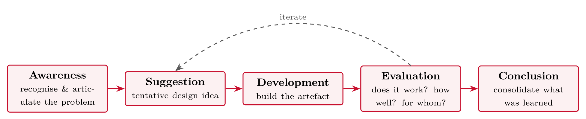

# Research Strategies 1: Survey, Design and Creation, Experiment {#sec-06-strategies-survey-design-experiment}

::: {.callout-note appearance="simple" icon="false"}
**Session 6** · Thursday 15 October 2026 · reading: Oates, Chapters 7--9
:::

This chapter presents the first three research strategies: the survey, which trades depth for breadth; design and creation, in which knowledge is demonstrated through an artefact and its evaluation; and the experiment, which buys causal claims with control. For each strategy the chapter gives the definition, a worked example and the criteria for judging it. The chapter closes with the choice: fit to the question, fit to the resources, the main risk --- and the strategies used in the papers read this semester.

## The menu {#sec-06-the-menu}

Oates distinguishes six research strategies --- survey, design and creation, experiment, case study, action research and ethnography --- and each is defined by the kind of knowledge it produces, the data it generates and the way its data are analysed. A strategy is the overall approach to answering the question; the methods within it are the techniques of generating and analysing data (Sessions 8 and 9). This session takes the first three; Session 7 takes the other three and the decision between them.

## Survey {#sec-06-survey}

::: {.callout-note}
## Survey

A survey refers to the collection of the same kinds of data from a large group of people or events in a standardised, systematic way, in order to find patterns that can be generalised to a larger population than the group actually studied.
:::

Four concepts make or break a survey. The population is everyone about whom the study wants to claim something; the sampling frame is the actual list from which the sample is drawn; the probability sampling technique --- random, stratified, cluster --- decides whether the results can be generalised statistically, and a convenience sample decides that they cannot; and the response rate decides how much of the intended sample is actually described. Typical questions are how widespread, which factors are associated with an outcome, and whether groups differ. The data are usually generated by questionnaires, sometimes by interviews, observations or documents, and analysed with statistics.

The four survey studies read this semester show the range of the strategy. Biloš and Budimir (2024) reached 694 respondents through an online questionnaire with seven-point Likert items; Huy et al. (2024) 671 respondents face to face and online; Grassini, Aasen and Møgelvang (2024) 104 Norwegian students, with a stop rule fixed in advance; and Jo and Park (2024) 351 workers recruited through a polling company's panel. All four adapted validated scales, and all four report a measurement model before the structural model. Their sampling decisions differ --- a large convenience sample, a small convenience sample with a pre-registered stop rule, a paid panel --- and each is defensible if it is stated and its limits discussed. None generalises to "Croatian consumers" or "Norwegian students" as populations.

## Design and creation {#sec-06-design-and-creation}

::: {.callout-note}
## Design and creation

Design and creation refers to a strategy in which new IT artefacts are developed --- constructs, models, methods or instantiations --- and the knowledge gained through building and evaluating them is the contribution.
:::

The strategy is the natural home of most cyber security theses, and also their most common weakness. Building a system is development; building it, asking a question about it, evaluating it systematically and claiming something that holds beyond the prototype is research. Oates describes a five-step cycle --- awareness of the problem, suggestion, development, evaluation and conclusion --- that is iterative rather than linear, and the evaluation step is where the research lives. Without an evaluation plan the artefact is a development project. A usability test with eight users, a benchmark against a named baseline, or an expert review with explicit criteria each turns the artefact into evidence, and the plan states what is evaluated, with whom and how it is measured before the artefact is built.

Hevner et al. (2004) and Peffers et al. (2007) set out the design science research methodology that underlies the strategy in information systems; von Nordenflycht (2010) shows a related product, a conceptual paper that develops a theory and taxonomy of knowledge-intensive firms without data of its own. A conceptual paper is a study in its own right when it follows a documented method, and so is a systematic review (Session 5); neither appears in Oates' list of six strategies, and both are legitimate bases for an essay and a thesis.

## Experiment {#sec-06-experiment}

::: {.callout-note}
## Experiment

An experiment refers to a strategy that investigates cause and effect: the researcher manipulates one factor, measures the outcome, and controls everything else, so that a difference in the outcome can be attributed to the manipulation.
:::

Five terms carry the strategy: the independent variable, which is manipulated; the dependent variable, which is measured; control, so that other factors are held constant or randomised away; random assignment of participants to conditions; and the hypothesis, the predicted effect. Two kinds of validity are traded against each other. Internal validity asks whether the treatment caused the effect and is threatened by confounds and selection; external validity asks whether the result holds outside the laboratory and is threatened by artificial tasks and unrepresentative samples. More control means cleaner causal claims and less resemblance to the real world.

Sparrow, Liu and Wegner (2011) show the strategy at its best and at its most exposed. In four laboratory experiments they asked whether having information at our fingertips changes what we remember. In one experiment participants typed trivia statements into a computer and were told that the statements would be saved or erased; recall was tested afterwards. Participants who expected the computer to keep the information recalled less of it, and remembered where it was stored better than what it was. The manipulation is the treatment, recall the outcome, random assignment the comparison --- a clean causal claim. Afterwards, a large replication project of social-science experiments published in *Nature* and *Science* (Camerer et al., 2018) did not reproduce the main effect of the study, which is worth checking before building on it. The question has since returned with generative AI: what do we stop remembering when the assistant remembers for us?

## Choosing {#sec-06-choosing}

Three criteria decide between strategies, in this order: fit to the question, fit to the resources, and the main risk. A "how widespread" question fits a survey and needs access to a population; a "does the artefact work" question fits design and creation and needs an evaluation plan and a period of use; a "does X cause Y" question fits an experiment and needs control, randomisation and comparable groups. The justification paragraph of Part III has a fixed shape: we choose X because it fits the question in this way and our resources in that way; we rejected Y because of this. The rejected alternatives with reasons are what examiners read for.

The papers read this semester show which strategies our field actually uses. Four surveys, one case study (Mayer et al., 2025), one experiment from psychology (Sparrow et al., 2011), one study of documents at scale (Boodraj et al., 2026), one qualitative workshop study (Woodruff et al., 2024), one systematic review (Enholm et al., 2022) and three conceptual papers --- and not one design and creation study, the strategy most cyber security theses use. The gap is an opportunity: a well-evaluated artefact with a clear question is a contribution in a field that publishes few of them.

## Worked examples and tables {#sec-06-worked-examples-and-tables}

### The menu

::: {#tbl-06-1}
  **Strategy**            **Core idea**                                                        **Session**
  ----------------------- -------------------------------------------------------------------- -------------
  **Survey**              the same questions to many, systematically                           today
  **Design & creation**   build an IT artefact --- and learn from building and evaluating it   today
  **Experiment**          manipulate a cause, measure the effect, control the rest             today
  Case study              one instance, studied in depth and context                           session 7
  Action research         change something in practice, study the change                       session 7
  Ethnography             live in the setting, understand its culture                          session 7

The menu of research strategies: core idea and session
:::

A strategy is not a method: within *each* strategy you still choose data generation methods (questionnaire, interview, observation, documents) --- sessions 8--9.

### Sampling

::: {#tbl-06-2}
  -------------------------- -----------------------------------------------------------------------------------
  **Population**             everyone your answer should apply to (e.g. SMB employees in Norway)
  **Sampling frame**         the actual list you can draw from (e.g. employees of 6 partner firms)
  **Probability sampling**   random selection --- allows statistical generalisation
  **Non-probability**        convenience, snowball, purposive --- honest label required; limits generalisation
  **Response rate**          who answered --- and, more dangerous, *who didn't* (non-response bias)
  -------------------------- -----------------------------------------------------------------------------------

Sampling vocabulary: population, sampling frame, sample and sampling techniques
:::

::: {.callout-important}
## Master's reality check

You will almost certainly use **convenience sampling**. That is acceptable --- *if* you name it, justify it, and discuss the limitation in Part IV. Pretending otherwise is what costs marks.
:::

### Survey --- worked example and assessment

::: {.callout-note}
## Example (cyber)

**RQ:** which factors are associated with password reuse among SMB employees?\
Online questionnaire via **Nettskjema** (UiA's survey tool --- data stays inside an approved system), n = 150 from six partner firms; validated scales for security fatigue and perceived account value; regression analysis.
:::

**Strong at:** breadth, patterns, comparability, generalisation (with good sampling).

**Weak at:** depth and *why*; self-report bias (people *say* they don't reuse passwords...); garbage in, garbage out --- question wording is a craft (session 8).

### Design and creation --- the cycle and the evaluation

{#fig-06-1}

Not a waterfall --- the cycle is **fluid and iterative**: evaluating the artefact deepens your understanding of the problem, which changes the design, and so on. *Based on Vaishnavi & Kuechler, in Oates et al. (2022), Ch. 8*

When is building a system **research** --- and when is it just a development project?

::: {#tbl-06-3}
  **Development project**      **Design & creation research**
  ---------------------------- --------------------------------------------------------------------
  goal: a working system       goal: knowledge, demonstrated via the artefact
  requirements from a client   problem grounded in literature
  testing: does it work?       evaluation: how well, for whom, compared to what --- with a method
  report: what we built        report: what we *learned*, transferable beyond this system

Development project and design and creation research compared
:::

::: {.callout-important}
## For your essay

If your group builds something, the **evaluation plan** is where the research lives: decide *now* how the artefact will be evaluated (usability test? benchmark? expert review?) --- and against what.
:::

::: {.callout-note}
## Example (frontend)

**RQ:** can a component library enforce WCAG accessibility by default --- and how does it affect developer effort?\
Build the library (development); evaluate with 12 developers solving standard tasks with vs. without it: task time, WCAG violations, short interviews.
:::

**Strong at:** relevance, motivation (you build!), natural fit with your master's thesis, visible product *and* knowledge.

**Weak at:** scope creep --- building consumes the semester and evaluation is left with too little time. Plan the evaluation **first**.

The evaluation is where the research lives --- three common shapes:

::: {#tbl-06-4}
  **Shape**        **Example**                                                                  **Produces**
  ---------------- ---------------------------------------------------------------------------- -------------------------------------------------
  Usability test   8 users complete 5 tasks with the artefact; time, errors, SUS                user-facing quality evidence
  Benchmark        the new API gateway vs. the old one on the same load profile                 performance evidence, controlled
  Expert review    3 security professionals assess the threat-model notation against criteria   judgement-based evidence for constructs/methods

Three common shapes of evaluation in design and creation research
:::

Pick the shape that matches the **claim** your question makes --- usable? faster? sound? --- and state it in the essay, with numbers.

### Experiment --- validity and a worked example

**Internal validity**\
*Did the IV really cause the effect?*

-   threats: confounds, selection bias, learning effects, the group that knew it was being watched

-   defences: randomisation, control group, counterbalancing

**External validity**\
*Does the effect survive outside the lab?*

-   threats: artificial tasks, student-only samples, lab pressure

-   defences: realistic tasks, field experiments, replication

::: {.callout-important}
## The eternal trade-off

More control → cleaner causal claim → less like the real world. There is no free lunch --- only a documented, justified position on the trade-off.
:::

::: {.callout-note}
## Example (cyber)

**RQ:** does a redesigned browser warning reduce click-through on phishing links?\
240 participants, randomly assigned to old vs. new warning; identical simulated e-mail task; DV: click-through rate; hypothesis stated in advance; effect reported with confidence intervals.
:::

**Strong at:** causal claims --- the only strategy that earns the word *because*.

**Weak at:** realism; recruiting enough participants; many interesting variables (breaches, team culture) simply cannot be manipulated ethically.

### Question--strategy fit

::: {#tbl-06-5}
  **If your question sounds like...**             **...consider**     **...you will need**
  ----------------------------------------------- ------------------- --------------------------------------
  how widespread / which factors are associated   survey              access to enough respondents
  can X be built --- and how well does it work    design & creation   build skills + an evaluation plan
  does A cause B                                  experiment          control, randomisation, participants

Question-strategy fit: what a question sounds like, which strategy to consider, and what it needs
:::

And remember session 4: if none of these fits, wait for next session --- case study, action research and ethnography cover the *depth-in-context* questions.

::: {.callout-important}
## Essay Part III in one sentence

Name the strategy, show it fits the **question**, and show it fits your **resources** --- with the alternatives you rejected and why.
:::

::: {#tbl-06-6}
  **Paper**                                 **Strategy**                                    **Data and analysis**
  ----------------------------------------- ----------------------------------------------- -----------------------------------------------------------------------
  Biloš & Budimir (2024)                    Survey                                          694 questionnaires; factor analysis, hierarchical regression
  Huy et al. (2024)                         Survey (with a developmental interview phase)   671 questionnaires; CB-SEM; 20 interviews to build the use scale
  Grassini et al. (2024)                    Survey                                          104 Norwegian students; PLS-SEM (session 8)
  Jo & Park (2024)                          Survey                                          351 workers via a polling panel; PLS-SEM
  Sparrow et al. (2011)                     Experiment                                      Four laboratory experiments; random assignment; recall as outcome
  Mayer et al. (2025)                       Case study                                      One consultancy; semi-structured interviews (session 7)
  Boodraj et al. (2026)                     Documents as data                               161,000 job postings analysed with Python (session 9)
  Woodruff et al. (2024)                    Qualitative --- participatory workshops         54 knowledge workers, seven industries; thematic analysis (session 9)
  Enholm et al. (2022)                      Systematic literature review                    43 papers; concept matrix (session 5)
  von Nordenflycht (2010)                   Conceptual --- theory and taxonomy              No data; argument from the literature
  Sapkota et al. (2025); Venkatesh (2022)   Conceptual review; research agenda              No data of their own

This semester's papers by strategy, data and analysis
:::

One experiment, and it comes from psychology; not one design and creation study --- the strategy most cyber security theses use. Two strategies Oates does not list, the **systematic review** and the **conceptual paper**, are studies in their own right when they follow a documented method.

## Terms from this session {#sec-06-terms-from-this-session .unnumbered}

::: {#tbl-06-terms}
  -------------------------- ------------------------------------------------------------------------------
  **Research strategy**      the overall plan for answering the question; Oates lists six
  **Survey**                 standardised data from many, to find generalisable patterns
  **Sampling frame**         the actual list respondents are drawn from
  **Convenience sampling**   taking who is available --- legitimate if named and its limits discussed
  **Design & creation**      building an IT artefact and learning through its construction and evaluation
  **Artefact**               construct, model, method or instantiation produced by design & creation
  **Experiment**             manipulating an independent variable and measuring the effect under control
  **Internal validity**      confidence that the manipulation, not something else, caused the effect
  **External validity**      confidence that the effect holds outside the study setting
  -------------------------- ------------------------------------------------------------------------------

Terms from Session 6
:::

## Questions from the reading {#sec-06-questions-from-the-reading .unnumbered}

::: {#exr-06-strategy}
## Strategy

What distinguishes a **strategy** from a **data generation method**?
:::

::: {#exr-06-sampling-frame}
## Sampling frame

In a survey: what is a **sampling frame**, and why does it limit your claims?
:::

::: {#exr-06-five-steps}
## Five steps

Name the **five steps** of design & creation.
:::

::: {#exr-06-internal}
## Internal

In an experiment: what do **internal** and **external** validity mean?
:::

## Questions for discussion {#sec-06-questions-for-discussion .unnumbered}

::: {#exr-06-score-the-three}
## Score the three

**Score the three** --- survey, design and creation, experiment: for your research question, rate each on fit to question, fit to resources and main risk. Which one leads, and why?
:::

::: {#exr-06-if-you-build-something}
## If you build something

**If you build something** --- what is the evaluation plan, in three lines: what, with whom, measured how?
:::

::: {#exr-06-your-included-papers}
## Your included papers

**Your included papers** --- which strategies did the studies from your search use for similar questions?
:::

## Interactive exercises {#sec-06-interactive-exercises .unnumbered}

Sort, order and pick: every exercise below is answerable from this chapter and checks itself.



## Key points {#sec-06-key-points .unnumbered}

-   Survey: breadth over depth; sampling decides what can be generalised

-   Design and creation: knowledge demonstrated through an artefact --- the evaluation plan is where the research lives

-   Experiment: cause and effect, bought with control; internal and external validity

-   Choosing: fit to question, fit to resources, main risk --- and defend the choice

## Sources {#sec-06-sources .unnumbered}

-   Biloš, A., & Budimir, B. (2024). Understanding the adoption dynamics of ChatGPT among Generation Z: Insights from a modified UTAUT2 model. *Journal of Theoretical and Applied Electronic Commerce Research*, *19*(2), 863--879. <https://doi.org/10.3390/jtaer19020045>

-   Enholm, I. M., Papagiannidis, E., Mikalef, P., & Krogstie, J. (2022). Artificial intelligence and business value: A literature review. *Information Systems Frontiers*, *24*, 1709--1734. <https://doi.org/10.1007/s10796-021-10186-w>

-   Grassini, S., Aasen, M. L., & Møgelvang, A. (2024). Understanding university students' acceptance of ChatGPT: Insights from the UTAUT2 model. *Applied Artificial Intelligence*, *38*(1), 2371168. <https://doi.org/10.1080/08839514.2024.2371168>

-   Huy, L. V., Nguyen, H. T. T., Vo-Thanh, T., Thinh, N. H. T., & Tran, T. T. D. (2024). Generative AI, why, how, and outcomes: A user adoption study. *AIS Transactions on Human-Computer Interaction*, *16*(1), 1--27. <https://doi.org/10.17705/1thci.00198>

-   Jo, H., & Park, D.-H. (2024). AI in the workplace: Examining the effects of ChatGPT on information support and knowledge acquisition. *International Journal of Human--Computer Interaction*, *40*(23), 8091--8106. <https://doi.org/10.1080/10447318.2023.2278283>

-   von Nordenflycht, A. (2010). What is a professional service firm? Toward a theory and taxonomy of knowledge-intensive firms. *Academy of Management Review*, *35*(1), 155--174.

-   Sapkota, R., Roumeliotis, K. I., & Karkee, M. (2025). AI agents vs. agentic AI: A conceptual taxonomy, applications and challenges. *Information Fusion*, *126*, 103599. <https://doi.org/10.1016/j.inffus.2025.103599>

-   Woodruff, A., Shelby, R., Kelley, P. G., Rousso-Schindler, S., Smith-Loud, J., & Wilcox, L. (2024). How knowledge workers think generative AI will (not) transform their industries. In *Proceedings of the CHI Conference on Human Factors in Computing Systems (CHI '24)*. ACM. <https://doi.org/10.1145/3613904.3642700>

-   Boodraj, M., Fairbanks, J., Davies, C., & Akcakaya, O. (2026). Beyond the firewall: The rise of the cybersecurity project manager. In *AMCIS 2026 Proceedings* (Emergent Research Forum paper). AIS. <https://aisel.aisnet.org/amcis2026/sig_itpm/sig_itpm/2>

-   Camerer, C. F., Dreber, A., Holzmeister, F., Ho, T.-H., Huber, J., Johannesson, M., et al. (2018). Evaluating the replicability of social science experiments in *Nature* and *Science* between 2010 and 2015. *Nature Human Behaviour*, *2*(9), 637--644. <https://doi.org/10.1038/s41562-018-0399-z>

-   Mayer, A.-S., Baygi, R. M., & Buwalda, R. (2025). Generation AI: Job crafting by entry-level professionals in the age of generative AI. *Business & Information Systems Engineering*, *67*(5), 595--613. <https://doi.org/10.1007/s12599-025-00959-x>

-   Sparrow, B., Liu, J., & Wegner, D. M. (2011). Google effects on memory: Cognitive consequences of having information at our fingertips. *Science*, *333*(6043), 776--778. <https://doi.org/10.1126/science.1207745>

-   Oates, B. J., Griffiths, M., & McLean, R. (2022). *Researching information systems and computing* (2nd ed.). SAGE. --- Chapters 7--9 (Surveys; Design and creation; Experiments).

-   Laudon, K. C., & Laudon, J. P. (2022). *Management information systems: Managing the digital firm* (17th ed., Global ed.). Pearson. --- Chapter 13 (Building information systems) --- system development as practice, in contrast to design and creation as research.
