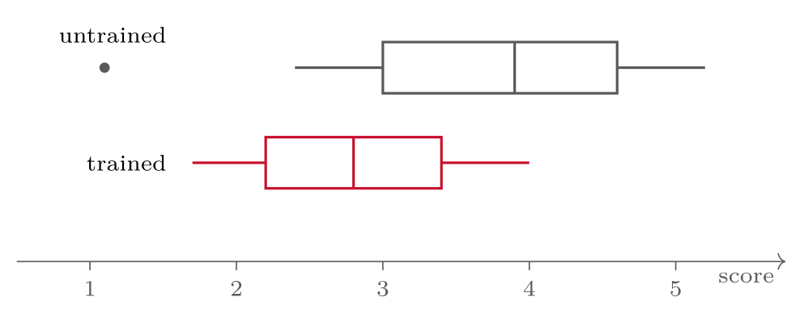

# Quantitative Data Collection and Analysis {#sec-08-quantitative-data}

::: {.callout-note appearance="simple" icon="false"}
**Session 8** · Thursday 29 October 2026 · reading: Oates, Chapters 15 and 17
:::

Numbers require design decisions before the first questionnaire is sent. This chapter covers the questionnaire as an instrument, the levels of measurement that decide which statistics are permitted, descriptive and inferential analysis, and the two words examiners look for: validity and reliability. Because most adoption studies in our field are surveys analysed with structural equation modelling, the chapter presents UTAUT2 as the workhorse theory, a survey study in nine steps, and the evaluation checklist for PLS-SEM.

## Questionnaires {#sec-08-questionnaires}

::: {.callout-note}
## Questionnaire

A questionnaire refers to a pre-defined set of questions, assembled in a fixed order, that respondents answer without the researcher present, so that the same data are collected from every respondent in the same way.
:::

Question wording is a craft with known failure modes: the double-barrelled item that asks two things at once; the leading item that suggests its answer; the ambiguous term that respondents interpret differently; the item that assumes a behaviour the respondent may not have; and the scale whose points do not match the question. Most first drafts contain at least one of these. Validated scales exist for most constructs in our field --- the UTAUT2 items are in the appendix of Venkatesh, Thong and Xu (2012) --- and reusing a validated scale is not laziness but method: the items have been tested for reliability and validity, and the results become comparable with the literature. Adaptation to a new setting is documented item by item, translation is checked by back-translation, and a pilot with ten to twenty respondents catches the ambiguities that the author cannot see.

## Levels of measurement {#sec-08-levels-of-measurement}

The level at which a variable is measured decides which statistics are permitted. Nominal data are categories without order --- operating system, role --- and allow counts and modes. Ordinal data have an order without equal distances --- Likert agreement, severity ratings --- and allow medians and rank-based tests. Interval and ratio data have equal distances, and ratio data a true zero --- response time in seconds, number of incidents --- and allow means, standard deviations and the parametric tests. The level is stated per item, because it decides both the descriptive statistics and the test later on; treating a five-point Likert item as interval is common practice in our field and should be stated as a decision rather than assumed.

## Analysis {#sec-08-analysis}

Analysis begins with description: frequencies and percentages, means and medians, spread, and visual displays that show the shape of the data before any test is run. Inference follows carefully. A statistical test asks whether an observed difference or association is unlikely under the assumption of no effect; the *p*-value reports that unlikelihood, and it says nothing about the size of the effect or its practical relevance. A test that returns *p* = 0.03 therefore leaves the most important question open: how large is the effect, and does it matter in practice? Effect sizes and confidence intervals are reported with every test, because a small effect in a large sample can be significant and irrelevant at the same time. The analysis plan --- variables, descriptives, the test with its justification, the tooling --- is written before the data arrive, and it names the one comparison the study rests on. A plan written after the data arrive invites the choice of whichever test happens to be significant.

## Quality {#sec-08-quality}

Two words summarise what examiners look for in quantitative work. Validity refers to whether the instrument measures what it claims to measure, and reliability to whether it measures consistently. Both have several faces --- content, construct and criterion validity; internal consistency and test--retest reliability --- and structural equation modelling formalises the most important of them into a checklist.

## Adoption surveys, UTAUT2 and PLS-SEM {#sec-08-adoption-surveys-utaut2-and-pls-sem}

Most adoption surveys in our field build on one theory. Venkatesh, Thong and Xu (2012) extended the unified theory of acceptance and use of technology to consumers: seven constructs --- performance expectancy, effort expectancy, social influence, facilitating conditions, hedonic motivation, price value and habit --- predict behavioural intention and use, moderated by age, gender and experience. Validated with 1,512 mobile internet users in Hong Kong, the extension raised the explained variance in intention from 56 to 74 per cent. Venkatesh, Thong and Xu (2016) synthesised the theory's use into a multi-level framework --- baseline UTAUT plus individual, technology, task, location and time contexts --- and set out a research agenda. The 2012 paper supplies a validated instrument; the 2016 paper supplies a map of what has already been tested, which is where an extension has to start.

A survey study runs in nine steps: (1) theory and model, with constructs and hypotheses from a validated theory and the model drawn; (2) the instrument, items from validated scales adapted to the setting, at least three per construct; (3) translation and pilot; (4) ethics and SIKT (Session 10); (5) sampling and distribution --- a defined population, a convenience, panel or random sample, Nettskjema for distribution and storage; (6) cleaning --- incomplete responses, straight-lining, attention checks, with what was removed reported; (7) the measurement model; (8) the structural model, with effect sizes and not only *p*-values; and (9) the report, with tables for descriptives, measurement and structural results, and limitations --- sample, self-report, common method bias. Huy et al. (2024) document all nine steps in five pages, and their method section is a good template for Part IV of the essay.

Structural equation modelling comes in two forms, and the choice is stated in the essay. Covariance-based SEM tests theory by reproducing the covariance matrix, prefers reflective measures and established theory, and needs larger samples and near-normal data; its software is AMOS, lavaan or Mplus, and Huy et al. (2024) used it. Partial least squares SEM aims at prediction and exploration by maximising explained variance, handles complex models with many constructs and formative measures, works with smaller samples and non-normal data, and runs in SmartPLS; Grassini et al. (2024) and Jo and Park (2024) used it. Both consist of a measurement model --- do the items measure the constructs? --- and a structural model --- do the constructs relate as hypothesised? Hair, Hult, Ringle and Sarstedt (2022) set out the criteria for PLS-SEM. For the measurement model: indicator loadings of at least 0.708; Cronbach's alpha and composite reliability between 0.70 and 0.95; average variance extracted of at least 0.50; and discriminant validity with HTMT below 0.90, or 0.85 when conservative. For the structural model: variance inflation factors below three, or at most five; path coefficients with bootstrapping over 5,000 to 10,000 subsamples, with significance and confidence intervals; the R² of the endogenous constructs and f² effect sizes; and predictive relevance with $Q^2_\text{predict}$. Every one of these numbers appears in the results of Grassini et al. (2024) and Jo and Park (2024). A survey paper without a measurement-model table is not assessable, and neither is an essay that plans one without saying which criteria it will apply.

Two PLS-SEM studies of ChatGPT show what the checklist produces. Grassini, Aasen and Møgelvang (2024) asked which UTAUT2 constructs explain students' intention to use ChatGPT; their sample was 104 students at universities in West and Central Norway, with a stop rule set in advance; they analysed with PLS-SEM in SmartPLS 4 and bootstrapping; performance expectancy had the strongest effect, followed by habit. Jo and Park (2024) asked how ChatGPT's perceived intelligence and self-learning affect information support, knowledge acquisition and use at work; their sample was 351 workers aged 20 to 40 in Korea, recruited through a polling company's panel; perceived intelligence and self-learning led to information support and knowledge acquisition, these to utilitarian benefits, and benefits to intention, with intention rather than benefits driving use. The two sampling decisions --- a small convenience sample with a pre-registered stop rule, and a paid panel --- are both defensible if stated and discussed, and neither generalises to "Norwegian students" or "Korean workers" as populations.

## Big data and mixed methods {#sec-08-big-data-and-mixed-methods}

Surveys are not the only source of numbers. Venkatesh, Brown and Sullivan (2023, Chapter 9) describe big data as data whose scale and complexity exceed conventional database tools --- large in volume, varied in source and form, fast in arrival --- and list its sources: clicks, transactions, user-generated content, social media and sensors. In security the list continues with logs, alerts and tickets. The authors' point is that both strands apply to such data: numbers, text, audio and video can be codified as quantitative and as qualitative data, analytics finds the patterns and relationships, and qualitative work supplies the meaning the numbers cannot. The design strategies for analytics research follow the same five aspects as any mixed-methods design --- what is explored and what confirmed, how many strands, in which order, with which priority, and where the strands are mixed. For a cyber security thesis the consequence is concrete: a SIEM export is a quantitative strand waiting for a question, and interviews with the analysts who triage the alerts are the qualitative strand that explains the pattern. Stating the purpose of the combination (Chapter 2) turns two data sets into one study.

## Worked examples and tables {#sec-08-worked-examples-and-tables}

### Item wording --- failures and repairs

::: {#tbl-08-1}
  **Failure**         **Example --- and why it breaks**
  ------------------- -------------------------------------------------------------------
  Leading             "Don't you agree that MFA is important?" --- pushes the answer
  Double-barreled     "Is the app fast and easy to use?" --- fast *or* easy?
  Jargon              "How often do you rotate credentials?" --- rotate what?
  Vague quantifiers   "Do you often reuse passwords?" --- often for whom?
  Memory overreach    "How many phishing mails did you get last year?" --- nobody knows

Item wording: the failures and why they break
:::

::: {.callout-important}
## The one defence that catches all five

**Pilot the questionnaire** on 3--5 people who match your respondents --- watch them fill it in, ask where they hesitated. Report the pilot in Part IV; it is evidence of method quality.
:::

::: {#tbl-08-2}
  **Broken**                             **Repaired**
  -------------------------------------- ---------------------------------------------------------------------------------------------
  Don't you agree MFA is important?      How important is MFA for your daily work? (1--5)
  Is the app fast and easy to use?       The app responds quickly. (1--5) + The app is easy to use. (1--5)
  How often do you rotate credentials?   How often do you change your work passwords?
  Do you often reuse passwords?          For how many of your work accounts do you use the same password? (none / some / most / all)
  How many phishing mails last year?     In the past month, how many suspicious e-mails do you recall receiving?

Item wording: broken and repaired
:::

Each repair does one thing: removes the push, splits the pair, drops the jargon, anchors the quantifier, or shrinks the recall window.

### Norwegian practicalities and validated scales

-   **Tool:** Nettskjema (via UiA) keeps data inside an approved system --- relevant the moment you collect anything person-related.

-   **SIKT:** if you collect personally identifiable data (even e-mail addresses, even indirectly identifying combinations), the project may need SIKT notification --- session 10 covers this; plan for it *now*.

-   **Anonymity vs. confidentiality:** anonymous = you *cannot* link answers to persons; confidential = you can but won't. Say which one you promise --- and mean it.

-   **Response reality:** expect 10--30 % response rates for cold e-mail surveys. Plan the denominator accordingly.

<!-- -->

-   **SUS** (System Usability Scale): 10 fixed items, alternating direction, scored to a 0--100 usability value --- decades of benchmark data to compare against.

-   **UTAUT-style acceptance items:** constructs like performance expectancy or effort expectancy, each measured with 3--4 Likert items averaged into a scale score.

-   In your essay, reuse looks like one sentence: *"Usability will be measured with the SUS (Brooke, 1996); security fatigue with the scale from \[source\], adapted to Norwegian."*

::: {.callout-important}
## Adaptation warning

Translating or trimming a validated scale changes it --- say what you changed, and pilot the adapted version.
:::

### Sampling scenarios

::: {#tbl-08-3}
  **Scenario**                         **What it is**               **What you may claim**
  ------------------------------------ ---------------------------- ----------------------------------------------------------------------------------
  fellow students answer your survey   convenience sample           patterns among IT students here --- not "employees"
  all 60 staff at the client           census of one organisation   solid claims about this organisation; generalise analytically, not statistically
  link posted in a developer forum     self-selected volunteers     exploratory signals; heavy self-selection bias --- name it

Sampling scenarios and what each allows you to claim
:::

None of these is forbidden --- each licenses a **different sentence** in your conclusions. Write the sentence you can afford.

### Levels of measurement and descriptives

::: {#tbl-08-4}
  **Level**   **Example**                            **Allowed**                **Typical summary**
  ----------- -------------------------------------- -------------------------- ----------------------
  Nominal     OS: Windows / macOS / Linux            count, compare             mode, frequencies
  Ordinal     Likert 1--5; severity low--high        rank                       median, distribution
  Interval    temperature in °C                      differences                mean, SD
  Ratio       response time in ms; count of alerts   everything, incl. ratios   mean, SD, ratios

Levels of measurement: example, allowed operations and typical summary
:::

Why it matters: the level decides the **legal operations**. A mean of nominal codes is nonsense; a mean of Likert items is debated --- the safe master's answer is: report medians and distributions for single Likert items, means for validated multi-item scales. *Based on Oates et al. (2022), Ch. 17*

-   **Centre:** mean (interval/ratio), median (ordinal, or skewed data), mode (nominal)

-   **Spread:** standard deviation, range, quartiles --- a mean without spread hides more than it shows

-   **Pictures before tests:** histograms and boxplots reveal skew, outliers and data-entry errors that summary numbers hide

::: {.callout-note}
## Worked example --- the phishing experiment (session 6)

Click-through: warning A 18 % (n = 120), warning B 9 % (n = 120). Descriptives already tell the story --- the difference is 9 percentage points. The question the next slide answers: could that difference be chance?
:::

Survey (n = 84, client staff), three scale scores (1--5):

::: {#tbl-08-5}
  **Scale**                  **Mean**   **Median**   **SD**   **n**
  ------------------------- ---------- ------------ -------- -------
  Security fatigue             3.6          4         0.9      84
  Perceived account value      2.8          3         1.2      84
  Reported reuse               3.1          3         0.7      82

Descriptive statistics for a scale: mean, median, standard deviation and n
:::

How to read it aloud: fatigue is high and fairly consistent (small SD); account value is mid and **divided** (large SD --- two camps?); two people skipped the reuse items (report the missing data, don't hide it). This paragraph *is* descriptive analysis --- before any test.

The same fatigue scores, plotted per group before any test:

{#fig-08-1}

What the picture says before any p-value: the untrained group sits higher *and* spreads wider; one outlier (the dot) would drag a mean --- check whether it is a data-entry error before testing. Two minutes of plotting prevents the most embarrassing class of analysis mistakes.

### Inference, tests and effect size

-   **The logic:** could a difference (or association) this large plausibly arise by chance if there were no real effect? The **p-value** is the probability of data at least this extreme *under that no-effect assumption* --- nothing more.

-   **What p is not:** not the probability the hypothesis is true; not a measure of importance. Always report the **effect size** (how big?) next to the p-value (how surprising?).

-   **Correlation ≠ causation:** only the experiment's design --- randomisation, control --- licenses the word *because*. A survey correlation never does.

::: {#tbl-08-6}
  **Master's-feasible situation**         **Test**
  --------------------------------------- -------------
  compare two group means                 t-test
  compare frequencies across categories   chi-square
  association of two numeric variables    correlation

Master's-feasible situations and the test that fits each
:::

*Tools: JASP (free, point-and-click), Excel, R/Python*

Essay Part IV wants the plan, not the results. A complete quantitative analysis plan states:

1.  **Variables:** name each one, its measurement level, and how it is operationalised (which items? which log field?)

2.  **Descriptives:** which summaries and figures, per variable

3.  **Tests (if any):** which comparison or association, which test, and *why that test fits the data type*

4.  **Tooling:** the software you will use

::: {.callout-note}
## Example line

"Password-reuse (self-report, 5-point Likert, three items averaged) will be described with medians and distributions and compared between trained and untrained employees with a t-test on the scale mean; analysis in JASP."
:::

::: {#tbl-08-7}
  **Situation**                                         **Test**      **Because**
  ----------------------------------------------------- ------------- --------------------------------------------------
  fatigue scale mean: trained vs. untrained employees   t-test        two groups, one interval-treated scale score
  clicked / didn't click × warning A / B                chi-square    two categorical variables, frequencies
  fatigue score vs. reported reuse score                correlation   two numeric variables, association not causation

Matching test to situation, with the reason
:::

The reasoning column is what Part IV wants --- the test name alone is a guess; the *because* shows you matched test to data type.

::: {#tbl-08-8}
  **Study**                      **p-value**   **Effect**
  ------------------------------ ------------- ------------------------------------
  warning redesign, n = 240      p = .03       9 percentage points fewer clicks
  warning redesign, n = 24,000   p \< .001     0.4 percentage points fewer clicks

p-values and effect sizes side by side
:::

The second study is *more* "significant" and *less* important: with enough data, trivial differences become statistically detectable. The decision-relevant number is the **effect size** --- report both, interpret the effect.

**Validity**\
*does the item measure what it claims?*

-   "How secure do you feel?" does not measure how secure anyone *is*

-   defence: validated instruments; pilot; triangulate self-report with behaviour where possible

**Reliability**\
*would it measure the same tomorrow?*

-   ambiguous wording → answers vary randomly

-   defence: clear items, multi-item scales, report internal consistency for scales you reuse

In Part IV's **limitations** discussion, name the validity threats you *cannot* remove (self-report bias, convenience sample) --- naming them honestly is rewarded; hiding them is found.

### UTAUT2 and PLS-SEM

**UTAUT2 (2012)** --- seven constructs predict **behavioural intention** and **use**:

-   performance expectancy, effort expectancy, social influence, facilitating conditions

-   hedonic motivation, price value, habit (added for consumers)

-   moderators: age, gender, experience

Validated with 1,512 mobile internet users in Hong Kong; explained variance in intention rose from 56 to 74 per cent.

**The synthesis (2016)** --- a multi-level framework: baseline UTAUT plus individual, technology, task, location and time contexts; a review of how the theory has been extended, and a research agenda.

::: {.callout-note}
## What this gives you

A validated instrument (the items are in the appendix of the 2012 paper) and a map of what has already been tested --- which is where your extension has to start.
:::

*Every ChatGPT study we have read this semester builds on this line: Biloš & Budimir, Huy et al., Grassini et al., Jo & Park.*

::: {#tbl-08-9}
             **PLS-SEM (partial least squares)**                        **CB-SEM (covariance-based)**
  ---------- ---------------------------------------------------------- --------------------------------------------------
  Aim        Prediction and exploration; maximises explained variance   Theory testing; reproduces the covariance matrix
  Model      Complex models, many constructs, formative measures        Reflective measures, established theory
  Data       Works with smaller samples and non-normal data             Needs larger samples and near-normal data
  Software   SmartPLS                                                   AMOS, lavaan (R), Mplus
  Used in    Grassini et al. (2024); Jo & Park (2024)                   Huy et al. (2024)

PLS-SEM and CB-SEM compared
:::

Both belong to structural equation modelling: a **measurement model** (do the items measure the constructs?) and a **structural model** (do the constructs relate as hypothesised?). Choose by aim and data --- and say why in the essay.

**Measurement model (reflective)**

-   Indicator loadings ≥ 0.708

-   Internal consistency: Cronbach's α and composite reliability between 0.70 and 0.95

-   Convergent validity: AVE ≥ 0.50

-   Discriminant validity: HTMT below 0.90 (conservative: 0.85)

**Structural model**

-   Collinearity: VIF below 3 (at most 5)

-   Path coefficients with bootstrapping (5,000--10,000 subsamples): significance and confidence intervals

-   R² of the endogenous constructs; f² effect sizes

-   Predictive relevance: $Q^2_\text{predict}$

::: {.callout-important}
## Report all of it

Every number above appears in the results section of Grassini et al. (2024) and Jo & Park (2024). A survey paper without a measurement-model table is not assessable --- neither is an essay that plans one without saying which criteria it will apply.
:::

::: {#tbl-08-10}
             **Grassini, Aasen & Møgelvang (2024)**                                                                         **Jo & Park (2024)**
  ---------- -------------------------------------------------------------------------------------------------------------- ------------------------------------------------------------------------------------------------------------------------------------------------------------------
  Question   Which UTAUT2 constructs explain students' intention to use ChatGPT, and their use?                             How do ChatGPT's perceived intelligence and self-learning affect information support, knowledge acquisition and use at work?
  Sample     104 students at universities in West and Central Norway; stop rule set in advance (date or 100 participants)   351 workers aged 20--40, Korea, recruited through a polling company's panel
  Analysis   PLS-SEM in SmartPLS 4, bootstrapping                                                                           PLS-SEM; measurement then structural model
  Result     Performance expectancy strongest, then habit; the adapted model explains a large share of intention            Perceived intelligence and self-learning → information support and knowledge acquisition → utilitarian benefits → intention; intention, not benefits, drives use

Two UTAUT2 studies of ChatGPT use, side by side
:::

Note the two sampling decisions: a small convenience sample with a pre-registered stop rule, and a paid panel. Both are defensible if they are stated and their limits discussed --- neither generalises to "Norwegian students" or "Korean workers" as populations.

## Terms from this session {#sec-08-terms-from-this-session .unnumbered}

::: {#tbl-08-terms}
  ------------------------------ ------------------------------------------------------------------------
  **Likert scale**               ordered response scale (e.g. 1--5 agreement); single items are ordinal
  **Validated instrument**       published, tested item set for a construct (SUS, UTAUT items)
  **Pilot**                      trial run of the questionnaire on a few matching respondents
  **Measurement level**          nominal / ordinal / interval / ratio --- decides legal operations
  **Descriptive statistics**     summaries of the data at hand: centre, spread, distributions
  **p-value**                    probability of data at least this extreme, assuming no real effect
  **Effect size**                how large the difference or association is --- report it with p
  **Validity (instrument)**      the item measures what it claims to measure
  **Reliability (instrument)**   the item measures consistently
  ------------------------------ ------------------------------------------------------------------------

Terms from Session 8
:::

## Questions from the reading {#sec-08-questions-from-the-reading .unnumbered}

::: {#exr-08-good-questionnaire-question}
## Good questionnaire question

According to Oates, what makes a **good questionnaire question**?
:::

::: {#exr-08-four-levels-of-measurement}
## Four levels of measurement

What are the **four levels of measurement** --- and why do they matter?
:::

::: {#exr-08-spread}
## Spread

Why should you report **spread**, not just the mean?
:::

::: {#exr-08-p-value}
## P-value

What does a **p-value** tell you --- and what does it *not* tell you?
:::

## Questions for discussion {#sec-08-questions-for-discussion .unnumbered}

::: {#exr-08-your-items}
## Your items

**Your items** --- draft three questionnaire items for your research question and state each item's level of measurement. Check them against the five failure modes.
:::

::: {#exr-08-the-analysis-plan}
## The analysis plan

**The analysis plan** --- variables, descriptives, test (if any) with justification, tooling: write it before the data arrive. What is the one comparison your study rests on?
:::

::: {#exr-08-effect-size}
## Effect size

**Effect size** --- your test returns *p* = 0.03. What do you still not know?
:::

## Interactive exercises {#sec-08-interactive-exercises .unnumbered}

Sort, order and pick: every exercise below is answerable from this chapter and checks itself.



## Key points {#sec-08-key-points .unnumbered}

-   Questionnaires: question wording is a craft; validated scales exist --- UTAUT2 is the workhorse

-   Levels of measurement decide what you may compute

-   A survey study in nine steps; PLS-SEM or CB-SEM, chosen by aim and data

-   The PLS-SEM checklist: loadings, reliability, AVE, HTMT; VIF, bootstrapped paths, R², f², Q²

## Sources {#sec-08-sources .unnumbered}

-   Grassini, S., Aasen, M. L., & Møgelvang, A. (2024). Understanding university students' acceptance of ChatGPT: Insights from the UTAUT2 model. *Applied Artificial Intelligence*, *38*(1), 2371168. <https://doi.org/10.1080/08839514.2024.2371168>

-   Hair, J. F., Hult, G. T. M., Ringle, C. M., & Sarstedt, M. (2022). *A primer on partial least squares structural equation modeling (PLS-SEM)* (3rd ed.). SAGE. --- Chapter 1.

-   Huy, L. V., Nguyen, H. T. T., Vo-Thanh, T., Thinh, N. H. T., & Tran, T. T. D. (2024). Generative AI, why, how, and outcomes: A user adoption study. *AIS Transactions on Human-Computer Interaction*, *16*(1), 1--27. <https://doi.org/10.17705/1thci.00198>

-   Jo, H., & Park, D.-H. (2024). AI in the workplace: Examining the effects of ChatGPT on information support and knowledge acquisition. *International Journal of Human--Computer Interaction*, *40*(23), 8091--8106. <https://doi.org/10.1080/10447318.2023.2278283>

-   Venkatesh, V., Thong, J. Y. L., & Xu, X. (2012). Consumer acceptance and use of information technology: Extending the unified theory of acceptance and use of technology. *MIS Quarterly*, *36*(1), 157--178. <https://doi.org/10.2307/41410412>

-   Venkatesh, V., Thong, J. Y. L., & Xu, X. (2016). Unified theory of acceptance and use of technology: A synthesis and the road ahead. *Journal of the Association for Information Systems*, *17*(5), 328--376. <https://doi.org/10.17705/1jais.00428>

-   Venkatesh, V., Brown, S. A., & Sullivan, Y. W. (2023). *Conducting mixed-methods research: From classical social sciences to the age of big data and analytics*. Virginia Tech Pamplin College of Business in association with Virginia Tech Publishing. <https://doi.org/10.21061/conducting-mixed-methods-research>

-   Oates, B. J., Griffiths, M., & McLean, R. (2022). *Researching information systems and computing* (2nd ed.). SAGE. --- Chapters 15 (Questionnaires) and 17 (Quantitative data analysis).
