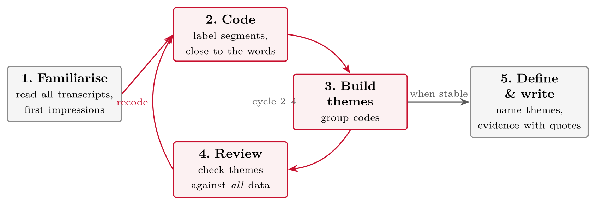

# Qualitative Data Collection and Analysis {#sec-09-qualitative-data}

::: {.callout-note appearance="simple" icon="false"}
**Session 9** · Thursday 5 November 2026 · reading: Oates, Chapters 13--14, 16 and 18
:::

Qualitative data --- interviews, observations, documents --- demand the same rigour as numbers, with different tools. This chapter covers the interview guide, systematic and participant observation, documents as data, and thematic analysis from transcript to theme. The argument for the number of participants is made with information power rather than saturation, and published studies show what a defensible qualitative data plan looks like.

## Interviews {#sec-09-interviews}

::: {.callout-note}
## Interview

An interview refers to a conversation between researcher and participant that has a purpose, an agenda and a documented guide, and in which the researcher generates data by asking and listening.
:::

Interviews come in three degrees of structure. A structured interview asks the same fixed questions of everyone and is close to a questionnaire read aloud; a semi-structured interview follows a guide of open questions with room for probes and reordering; an unstructured interview starts from a topic and follows the participant. Most master's theses use the semi-structured form, and the guide is its instrument: an opening that settles the participant, two or three core questions that address the research question, probes that follow the material --- "what happened then?" --- and a closing that asks what was missed. Good questions are open, concrete and not leading: "tell me about the last time you ..." asks for an episode and produces data, whereas "do you think X is important?" produces a yes. The practicalities are known and still neglected: a pre-tested guide, consent obtained before recording, a quiet setting, audio recording and verbatim transcription, and a note after each interview on what surprised the interviewer.

Mayer, Baygi and Buwalda (2025) show what a published interview study reports. They interviewed entry-level professionals first, and then senior consultants and managers once the first interviews raised questions about how seniors perceive the change --- the sample followed the analysis. The interviews were semi-structured, about 45 minutes, audio-recorded and transcribed verbatim, and the guide is published in the appendix. Three known forms of job crafting came out of the data and one new form, signal crafting, which the guide had not asked for. The parts to copy are two: the sampling decision is explained as a consequence of the analysis, and the guide is published. Both belong in Part IV of the essay.

## Observations and documents {#sec-09-observations-and-documents}

::: {.callout-note}
## Observation

Observation refers to watching and recording what people actually do, as opposed to what they say they do, either systematically with a predefined schedule or as a participant in the setting.
:::

Systematic observation uses a schedule of categories and counts occurrences; participant observation immerses the researcher in the setting and records field notes. Both raise the question of the observer's effect, which the essay addresses rather than ignores. Documents are the third source: policies, incident reports, meeting minutes, logs, job postings and software repositories are data that already exist, and the method questions are the same as for interviews --- which corpus, why, how selected and how coded. Boodraj et al. (2026) show documents at scale: they asked which skills and competencies are most in demand for cyber security project managers, took 5,841 cyber security project manager and 155,436 IT project manager job postings from 2014 to 2025 from a labour market database, analysed them with Python-based text analytics, and plan a market basket analysis of co-occurring skills; their preliminary finding is that employers ask for dual-domain certifications and for interpersonal and team skills.

## Analysis {#sec-09-analysis}

::: {.callout-note}
## Thematic analysis

Thematic analysis refers to a method for identifying, analysing and reporting patterns --- themes --- in qualitative data, through a documented sequence of familiarisation, coding, theme development, review and definition.
:::

The sequence runs from the transcript to the theme, and every step is visible. Familiarisation means reading the material more than once; coding means labelling segments with what they are about; themes group codes into patterns that answer the research question; reviewing tests the themes against the whole data set; and defining names each theme and states what it captures. Two people who code the same transcript independently will disagree on a third of the codes, and that is the normal starting point rather than a problem: the disagreements are discussed, the code book refined, and the procedure reported --- which is what quality in qualitative analysis looks like, not a percentage. Software such as NVivo supports the bookkeeping; it does not do the analysis.

## The qualitative data plan {#sec-09-the-qualitative-data-plan}

Part IV of the essay asks for a data plan with five elements: participants, method, handling, analysis and limitations. The number of participants is argued rather than asserted. "Saturation" is tied to grounded theory and used inconsistently; Malterud, Siersma and Guassora (2016) propose information power instead. The more relevant information the sample holds, the fewer participants are needed, and five dimensions decide it: a narrow study aim needs fewer participants than a broad one; a dense sample, whose participants hold exactly the experience sought, needs fewer than a sparse one; a study that applies established theory needs fewer than one that does not; a strong dialogue --- clear, focused, articulate --- needs fewer than a weak one; and case analysis in depth needs fewer than cross-case analysis. "Eight interviews with SOC analysts, a narrow aim, a dense sample and UTAUT as a lens" is an argument; "until saturation" is not, and the argument is revisited during data collection.

The honest limitations of most qualitative theses are access and self-report: a small purposive sample from one organisation, and accounts of behaviour rather than behaviour. Naming them is judgement; hiding them is a weakness.

## Worked examples and tables {#sec-09-worked-examples-and-tables}

### The interview guide, practicalities and probing

For the question *"what does 'secure enough' mean to sysadmins in small businesses?"*:

1.  **Opening (easy, factual):** "Can you walk me through a normal day in your role?"

2.  **Core (open, experience-near):** "Tell me about the last time you decided something was secure enough to ship."

3.  **Probe (follow the answer):** "You said 'good enough for us' --- what makes it good enough *here*?"

4.  **Contrast:** "Was there a time you were overruled on a security decision? What happened?"

5.  **Closing:** "Is there anything about this topic I should have asked and didn't?"

Rules visible in the example: **open** questions, **concrete episodes** (not opinions in general), **no leading**, probes prepared but flexible.

-   **How many?** Until **saturation**: new interviews stop producing new themes. At master's scale, 6--12 semi-structured interviews of 30--60 minutes is a defensible plan --- *state the saturation logic*, don't just state a number.

-   **Recording:** always ask consent, always record (notes lie); audio only. Use the **Nettskjema diktafon app** --- audio goes straight to approved storage instead of your phone's cloud backup (session 10 explains why that matters).

-   **Transcription:** verbatim for the parts you analyse; budget 4--6 hours of transcription per interview hour --- this is where qualitative time actually goes.

-   **Pilot** the guide once, exactly like a questionnaire.

::: {#tbl-09-1}
  **Broken**                                     **Repaired**
  ---------------------------------------------- ------------------------------------------------------------------
  Don't you find security policies annoying?     How do the security policies affect your daily work?
  Do you follow the password policy? (yes/no)    Tell me about the last time the password policy got in your way.
  Why is your team bad at reviews?               How do reviews typically go in your team?
  What do you think about security in general?   Describe a recent security decision you were part of.
  Would you say training helps?                  What, if anything, changed after the last training?

Interview questions: broken and repaired
:::

The repairs share a pattern: **open** instead of yes/no, **episodes** instead of opinions, **neutral** instead of loaded.

-   **P:** "We just click through the warnings, honestly."

-   **Weak follow-up:** "So you ignore security?" *(judgement --- shuts the door)*

-   **Probe 1 --- elaborate:** "Walk me through the last time that happened."

-   **Probe 2 --- clarify:** "When you say *we* --- is that the whole team?"

-   **Probe 3 --- contrast:** "Was there ever a warning you didn't click through? What was different?"

Probes are prepared **types**, not prepared sentences: elaborate, clarify, contrast, and --- hardest --- **silence**. Two seconds of it produces more data than any question.

### Observations, field notes and documents

::: {.callout-note}
## Observation

Systematically watching and recording what people **actually do** in the setting --- overt or covert, participant or non-participant --- captured in structured **field notes**.
:::

::: {.callout-note}
## Documents

Existing materials analysed as data: **found documents** (incident reports, policies, commit messages, pull-request threads, meeting minutes) or **researcher-generated** ones (diaries you ask participants to keep).
:::

Why they matter: interviews get the *account*; observation gets the *behaviour*; documents get the *trace*. Where the three disagree, the interesting finding usually lives. *Oates et al. (2022), Ch. 14, 16*

::: {.callout-note}
## RQ: how does a development team actually handle security warnings?

-   **Interviews:** developers *say* they review every warning before merging.

-   **Documents:** the CI logs and pull requests show warnings suppressed with `ignore` flags in a third of merges.

-   **Observation:** in sprint pressure, warnings are triaged in seconds --- by habit, not policy.
:::

The finding is the **gap between account, trace and behaviour** --- reachable only because three methods were combined. One method would have reported either compliance or cynicism; the combination explains *when* each is true.

::: {#tbl-09-2}
  **Descriptive (what happened)**                                                                                     **Interpretive (what I make of it)**
  ------------------------------------------------------------------------------------------------------------------- ---------------------------------------------------------------------------------
  10:14 --- build fails on security scan; A groans, adds `ignore` flag without opening the finding; nobody comments   suppression is routinised --- no discussion needed, so the norm is settled
  10:40 --- B asks A "real one?"; A shrugs: "same as always"                                                          a shared classification exists ("real ones" vs. noise) that no document defines

Field notes: descriptive and interpretive columns
:::

Keep the two columns **separate**: the left is evidence, the right is analysis-in-progress. Mixing them is how observations quietly become opinions.

::: {.callout-note}
## Corpus: 6 months of pull requests in the client's main repository

Extract per PR: review turnaround, number of comments, whether the security checklist was mentioned, who approved.
:::

-   **Found** documents: produced for work, not for you --- so they show behaviour without observer effects

-   But they answer only what they record: turnaround yes, the *reasoning* no --- pair them with interviews

-   Practicalities: written permission for repository access; strip author names before analysis; note the corpus boundary (which repos, which period) in Part IV

### Thematic analysis --- process, coding, quality

{#fig-09-1}

Steps 2--4 are a **cycle**, not a sequence: reviewing themes sends you back to recode, often several times. You exit to writing only when new passes stop changing the themes. Inductive by default: the codes come **from the data**, not from a list made in advance. *Based on Oates et al. (2022), Ch. 18*

::: {#tbl-09-3}
  **Transcript (sysadmin, small business)**                               **Code**                     **Theme**
  ----------------------------------------------------------------------- ---------------------------- --------------------------------
  "Honestly, I patch when something breaks. There's no time otherwise."   reactive patching            security as time negotiation
  "The boss asks what security costs, never what it saves."               cost framing by management   security as time negotiation
  "After the incident next door, suddenly everything was urgent."         incident as trigger          external events drive priority

From transcript to code to theme
:::

Notice: codes stay **close to the words**; themes **interpret** across codes. In the write-up, every theme is evidenced with 1--2 **verbatim quotes** --- the qualitative equivalent of reporting your numbers.

Interviews with frontend developers on accessibility work:

::: {#tbl-09-4}
  **Codes (close to the words)**                      **Grouped**              **Theme**
  --------------------------------------------------- ------------------------ ----------------------------------------
  "no ticket, no time"; "sprint has no a11y column"   work not planned         accessibility is invisible work
  "I learned it from Maria"; "one person owns it"     knowledge in persons     expertise is a single point of failure
  "audit panic in March"; "then it faded"             event-driven attention   compliance is episodic, not continuous

Codes grouped into themes
:::

Note the movement left to right: quotes → codes → interpretation. Every theme can be traced back to words someone actually said --- that traceability is your quality argument.

-   **Transparency:** document the coding process --- how codes arose, how themes were built. A small **code book** (code, definition, example quote) in the appendix does this.

-   **Second coder:** two people code a subset independently and discuss to consensus --- the procedure used in the review you saw in session 5. At master's scale, even coding *two* transcripts in pairs strengthens the method section.

-   **Evidence, not anecdote:** themes carried by quotes from *several* participants; note disconfirming cases instead of hiding them.

-   **Tools:** a table in Word does the job at 6--12 interviews; dedicated software (e.g. NVivo) only pays off at larger scale.

### Information power and the data plan

"Saturation" is tied to grounded theory and is used inconsistently. Malterud et al. propose **information power**: the more relevant information the sample holds, the fewer participants are needed. Five dimensions decide it:

::: {#tbl-09-5}
  **Dimension**         **Fewer participants**                                   **More participants**
  --------------------- -------------------------------------------------------- ----------------------------
  Study aim             Narrow                                                   Broad
  Sample specificity    Dense: participants hold exactly the experience sought   Sparse
  Established theory    Applied                                                  Not applied
  Quality of dialogue   Strong: clear, focused, articulate                       Weak
  Analysis strategy     Case analysis (in-depth, few)                            Cross-case analysis (many)

Information power: what calls for fewer or more participants
:::

For your essay: argue the sample size with these five, before data collection, and revisit it during collection. "Eight interviews with SOC analysts, a narrow aim, a dense sample and UTAUT as a lens" is an argument; "until saturation" is not.

1.  **Participants:** who, how recruited, how many --- with the saturation logic stated

2.  **Method:** interview type and guide (appendix), or observation protocol, or document corpus and access

3.  **Data handling:** recording, transcription, storage --- consistent with consent and SIKT (session 10)

4.  **Analysis:** thematic analysis, the five steps, coding approach, quality measures (code book, second coder)

5.  **Limitations:** researcher influence, sample scope, self-report vs. behaviour --- named, not hidden

::: {.callout-note}
## Example line

"Eight semi-structured interviews (30--45 min) with sysadmins recruited via the client's network, recorded and transcribed verbatim, analysed thematically with an inductively developed code book; two transcripts double-coded."
:::

## Terms from this session {#sec-09-terms-from-this-session .unnumbered}

::: {#tbl-09-terms}
  ------------------------------- --------------------------------------------------------------------
  **Semi-structured interview**   interview guide plus freedom to follow up --- the master's default
  **Interview guide**             the planned questions and probes; goes in the appendix
  **Saturation**                  the point where new data stops producing new themes
  **Field notes**                 structured written record of observations
  **Found documents**             existing materials analysed as data (logs, policies, PR threads)
  **Code**                        a short label for a meaningful data segment, close to the words
  **Theme**                       an interpretation that groups codes across the data
  **Code book**                   table of codes with definitions and example quotes
  **Second coder**                independent coding of a subset, compared to consensus
  ------------------------------- --------------------------------------------------------------------

Terms from Session 9
:::

## Questions from the reading {#sec-09-questions-from-the-reading .unnumbered}

::: {#exr-09-structured}
## Structured

**Structured** vs. **semi-structured** interviews --- what exactly changes?
:::

::: {#exr-09-field-notes}
## Field notes

What belongs in good **field notes**?
:::

::: {#exr-09-found}
## Found

**Found** vs. **researcher-generated** documents --- one example of each?
:::

::: {#exr-09-transcript}
## Transcript

What are the steps that lead from a **transcript** to a **theme**?
:::

## Questions for discussion {#sec-09-questions-for-discussion .unnumbered}

::: {#exr-09-your-interview-guide}
## Your interview guide

**Your interview guide** --- opening, two core questions, one probe, closing: draft it for your research question. Is each question open, concrete and not leading?
:::

::: {#exr-09-coding-a-fragment}
## Coding a fragment

**Coding a fragment** --- two people code the same transcript independently. They disagree on a third of the codes. Is that a problem?
:::

::: {#exr-09-your-qualitative-data-plan}
## Your qualitative data plan

**Your qualitative data plan** --- participants, method, handling, analysis, limitations: write the paragraph. Which limitation is the honest one?
:::

## Interactive exercises {#sec-09-interactive-exercises .unnumbered}

Sort, order and pick: every exercise below is answerable from this chapter and checks itself.



## Key points {#sec-09-key-points .unnumbered}

-   Interviews: a conversation with a purpose and a documented guide

-   Observations and documents: what people do, and what their work leaves behind

-   Thematic analysis: from transcript to theme, every step visible

-   The qualitative data plan --- the same rigour as the numbers

## Sources {#sec-09-sources .unnumbered}

-   Malterud, K., Siersma, V. D., & Guassora, A. D. (2016). Sample size in qualitative interview studies: Guided by information power. *Qualitative Health Research*, *26*(13), 1753--1760. <https://doi.org/10.1177/1049732315617444>

-   Woodruff, A., Shelby, R., Kelley, P. G., Rousso-Schindler, S., Smith-Loud, J., & Wilcox, L. (2024). How knowledge workers think generative AI will (not) transform their industries. In *Proceedings of the CHI Conference on Human Factors in Computing Systems (CHI '24)*. ACM. <https://doi.org/10.1145/3613904.3642700>

-   Boodraj, M., Fairbanks, J., Davies, C., & Akcakaya, O. (2026). Beyond the firewall: The rise of the cybersecurity project manager. In *AMCIS 2026 Proceedings* (Emergent Research Forum paper). AIS. <https://aisel.aisnet.org/amcis2026/sig_itpm/sig_itpm/2>

-   Mayer, A.-S., Baygi, R. M., & Buwalda, R. (2025). Generation AI: Job crafting by entry-level professionals in the age of generative AI. *Business & Information Systems Engineering*, *67*(5), 595--613. <https://doi.org/10.1007/s12599-025-00959-x>

-   Oates, B. J., Griffiths, M., & McLean, R. (2022). *Researching information systems and computing* (2nd ed.). SAGE. --- Chapters 13--14, 16 and 18 (Interviews; Observations; Documents; Qualitative data analysis).
