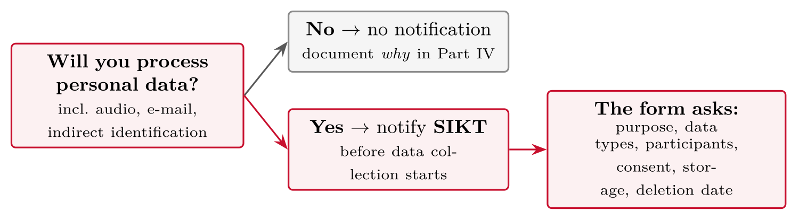

# Ethics in Research {#sec-10-ethics}

::: {.callout-note appearance="simple" icon="false"}
**Session 10** · Thursday 12 November 2026 · reading: Oates, Chapters 4--5
:::

Research ethics is not paperwork: it is the part of the design that decides whether the study may be done at all, and how. This chapter covers personal data and the law, informed consent, anonymity versus confidentiality, the SIKT notification and the data management plan, and three special zones --- public data, security research and AI tools. It ends with the references every student should keep at hand, including the University of Agder's own guidelines.

## The law {#sec-10-the-law}

::: {.callout-note}
## Personal data

Personal data refers to any information relating to an identified or identifiable person --- directly, such as a name or e-mail address, or indirectly, such as an IP address, a voice recording, or a job title in a small organisation.
:::

Personal data is broader than it looks, and the law obliges the researcher. E-mail addresses, IP addresses, voice recordings and free-text answers are personal data; so are job titles in a small organisation, because they identify indirectly. The General Data Protection Regulation and the Norwegian Personal Data Act set the frame: a legal basis for processing, information to the persons concerned, minimisation, secure storage, and deletion when the purpose is fulfilled. If anything on the data inventory of a study is personal data, the SIKT notification follows.

## Participants' rights {#sec-10-participants-rights}

::: {.callout-note}
## Informed consent

Informed consent refers to a participant's agreement to take part, given freely after being told what the study is for, what participation involves, how data are stored and deleted, that withdrawal is possible at any time, and whom to contact.
:::

Consent is documented, usually with a form that states purpose, procedure, storage and deletion, the right to withdraw, and contact details. Two promises are often confused. Confidentiality means that the researcher knows who said what and does not reveal it; anonymity means that no one, including the researcher, can link the data to a person. Confidentiality can be promised; anonymity only if the data will never be linkable --- which is rarely true of interviews, and never true of a recorded voice. The client problem follows: examiners sign no non-disclosure agreement, and client-confidential details, especially vulnerabilities, do not belong in the graded essay. Anonymisation is planned before data collection, not after.

## SIKT in practice {#sec-10-sikt-in-practice}

SIKT --- the Norwegian agency for shared services in education and research --- assesses the processing of personal data in research. The notification is submitted before data collection, and the assessment takes weeks, which are planned into the timeline. It asks what is collected, from whom, on what legal basis, how it is stored and when it is deleted; the data management plan answers the same questions for the researcher's own use. Nettskjema, developed and run by the University of Oslo and available to UiA users, keeps survey and consent data in Norway and has consent text and anonymous forms built in. Four worked cases in the session --- a survey with e-mail addresses, an analysis of public GitHub data, interviews at a client, and a phishing simulation --- show that the answers differ by case, and that the paperwork is the design, not an appendix to it.

## Special zones {#sec-10-special-zones}

Three areas need extra care. Public data are not free of ethics: forum posts, GitHub commits and Discord messages are publicly visible, but the authors expect an audience of peers rather than researchers, and quoting them verbatim can identify them; the Sámi example of Session 7 makes the same point about communities. Security research raises two further questions --- authorisation, because testing systems one is not authorised to test is an offence regardless of intent, and responsible disclosure, because a vulnerability found in a thesis has an owner who must learn of it first. AI tools raise the newest questions: never paste participant data into an external service, declare which tools were used and for what, and treat the tool's output as text to be checked rather than evidence.

## References to keep at hand {#sec-10-references-to-keep-at-hand}

Six references belong on the desk of every student writing an essay. The University of Agder's ethical guidelines and its guidelines for the use of artificial intelligence state what the institution expects of its students and staff. The national guidelines of the research ethics committees (NESH and NENT) at forskningsetikk.no state what the research community expects. SIKT's personal-data service is where the notification is submitted. Nettskjema is where survey and consent data are collected. Lastly, the Montréal Declaration for a Responsible Development of Artificial Intelligence (2018) sets out ten principles --- well-being, autonomy, privacy, solidarity, democratic participation, equity, diversity, prudence, responsibility and sustainability --- that frame any study that builds or evaluates AI, and the student's own use of AI tools.

## Worked examples and tables {#sec-10-worked-examples-and-tables}

### Consent and anonymisation

Consent is only valid if it is **informed, voluntary and documented**. The information sheet / consent form states:

-   **who** is doing the research, for what **purpose**

-   **what participation involves** (time, recording, topics)

-   what **data** is collected, how it is **stored**, who can access it, and **when it is deleted**

-   that participation is **voluntary** and can be **withdrawn at any time, without reason or consequence**

-   whether results are reported **anonymously** or **confidentially** --- and which one you actually promise

-   **contact** for questions and complaints

*SIKT provides consent-form templates --- use them rather than writing your own from scratch.*

::: {#tbl-10-1}
  **Example wording**                                                                                                      **Which requirement it meets**
  ------------------------------------------------------------------------------------------------------------------------ ------------------------------------
  "We are three master's students investigating how developers handle security warnings."                                  who + purpose
  "Participation means one recorded interview of 30--45 minutes about your daily work."                                    what it involves
  "Recordings are stored on university-approved storage, accessible to the group only, and deleted after transcription."   data, storage, deletion
  "Participation is voluntary; you may withdraw at any time without giving a reason."                                      voluntariness, withdrawal
  "Results are reported confidentially: quotes are shown to you before use and stripped of identifying detail."            the promise --- and how it is kept

Consent-form wording and the requirement each sentence meets
:::

Five sentences cover the checklist --- built on the SIKT template, adapted to your study. Attach the full form to Part IV as an appendix.

::: {#tbl-10-2}
  **As transcribed**                                                                                    **As reported**
  ----------------------------------------------------------------------------------------------------- -------------------------------------------------------------------------------------------------------------------
  "As the only senior backend dev here, I told Anna in March that the payment service was wide open."   "One developer described raising a serious service vulnerability with management months before it was addressed."

Anonymisation: as transcribed and as reported
:::

What the repair removed: the **unique role**, the **named colleague**, the **date**, and the **specific system** --- any one of which identifies the speaker to an internal reader. The finding survives; the person is protected. Let participants review their quotes before submission.

### SIKT, and four worked cases

{#fig-10-1}

-   **Timeline:** assessment can take **weeks** --- submit well before you plan to collect. In your essay, put the notification into the project plan.

-   **Storage:** Nettskjema and UiA-approved storage keep you inside the rules; private Dropbox and free transcription apps do not.

**Design:** questionnaire to client staff; e-mail collected for a follow-up interview draw.

-   Data inventory: responses + **e-mail** → personal data, direct

-   SIKT: **yes** --- notify before launch; deletion date for the address list stated

-   Consent: purpose, voluntariness, storage in Nettskjema, addresses deleted after interviews are scheduled

-   Cheaper alternative worth considering: separate, voluntary sign-up form --- the survey itself becomes anonymous

The last bullet is the pattern to learn: **redesign can remove the data problem entirely** --- minimisation by design beats paperwork.

**Design:** mine 200 public repositories for dependency-update behaviour; no interaction with authors.

-   Data inventory: commits carry **usernames and e-mails** → personal data exists in the raw material

-   Mitigation: strip identities at ingestion; analyse and report only **aggregates** per repository

-   SIKT: with identities stripped immediately and nothing person-level stored, likely **no** --- but the reasoning is *documented* in Part IV, not assumed

-   Quoting a named user's commit message in the report would reverse this analysis --- don't

**Design:** eight interviews with the client's developers about security practices.

-   Personal data: audio, names, role information → **SIKT yes**; consent per template

-   The client trap in force: promise **confidentiality** (not anonymity --- you know who said what), aggregate roles, quote review by participants

-   Power relations: the CTO offers to "send the team" --- decline; recruit directly, stress voluntariness, never report who participated

-   Storage: recordings on approved storage only; deleted after transcription; transcripts pseudonymised (P1...P8)

**Design:** simulated phishing campaign to measure training effect at the client.

-   Deception involved → the bar rises: written **management authorisation** with scope (who, when, what pretext)

-   **No individual-level reporting** to the employer --- click rates per department at most, never per person

-   **Debriefing**: all recipients informed afterwards what happened and why; support contact included

-   SIKT: click data linked to persons during collection → notify; anonymise at analysis

If any of the three protections is refused by the client, the honest Part IV answer is: this design is not ethically feasible here --- and you redesign.

### The data management plan

::: {#tbl-10-3}
  **Data**                      **Stored where**              **Access**   **Deleted**
  ----------------------------- ----------------------------- ------------ -----------------------
  audio recordings              approved uni storage          two coders   after transcription
  transcripts (pseudonymised)   approved uni storage          group        project end + grading
  survey responses              Nettskjema                    group        per SIKT notification
  key file (name ↔ P#)          separate, access-restricted   one person   after quote review

The data management plan: data, storage, access and deletion
:::

Four columns answer every storage question SIKT and your consent form ask --- copy the structure, fill your rows, attach it to Part IV.

### Special zones

-   Forum posts, GitHub commits, Discord messages are **publicly visible** --- but the people who wrote them did not consent to becoming **research subjects**.

-   Questions to answer in Part IV: do the authors reasonably **expect an audience like you**? Can quotes be **searched** and traced back? Is the community sensitive?

-   The typing study (session 1) used public GitHub code --- defensible because it analysed **code, not people**, in aggregate. Quoting named users' comments would be a different matter.

-   Virtual ethnography (session 7): observing a community raises the overt/covert question --- covert observation needs strong, documented justification.

<!-- -->

-   **Authorisation in writing.** Testing systems --- scanning, pentesting, phishing simulations --- requires the owner's explicit, written permission *with defined scope*. Without it, the same activity is an offence, not research.

-   **Responsible disclosure.** If your project finds a vulnerability: report it to the owner, agree a remediation window, and anonymise it in the report. A essay that touches vulnerabilities should state this policy in advance.

::: {.callout-note}
## Phishing simulations with employees

Deception is involved --- so the bar rises: management authorisation, debriefing of participants afterwards, no individual-level reporting to the employer. State all three in Part IV.
:::

::: {.callout-important}
## The fact that changes your planning

Essay reports and master's reports are read by **external examiners** --- and examiners normally sign **no NDA** with your client.
:::

Consequences, especially for security work:

-   **Agree in writing, up front,** what may appear in the graded report --- Oates: discuss confidentiality *before* you start, via disguise or delayed publication if needed

-   **Anonymise the client** where required ("a Norwegian retail SMB") --- the method quality is gradable without the name

-   **Pentesting and vulnerabilities:** detailed findings belong in a separate *client deliverable*; the graded report carries only remediated, generalised descriptions. Appendices do not help --- examiners read those too

-   If the client demands confidentiality that conflicts with examination, raise it with the course responsible **early** --- not in submission week

<!-- -->

-   **Never paste participant data** --- transcripts, survey exports, log extracts --- into external AI services. That is a disclosure to a third party your consent form did not cover.

-   AI assistance in **writing and coding** is governed by UiA's rules and the **AI declaration** you submit with the essay --- declare what you used and for what.

-   If your *method* uses AI (e.g. AI-assisted coding of interview data), that is a methodological choice: describe it, justify it, and address its reliability like any other instrument.

## Terms from this session {#sec-10-terms-from-this-session .unnumbered}

::: {#tbl-10-terms}
  ---------------------------- --------------------------------------------------------------------------------
  **Personal data**            information relating to an identified or identifiable person, incl. indirectly
  **Informed consent**         voluntary, documented agreement based on full information
  **Right to withdraw**        participants may leave at any time, without reason or consequence
  **Anonymity**                answers cannot be linked to persons --- not even by the researcher
  **Confidentiality**          the link exists but is protected and never revealed
  **SIKT notification**        Norwegian notification of projects processing personal data, before collection
  **Responsible disclosure**   reporting found vulnerabilities to the owner before any publication
  **Data minimisation**        collecting only the data the research question requires
  ---------------------------- --------------------------------------------------------------------------------

Terms from Session 10
:::

## Questions from the reading {#sec-10-questions-from-the-reading .unnumbered}

::: {#exr-10-rights}
## Rights

Which **rights** do people directly involved in research have, according to Oates?
:::

::: {#exr-10-anonymity}
## Anonymity

What is the difference between **anonymity** and **confidentiality**?
:::

::: {#exr-10-publicly-visible}
## Publicly visible

Why is internet research ethically difficult even when the data is **publicly visible**?
:::

::: {#exr-10-responsibilities}
## Responsibilities

Which **responsibilities** does Oates assign to the ethical researcher --- beyond following the law?
:::

## Questions for discussion {#sec-10-questions-for-discussion .unnumbered}

::: {#exr-10-data-inventory}
## Data inventory

**Data inventory** --- list every data type your design collects. Which of them are personal data, directly or indirectly?
:::

::: {#exr-10-consent}
## Consent

**Consent** --- what must your consent form say, and what may you promise: anonymity or confidentiality?
:::

::: {#exr-10-your-ethics-paragraph}
## Your ethics paragraph

**Your ethics paragraph** --- write the Part IV paragraph from the inventory, the SIKT decision and the risk table. Which risk is specific to security research?
:::

## Interactive exercises {#sec-10-interactive-exercises .unnumbered}

Sort, order and pick: every exercise below is answerable from this chapter and checks itself.



## Key points {#sec-10-key-points .unnumbered}

-   Personal data is broader than it looks --- and the law obliges you

-   Informed consent, withdrawal, anonymity versus confidentiality

-   SIKT: when, how, and where it sits in your timeline; the data management plan

-   Special zones: public data, security research, AI tools

## Sources {#sec-10-sources .unnumbered}

-   Oates, B. J., Griffiths, M., & McLean, R. (2022). *Researching information systems and computing* (2nd ed.). SAGE. --- Chapters 4--5 (The digital researcher; Participants and research ethics).

-   Université de Montréal. (2018). *Montréal Declaration for a Responsible Development of Artificial Intelligence*. <https://montrealdeclaration-responsibleai.com>

-   Laudon, K. C., & Laudon, J. P. (2022). *Management information systems: Managing the digital firm* (17th ed., Global ed.). Pearson. --- Chapter 4 (Ethical and social issues in information systems).
