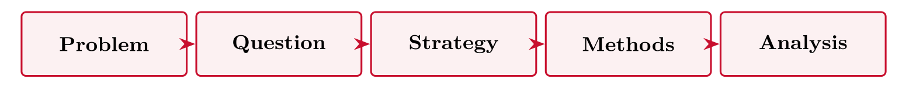
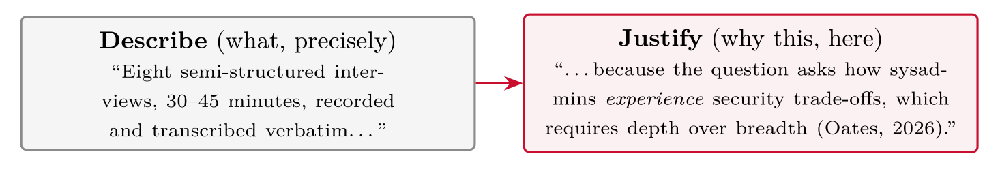

# Producing the Essay {#sec-11-producing-the-essay}

::: {.callout-note appearance="simple" icon="false"}
**Session 11** · Thursday 19 November 2026 · reading: Oates, Chapter 21
:::

The essay is an argument, not a form. This chapter presents it as a paper --- introduction, theoretical foundations, method, findings, discussion, conclusion --- with the question each section answers, and then works through the craft of reading and synthesising literature with SQ3R and the concept matrix. The describe--justify pattern, the checklist part by part, the recurring failures and the toolchain complete the chapter. It is the chapter to keep open while writing.

## The essay as argument {#sec-11-the-essay-as-argument}

The essay is an argument with a golden thread: the research question comes first, and every choice after it traces back to that question. Where the thread breaks is where the examiner's first question will come from, and the typical break is a strategy chosen in Part III that the question in Part I does not require.

Read as a paper, the essay has six sections, and each answers one question. The introduction answers what the problem is, who has it, why now --- and what the research question is (Part I). The theoretical foundations answer what is already known and through which theory or framework we look (Part II). The method answers how we find out --- strategy, methods, sample, analysis --- and why (Part III). The findings answer what was found or, in a proposal, what the analysis will produce and how it will be reported (Part IV). The discussion answers what the findings mean against the literature and what the limitations are. Lastly, the conclusion answers what the contribution is and, above all, *so what*: who acts differently because of it. This is the structure of the papers read in this course --- Huy et al., Enholm et al., Woodruff et al. --- and of my own papers. A literature review can be the basis: then the method section is the search protocol and the findings are the synthesis. Venkatesh, Brown and Sullivan (2023, Chapter 11) give the same six sections as the template for a mixed-methods paper --- introduction, literature review or theory development, methods, results, discussion, conclusions --- and add three requirements that apply to a single-method essay as well. The introduction must contain the topic, the research problems as practical and theoretical gaps, the research questions, and a rationale for the methodological choice; results and discussion may be combined, and the sections need not be written in the order in which they appear; and meta-inferences, the conclusions that integrate both strands, are reported as such rather than as two separate findings sections.

Boodraj et al. (2026) show the shape in six pages. Their introduction sets out project failure rates, cyber threats and the absence of a standard for the competencies of a cyber security project manager --- the gap and the question. Their foundations draw two themes from the literature. Their method is a labour market analysis of 161,000 job postings with Python analytics, with a market basket analysis planned. Their preliminary findings are dual-domain certifications and interpersonal skills in demand, and their discussion asks how organisations recruit, train and integrate these managers. Every section is present, part of the work is still ahead, and the topic is cyber security: this is what the essay looks like when it is done well.

## Writing methodology {#sec-11-writing-methodology}

::: {.callout-note}
## Describe--justify

The describe--justify pattern refers to writing every methodological choice as a pair: what was chosen (describe), and why this choice fits the question and the resources better than the alternatives (justify), with the source cited at the choice.
:::

"We use semi-structured interviews (describe) because the question asks for practitioners' reasoning, which a questionnaire cannot capture (justify; Oates, Chapter 13)." Every choice in Parts III and IV carries a because, and the curriculum is cited at the choice, not in a separate list of definitions. Four before--after excerpts in the session show the same transformation in each part: a draft that names and describes becomes a draft that argues. Limitations are written in three sentences --- what the study cannot show, why, and what would be needed to show it --- and are graded as judgement, not confessed as faults. The signposting of a strong Part III opens with the strategy, the reason and the alternative in three sentences, so that a reader knows the argument before the details.

## Reading and synthesising {#sec-11-reading-and-synthesising}

Writing the foundations depends on reading well, and reading well is a method. SQ3R --- survey, question, read, recite, review --- was published by Robinson in 1946 for people who had to work through dense technical material fast and remember it, and the problem is unchanged: passive, linear reading yields poor retention. Survey takes two minutes: title, first paragraph, every heading, every table, the conclusion, for orientation rather than comprehension. Question turns each heading into a question before the section is read, so that reading has a target. Read hunts for the answers and marks them. Recite closes the paper and says the findings in one's own words; if that fails, the section is read again. Review goes back over the whole paper for its throughline --- the one idea that runs through it. A paper read this way takes forty minutes and leaves a record; a paper read front to back takes longer and leaves an impression. Presthus and Sørum's (2025) survey of consumer perspectives on AI serves as the worked example in the session: an online survey of 306 Norwegians and seven everyday scenarios, eight pages, one idea --- people want AI in addition to humans, not instead.

The record goes into the concept matrix. Webster and Watson (2002), then editors at *MIS Quarterly*, wrote their guide because reviews in the field read like phone books --- an impressive cast of names, no plot. Their answer was to organise the review by concept rather than by author, and to keep a small table while reading: one row per paper, one column per concept, a mark where a paper covers it. The row is added during the review pass while the paper is open; a concept not yet in the table receives a new column. The matrix is then read down a column, and the column is the material for one synthesised section: several papers, one argument. Watson and Webster (2020) take the matrix one step further. A mark becomes a 1, a blank a 0, and the grid is the recipe for a graph in which every 1 is a line between a paper and a concept; papers that meet at a concept form one paragraph, and missing edges mark open questions. In their release 2.0 the edges carry a type --- relates to, causes, moderates --- so that each paper's core model becomes a small graph, coded in Cypher and loaded into a graph database, and the graphs combine across papers into one searchable synthesis. The matrix is binary: a mention is a 1, never a count. The graph is inspiration, not proof.

Applied to the papers of this semester, the matrix has one row for Woodruff et al., Huy et al., Jo and Park, and Enholm et al., and columns for expected impact, mechanism, human role and method. Read by column, the mechanism column already contains a finding: the surveys explain adoption, the workshop study explains its limits, the review explains value. That is a paragraph of the foundations, and it is synthesis rather than summary.

## Part by part {#sec-11-part-by-part}

Parts I and II must contain the background and the prevailing knowledge, the problem with its owner and cost, the aims and objectives, one main research question with sub-questions and its justification, and the contribution to practice and, where applicable, to academia; Part II adds the keyword table, the search log with databases, strings and dates, the inclusion and exclusion criteria, a PRISMA-style flow, and a synthesis in blocks. Parts III and IV must contain the strategy named and argued with fit to question, fit to resources and rejected alternatives; the data generation methods, sample and instrument; the analysis plan; the ethics paragraph with data inventory, consent, SIKT and storage; and the limitations. The formalities are about ten pages excluding front page and references, English or Norwegian, APA 7 referencing, and an honest and specific AI declaration --- UiA's rules on the use of artificial intelligence apply.

A rough page budget spends the ten pages deliberately: about two pages on the introduction, problem and question, about two and a half on relevant work, about three on the choice of methods, and about two and a half on data, analysis, limitations and ethics. Drafts overspend on reproduction --- definitions, background --- and underspend on judgement --- justification, limitations --- which is the exact opposite of what is graded. Tables carry information cheaply.

## Naming the contribution {#sec-11-naming-the-contribution}

The conclusion states the form of the contribution in Presthus and Munkvold's (2016) vocabulary --- a confirmation, extension or contradiction of a named model; a taxonomy; a set of guidelines; a rich case description --- and for whom: a contribution to practice names a decision that becomes better informed, a contribution to theory names a gap that becomes smaller. The decision is taken before the data are collected, and the conclusion is written first as a target and revised when the findings are in. The so-what test is simple: cover the findings, and read the conclusion. If it still tells a security manager, a developer or a policymaker what to do differently on Monday, the essay has a contribution; if it only restates the findings, it has a summary.

## Failure modes {#sec-11-failure-modes}

Seven failures recur. Textbook methodology: pages of definitions and no argument. Unjustified strategy: the strategy named but not argued, with no "we rejected ... because". Shopping-list literature: paper by paper, no synthesis. Broken thread: a question that Part III does not answer. Afterthought ethics: a paragraph copied from a template, without a data inventory. Missing limitations: none stated, which reads as none noticed. Vague plan: "interviews will be conducted" with no numbers, no guide, no analysis. All seven are avoidable before submission, and the checklist of this chapter is the instrument.

## The toolchain {#sec-11-the-toolchain}

One rule beats all tool debates: decide the tools now and use the same ones until submission. Zotero, free, collects every paper with its metadata from a browser button and cites while you write in Word and LaTeX; one note per paper holds the seven items you mark --- problem and gap, question, method, findings, admitted limitations, the so-what, and one sentence worth quoting. Word with the Zotero plug-in is the low-friction default; LaTeX, in Overleaf or locally, if you know it. Grammarly or Word's editor serve grammar and clarity only, never content, and are declared if used. draw.io draws the research process and the model as figures, in BPMN notation where a process is described. Excel holds the search log and the concept matrix, one sheet each. Nettskjema collects the data; SmartPLS runs PLS-SEM; JASP handles descriptive and inferential statistics; NVivo supports qualitative coding.

## Worked examples and tables {#sec-11-worked-examples-and-tables}

### What the examiners look for

::: {#tbl-11-1}
  **Essay part**                                    **The examiners look for**
  ------------------------------------------------- -------------------------------------------------------------------------------------
  I --- introduction, problem, research questions   One question, a clear hierarchy, justified relevance
  II --- relevant work                              A documented, repeatable search; synthesis, not a list
  III --- choice of methods                         Choices *argued*: fit to question and resources, alternatives rejected with reasons
  IV --- data, analysis, limitations, ethics        Judgement: honest limitations, concrete ethics and privacy, a realistic plan

What the examiners look for, part by part
:::

Weights: the written essay counts 40 % of the course grade, its presentation and discussion in the oral exam 20 %. Note where judgement lives: Parts III and IV. That is where grades separate.

{#fig-11-1}

Every element must **answer to the one before it**. The most common structural failure is a broken thread: a qualitative question followed by a survey, or an analysis plan that ignores half the collected data.

::: {.callout-note}
## The reviewer's test --- apply it to your own draft

Read only your research question, then only your methods section. Could a stranger tell they belong to the same project?
:::

### Describe and justify --- worked pairs

Every methodological statement has two halves:

{#fig-11-2}

Writing conventions that help:

-   **Future tense** --- a essay plans ("we will recruit"), it does not pretend to have finished

-   **Precision** --- numbers, durations, tools, versions; "several interviews" is not a plan

-   **References at choices** --- the method literature (Oates, Creswell) is cited *where the choice is made*, not dumped in one paragraph

::: {#tbl-11-2}
  **Describe**                                                                               **Justify**
  ------------------------------------------------------------------------------------------ ----------------------------------------------------------------------------------------------------------
  "An online questionnaire (12 items, Nettskjema) will be sent to all 60 client staff..."    "...because SQ1 asks how widespread reuse is, which requires breadth across the whole organisation."
  "The component library will be evaluated in a usability test (8 users, 5 tasks, SUS)..."   "...because the research claim concerns developer-facing usability, not runtime performance."
  "The incident will be studied as a single explanatory case..."                             "...because the question asks *how* recovery unfolded in context --- depth in one setting over breadth."

Describe and justify: worked pairs
:::

Note the mechanical link: every justification points back at the **question's wording**. That is the golden thread, sentence by sentence.

::: {.callout-note}
## Where the references belong

"Since the question asks how developers *experience* accessibility work, a qualitative approach is indicated (Creswell & Creswell, 2018). We therefore use semi-structured interviews, which combine a focused guide with room for follow-up (Oates et al., 2026, Ch. 13). Analysis follows the thematic-analysis steps of Braun and Clarke (2006)."
:::

-   Three citations, each attached to the **decision it licenses** --- approach, method, analysis

-   Contrast with the failure mode: ten references parked in one introductory sentence, then an unreferenced methods section

-   This is also how the examiners verify you *used* the curriculum, which the essay text explicitly asks for

### Before and after --- one excerpt per part

::: {#tbl-11-3}
  **Draft**                                                                                               **Repaired**
  ------------------------------------------------------------------------------------------------------- ------------------------------------------------------------------------------------------------------------------------------------------------------------------------------------------------------------------------------------------------------------------------------------------------------------------------------
  "Cyber security is very important nowadays. Many companies get hacked. We want to look at passwords."   "Despite mandatory annual training, the client reports recurring password reuse across systems. Reuse turns one credential leak into many; for an SMB without a security team, that multiplication is the main breach risk. This essay therefore asks which factors are associated with reuse among the client's employees."

Before and after, Part I: the introduction
:::

The repair adds: an **owner** (the client), a **cost** (multiplication of leaks), and a direct handover to the **question**. Zero words spent on "nowadays".

::: {#tbl-11-4}
  **Draft**                                                                                            **Repaired**
  ---------------------------------------------------------------------------------------------------- ------------------------------------------------------------------------------------------------------------------------------------------------------------------------------------------------------------------------------------------------------------------------------------------------------------------------------------
  "Smith (2021) surveyed employees. Lee (2022) did an experiment. Hansen (2023) interviewed admins."   "Across survey studies, security fatigue consistently predicts reuse (Smith, 2021; Lee, 2022). The one interview study complicates this: admins describe reuse as a deliberate time trade-off, not exhaustion (Hansen, 2023). No study examines SMBs, where both mechanisms plausibly intensify --- the gap this essay addresses."

Before and after, Part II: relevant work
:::

Same three sources --- but the repaired version runs the **four moves**: establish, complicate, gap, therefore.

::: {#tbl-11-5}
  **Draft**                                                                                                                                                                                   **Repaired**
  ------------------------------------------------------------------------------------------------------------------------------------------------------------------------------------------- ----------------------------------------------------------------------------------------------------------------------------------------------------------------------------------------------------------------------------------------------------------------------------------
  "A case study is an in-depth investigation of one instance in its natural setting (Oates, 2026). Case studies can be exploratory, descriptive or explanatory..." \[continues for a page\]   "We choose a single explanatory case study because the question asks *how* trust was rebuilt in this specific recovery (Oates, 2026). A survey was rejected: no population of comparable recoveries is accessible. An experiment was rejected: the event cannot be manipulated."

Before and after, Part III: choice of methods
:::

The textbook page becomes three sentences of **choices** --- and the citation moves to where the choice is made.

::: {#tbl-11-6}
  **Draft**                                                                                **Repaired**
  ---------------------------------------------------------------------------------------- ------------------------------------------------------------------------------------------------------------------------------------------------------------------------------------------------------------------------------------------------------------------------------------------------------------------------------------------------------------------
  "Some interviews will be conducted and analysed. Ethical guidelines will be followed."   "Eight semi-structured interviews (30--45 min) with developers recruited directly (not via management), recorded, transcribed, thematically analysed with a code book; two transcripts double-coded. Audio and role data are personal data: SIKT will be notified before recruitment; confidentiality (not anonymity) is promised and enforced by quote review."

Before and after, Part IV: data, analysis and ethics
:::

Every vague noun acquired a **number, a procedure, or a decision**. That is the whole difference between the drafts the examiners mark down and the ones they don't.

### Must-haves and the page budget

**Part I**

-   background: prevailing knowledge, key challenges

-   problem with an **owner and a cost**

-   aim, objectives

-   **one** main research question; sub-questions in clear hierarchy

-   contribution to practice (and academia, if applicable); why the project is important and interesting

**Part II**

-   keyword table; **one** final search string

-   databases named and justified

-   search log (iterations, hit counts)

-   inclusion/exclusion criteria

-   results in a table; **PRISMA figure**

-   what the included papers taught you --- feeding Part III

**Part III**

-   strategy named --- and **argued**: fit to question, fit to resources

-   rejected alternatives, with reasons

-   data generation methods, concretely (guide/items in appendix)

-   consistency with the approach implied by the question

**Part IV**

-   data plan: what, from whom, how much, when

-   analysis plan (session 8/9 templates)

-   **limitations** --- named, not hidden

-   ethics: personal data inventory, consent, **SIKT** decision documented

-   expected contributions, revisited

*Formalities: about 10 pages excl. front page and references; English or Norwegian; APA 7 referencing; AI declaration submitted and honest. And remember session 10: examiners sign no NDA --- client-confidential details (esp. vulnerabilities) do not belong in the graded report.*

::: {#tbl-11-7}
  **Part**                                     **Rough budget**   **Where drafts overspend**
  -------------------------------------------- ------------------ ----------------------------
  I --- introduction, problem, question         2 pages           General background prose
  II --- relevant work                          2.5 pages         Summarising paper by paper
  III --- choice of methods                     3 pages           Textbook definitions
  IV --- data, analysis, limitations, ethics    2.5 pages         Boilerplate ethics

Must-haves and the page budget, part by part
:::

A guide, not a rule --- but the pattern is stable: drafts overspend on **reproduction** (definitions, background) and underspend on **judgement** (justification, limitations) --- the exact opposite of what is graded. Tables (search log, matrix, PRISMA) carry information cheaply.

### Signposting, limitations and the AI declaration

::: {.callout-note}
## The first paragraph of Part III, as a working example

"This part justifies the methodological design. Section 3.1 argues for a mixed-methods approach based on the two sub-questions; 3.2 details the survey (instrument, sample, procedure); 3.3 details the interview study; 3.4 states how the two strands will be integrated."
:::

-   Four sentences, and the examiner now reads with a map --- nothing surprises, nothing is searched for

-   The same pattern in miniature at every section start: *what this section does, in one sentence*

-   Cost:  50 words per part. Return: the reader never wonders whether something is missing or merely elsewhere

::: {.callout-note}
## From a strong Part IV

"Three limitations bound our claims. First, the sample is a census of one organisation; findings generalise analytically, not statistically. Second, reuse is self-reported; social desirability likely deflates it, so our estimates are conservative. Third, the first author works at the client; to reduce interviewer effects, interviews are conducted by the other members and coding is done in pairs."
:::

What makes it strong: each limitation is **named**, its **direction of bias** is reasoned about, and where possible a **mitigation** is attached. No limitation is apologised for --- bounded claims are what research is.

::: {#tbl-11-8}
  **Vague (looks evasive)**                              **Specific (looks honest)**
  ------------------------------------------------------ ---------------------------------------------------------------------------------------------------------------------------------------------------------------------------------------------------------------------------------------------------------------------------------
  "AI tools were used to some extent during the work."   "ChatGPT was used to brainstorm synonym candidates for the search string (Part II) and to check grammar in the final draft. All sources were located, read and selected by the group; no participant data was entered into any AI tool; no text was generated for Parts I--IV."

Limitations: vague versus specific wording
:::

The specific version names **tools, tasks, and boundaries**. In an essay that explicitly values transparency and traceability, specificity is self-protection, not confession.

### The concept matrix with this semester's papers

One row per paper, one column per concept; the cells hold what the paper says about the concept, not whether it mentions it.

::: {#tbl-11-9}
  **Paper**                **Expected impact**                          **Mechanism**                                               **Human role**              **Method**
  ------------------------ -------------------------------------------- ----------------------------------------------------------- --------------------------- ---------------
  Woodruff et al. (2024)   Not disruptive; amplifies four forces        Deskilling, dehumanisation, disconnection, disinformation   Reviewer of AI output       Workshops, 54
  Huy et al. (2024)        Adoption driven by expectancy and fit        UTAUT2 + TTF paths                                          User; curiosity moderates   Survey, 671
  Jo & Park (2024)         Information support, knowledge acquisition   Perceived intelligence, self-learning                       Worker aged 20--40          Survey, 351
  Enholm et al. (2022)     Business value, first- and second-order      Enablers, inhibitors, typologies                            Organisation                SLR, 43

The concept matrix with this semester's papers
:::

Read the matrix by **column**: the "mechanism" column already contains a finding --- surveys explain adoption, the workshop study explains its limits, the review explains value. That is a paragraph of section 2: synthesis, not summary (Webster & Watson, 2002; Watson & Webster, 2020).

### The seven recurring failures

::: {#tbl-11-10}
  **Failure**                **What it looks like --- and the fix**
  -------------------------- ----------------------------------------------------------------------------------------------------------
  Textbook methodology       Part III defines "what a case study is" for a page --- replace definitions with *your* justified choices
  Unjustified strategy       strategy named, never argued --- add fit-to-question, fit-to-resources, rejected alternatives
  Shopping-list literature   paper-by-paper summary --- rewrite by concept, end each block facing your question
  Broken thread              question and methods from different projects --- run the reviewer's test
  Afterthought ethics        one generic paragraph --- data inventory, consent, SIKT decision, concretely
  Missing limitations        the plan admits no weaknesses --- name convenience sampling, self-report, scope
  Vague plan                 "some interviews will be conducted" --- numbers, durations, recruitment, tools

The seven recurring failures, what they look like and the fix
:::

## Terms from this session {#sec-11-terms-from-this-session .unnumbered}

::: {#tbl-11-terms}
  ------------------------------- ----------------------------------------------------------------------------------------------
  **Golden thread**               the chain problem → question → strategy → methods → analysis, each answering to the previous
  **Describe--justify pattern**   every methodological statement: what precisely, then why this here
  **Signposting**                 telling the reader where they are and what comes next
  **Word budget**                 deliberate allocation of the 10 pages across the four parts
  **Limitations section**         the study's named weaknesses --- rewarded when honest, found when hidden
  **AI declaration**              the submitted statement of what AI assistance was used, and for what
  ------------------------------- ----------------------------------------------------------------------------------------------

Terms from Session 11
:::

## Questions from the reading {#sec-11-questions-from-the-reading .unnumbered}

::: {#exr-11-methodology-chapter}
## Methodology chapter

What belongs in a **methodology chapter**, according to Oates?
:::

::: {#exr-11-describing}
## Describing

What is the difference between **describing** a method and **justifying** it?
:::

::: {#exr-11-criticisable}
## Criticisable

What makes academic writing **criticisable** --- in the good sense from session 1?
:::

::: {#exr-11-structure-and-signposting}
## Structure and signposting

What does Oates say about **structure and signposting** for the reader?
:::

## Questions for discussion {#sec-11-questions-for-discussion .unnumbered}

::: {#exr-11-self-assessment}
## Self-assessment

**Self-assessment** --- score your draft against the part-by-part checklist. Which part is weakest, and what is the one sentence it is missing?
:::

::: {#exr-11-describe-and-justify}
## Describe and justify

**Describe and justify** --- take one methodological choice from your draft and write it as a describe--justify pair, citing the curriculum at the choice.
:::

::: {#exr-11-limitations}
## Limitations

**Limitations** --- write the limitations paragraph in three sentences: what the study cannot show, why, and what would be needed to show it.
:::

## Interactive exercises {#sec-11-interactive-exercises .unnumbered}

Sort, order and pick: every exercise below is answerable from this chapter and checks itself.



## Key points {#sec-11-key-points .unnumbered}

-   The essay as a paper: introduction, theoretical foundations, method, findings, discussion, conclusion --- each answers one question

-   Reading with SQ3R, marking seven things, one note per paper; the concept matrix turns notes into synthesis

-   Describe and justify: every choice carries a because, cited at the choice

-   Name the contribution and pass the so-what test; seven recurring failures --- all avoidable before submission

## Sources {#sec-11-sources .unnumbered}

-   Enholm, I. M., Papagiannidis, E., Mikalef, P., & Krogstie, J. (2022). Artificial intelligence and business value: A literature review. *Information Systems Frontiers*, *24*, 1709--1734. <https://doi.org/10.1007/s10796-021-10186-w>

-   Huy, L. V., Nguyen, H. T. T., Vo-Thanh, T., Thinh, N. H. T., & Tran, T. T. D. (2024). Generative AI, why, how, and outcomes: A user adoption study. *AIS Transactions on Human-Computer Interaction*, *16*(1), 1--27. <https://doi.org/10.17705/1thci.00198>

-   Jo, H., & Park, D.-H. (2024). AI in the workplace: Examining the effects of ChatGPT on information support and knowledge acquisition. *International Journal of Human--Computer Interaction*, *40*(23), 8091--8106. <https://doi.org/10.1080/10447318.2023.2278283>

-   Presthus, W., & Munkvold, B. E. (2016). How to frame your contribution to knowledge? A guide for junior researchers in information systems. *NOKOBIT*, *24*(1). Paper presented at NOKOBIT 2016, Bergen.

-   Watson, R. T., & Webster, J. (2020). Analysing the past to prepare for the future: Writing a literature review a roadmap for release 2.0. *Journal of Decision Systems*, *29*(3), 129--147. <https://doi.org/10.1080/12460125.2020.1798591>

-   Webster, J., & Watson, R. T. (2002). Analyzing the past to prepare for the future: Writing a literature review. *MIS Quarterly*, *26*(2), xiii--xxiii.

-   Woodruff, A., Shelby, R., Kelley, P. G., Rousso-Schindler, S., Smith-Loud, J., & Wilcox, L. (2024). How knowledge workers think generative AI will (not) transform their industries. In *Proceedings of the CHI Conference on Human Factors in Computing Systems (CHI '24)*. ACM. <https://doi.org/10.1145/3613904.3642700>

-   Boodraj, M., Fairbanks, J., Davies, C., & Akcakaya, O. (2026). Beyond the firewall: The rise of the cybersecurity project manager. In *AMCIS 2026 Proceedings* (Emergent Research Forum paper). AIS. <https://aisel.aisnet.org/amcis2026/sig_itpm/sig_itpm/2>

-   Presthus, W., & Sørum, H. (2025). Consumer perspectives on the increasing use of artificial intelligence: It is helpful, scary or so wrong? *Procedia Computer Science*, *256*, 158--165. <https://doi.org/10.1016/j.procs.2025.02.108>

-   Robinson, F. P. (1946). *Effective study*. Harper & Brothers.

-   Venkatesh, V., Brown, S. A., & Sullivan, Y. W. (2023). *Conducting mixed-methods research: From classical social sciences to the age of big data and analytics*. Virginia Tech Pamplin College of Business in association with Virginia Tech Publishing. <https://doi.org/10.21061/conducting-mixed-methods-research>

-   Oates, B. J., Griffiths, M., & McLean, R. (2022). *Researching information systems and computing* (2nd ed.). SAGE. --- Chapter 21 (Presentation of the research).

-   Laudon, K. C., & Laudon, J. P. (2022). *Management information systems: Managing the digital firm* (17th ed., Global ed.). Pearson. --- Chapter 14 (Making the business case for information systems and managing projects) --- rigour and relevance seen from the organisation.
