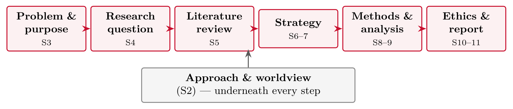
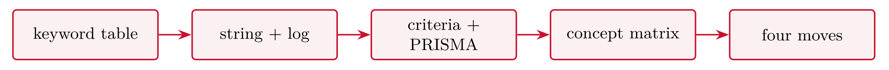

# Summing-up {#sec-12-summing-up}

::: {.callout-note appearance="simple" icon="false"}
**Session 12** · Thursday 26 November 2026 · reading: the whole book
:::

The final chapter assembles the course in one picture. It flashes back through the twelve sessions, shows the running example end to end, diagnoses the mismatches between question and strategy that most often cost marks, and sets out what separates the grades. It ends where the course began: with the question *how do they know?* --- and with the three places this pipeline reappears after the course.

## The course in one picture {#sec-12-the-course-in-one-picture}

Twelve sessions form one pipeline: from problem and purpose to research question, from the question to the literature, from the literature to a strategy, from the strategy to methods of generating and analysing data, and from the data to ethics and the report. The pipeline is the essay's table of contents, the method backbone of the master's thesis, and the skeleton of any empirical work done later. Every box has been filled at least once; the essay is the pipeline written down.

The flashbacks follow the sessions. Session 2 asked one question three ways and showed that the approach must be justified. Session 3 supplied the 6Ps, one line each. Session 4 named the five failure modes of a research question --- too broad, trivial yes or no, not researchable, double-barrelled, assumption baked in --- and their repairs. Session 5 built the review chain: keyword table, string and log, criteria and PRISMA flow, concept matrix, the four moves of synthesis. Sessions 6 and 7 placed the six strategies on one table, one line each. Sessions 8 and 9 built the two data plans, quantitative and qualitative, with the same rigour. Session 10 stated the ethics questions: what is collected, from whom, on what legal basis, stored how, deleted when. Session 11 turned the whole into an argument.

## One study, end to end {#sec-12-one-study-end-to-end}

The running example assembles itself from the building blocks. A problem in a security operations centre --- analysts ignore alerts --- becomes a purpose, a main question with two sub-questions, a documented literature search, a case study strategy with justified alternatives, semi-structured interviews with an information-power argument for their number, a thematic analysis plan, an ethics paragraph with data inventory and SIKT decision, and stated limitations. Read in that order it is the essay; read backwards it is the master's thesis waiting for its data.

The mismatch clinic diagnoses the most common failure in Part III. A survey used to understand why administrators ignore alerts asks a why-question with a breadth strategy. An experiment with no control group has no comparison and therefore no cause. An ethnography of three weeks lacks the immersion the strategy needs. Each is a mismatch between question and strategy, and each is visible in the justification paragraph --- or in its absence.

## The essay and the oral exam {#sec-12-the-essay-and-the-oral-exam}

The facts of submission are few: about ten pages excluding front page and references, the four parts clearly marked; English or Norwegian, as a PDF; the written essay counts 40 % and its presentation and discussion 20 %; APA 7 references with the curriculum cited at the choices; an honest and specific AI declaration; and the deadline, portal and oral exam dates as announced. The oral exam is the essay presented and its choices defended in discussion --- the same describe--justify pairs, spoken. Frequently asked questions have short answers: tables count towards the ten pages and are used for density, not evasion; there is no reference quota, but every claim that needs support has it; the research question may still change if Parts II to IV are updated to match; in a group, each member must be able to defend every part; and a pending SIKT decision is stated in Part IV with its submission date, because the plan is graded, not the approval letter.

What separates the grades is judgement rather than reproduction. In Parts I and II, reproduction means background and literature reported correctly, and judgement means one question with a hierarchy and a synthesis that argues. In Parts III and IV, reproduction means strategy and methods named and described, and judgement means choices justified, alternatives rejected with reasons, limitations and ethics concrete. In the oral exam, reproduction is the essay presented, and judgement is the choices defended under questioning. The climb from a passing to a strong essay is mostly judgement, which is why Sessions 10 and 11 were disproportionately about Parts III and IV.

## After the course {#sec-12-after-the-course}

This pipeline reappears in three places. First, in the master's thesis: the method backbone built here --- question, background, justified methods, evaluation, ethics --- is its method chapter, and should be reused deliberately. Secondly, in further studies: a doctorate is this pipeline, scaled up, and its vocabulary and checkpoints are now familiar. Thirdly, in working life: post-incident reviews, A/B tests, security assessments and vendor-claim reviews all rest on the question *how do they know?* and on the ability to design the small study that answers it.

## Flashbacks and tables {#sec-12-flashbacks-and-tables}

### The pipeline

{#fig-12-1}

**You are here:** every box has been filled at least once --- the essay is the pipeline written down.\
The same pipeline is your essay's table of contents, your master's thesis's method backbone, and --- later --- the skeleton of any empirical work you do.

### Flashbacks

::: {#tbl-12-1}
  -------------- ------------------------------------------------------------------------
  Quantitative   survey, n = 300 app users: which measured factors predict abandonment?
  Qualitative    10 interviews: what does abandoning the app *mean* to users?
  Mixed          QUANT → qual: measure the pattern, then explain it
  -------------- ------------------------------------------------------------------------

Flashback to Session 2: one phenomenon, three approaches
:::

One phenomenon, three legitimate studies --- the **question wording** decides which. If your Part I question and Part III strategy imply different rows of this table, fix one of them this session.

::: {#tbl-12-2}
  -------------- ------------------------------------------------------
  Purpose        the problem, its owner, its cost --- and the so-that
  Products       what new knowledge (and possibly artefact) comes out
  Process        the pipeline: question → ... → report
  Participants   whose time and data you borrow --- and their rights
  Paradigm       the worldview underneath the choices
  Presentation   the essay now; the master's thesis next
  -------------- ------------------------------------------------------

Flashback to Session 3: the 6Ps
:::

Final use of the 6Ps: as a completeness check --- read your draft and tick each P. An unticked P is a missing section, not a style issue.

-   **Too broad** --- a career, not a study

-   **Trivial yes/no** --- answerable without data

-   **Not researchable** --- a value judgement in disguise

-   **Double-barreled** --- two studies wearing one question mark

-   **Assumption baked in** --- presumes the effect it should test

Final check: read your main question aloud and try to accuse it of each failure. If one accusation sticks even slightly, the repair patterns from session 4 are in the session 4 slides.

{#fig-12-2}

Five artefacts, and Part II assembles itself around them. The most common gap at this stage: the matrix exists but the **moves** were never written --- the review lists instead of arguing. One writing session fixes it.

::: {#tbl-12-3}
  ------------------- --------------------------------------------------------------
  Survey              breadth: patterns across many, sampling decides the claim
  Design & creation   learning via making --- the research lives in the evaluation
  Experiment          the only strategy that earns the word *because*
  Case study          depth in one setting; analytical generalisation
  Action research     change practice in cycles, with the practitioners
  Ethnography         immersion; the unwritten rules
  ------------------- --------------------------------------------------------------

Flashback to Sessions 6-7: the six strategies in one line each
:::

Part III check: your paragraph should read as *one chosen, others rejected with reasons* --- not as this table copied out.

**Quantitative (S8)**

-   variables + measurement levels

-   descriptives per variable

-   test with a *because*

-   tool named

**Qualitative (S9)**

-   participants + saturation logic

-   guide/protocol in appendix

-   thematic analysis, code book

-   second-coder procedure

Both templates end the same way: **limitations, named**. If your Part IV has numbers but no plan, or a plan but no limits, today's sprint starts there.

1.  What data do we collect --- and which of it is **personal**, directly or indirectly?

2.  **SIKT**: needed? Decision documented either way?

3.  Consent: informed, voluntary, withdrawable --- and which promise: anonymous or confidential?

4.  The **client trap**: can an internal reader identify a speaker?

5.  Special zones touched? Public data, deception, security testing, AI tools?

Five questions, five sentences of answers --- that is a complete Part IV ethics discussion at master's scale.

### The running example, assembled

::: {#tbl-12-4}
  ----------------- ---------------------------------------------------------------------------------------------------------------------------------------------------------------------------
  Problem (S3)      employees reuse passwords despite training --- SMBs carry the breach risk
  Purpose (S3)      to identify which factors drive reuse among SMB employees, so training can target them
  Question (S4)     which factors are associated with password reuse among SMB employees?
  Sub-questions     SQ1 how widespread is reuse (descriptive); SQ2 how do employees explain it (qualitative)
  Literature (S5)   string `("password reuse" OR "credential reuse") AND (employee* OR staff) AND (SMB OR SME)`; log, criteria, PRISMA; matrix shows fatigue converging, risk perception thin
  ----------------- ---------------------------------------------------------------------------------------------------------------------------------------------------------------------------

The running example, assembled: problem, purpose, question and literature
:::

Note how each row **consumes** the one above --- the golden thread in action.

::: {#tbl-12-5}
  ------------------ ---------------------------------------------------------------------------------------------------------------------------------
  Strategy (S6--7)   survey (SQ1) + interviews (SQ2) = mixed, explanatory sequential; case study rejected: question targets factors, not one setting
  Data (S8)          questionnaire, n ≈ 150 via six partner firms; validated fatigue scale; Nettskjema
  Data (S9)          8 semi-structured interviews, saturation logic; thematic analysis, code book, two transcripts double-coded
  Analysis (S8)      descriptives; t-test trained vs. untrained; effect size reported; JASP
  Ethics (S10)       personal data: yes (e-mail, audio) → SIKT; consent per template; confidentiality, client-trap mitigations
  Limitations        convenience sample, self-report; named in Part IV
  ------------------ ---------------------------------------------------------------------------------------------------------------------------------

The running example, assembled: strategy, data, analysis, ethics and report
:::

This table *is* a essay in miniature. Your essay is this, written out --- with the justifications attached.

### Mismatch clinic

For each: where does the thread break, and what is the cheapest fix?

1.  Question: "how do users *experience* the new login flow?" --- Method: telemetry funnel analysis only.

2.  Question: "does the caching layer reduce p95 latency?" --- Strategy: interviews with the platform team.

3.  Question: "which factors predict design-system adoption?" --- Data: 5 interviews in one team.

*(1) experience needs voices --- add interviews or reword to behaviour; (2) a causal system question needs the experiment from session 6; (3) *predict* implies breadth --- survey, or reword to *how does adoption happen here*.*

### Submission, FAQ and grades

-   **Format:** about 10 pages excl. front page and references; the four parts clearly marked

-   **Language:** English or Norwegian; PDF

-   **Weights:** written essay 40 %; presentation and discussion in the oral exam 20 %

-   **References:** APA 7; cite the curriculum where your choices lean on it

-   **AI declaration:** submitted with the essay --- honest and specific

-   **Deadline, portal and oral exam dates:** to be announced --- check now, not the night before

::: {.callout-note}
## The oral exam in one line

You present the essay and defend its choices in discussion: the same describe--justify pairs, spoken.
:::

::: {#tbl-12-6}
  **Question**                                                     **Answer**
  ---------------------------------------------------------------- -----------------------------------------------------------------------------------------------------------
  Do tables count toward the 10 pages?                             Yes; use tables for density, not for evasion
  How many references are enough?                                  No quota: every claim that needs support has it; the curriculum is cited at the choices
  Can we change the research question now?                         Yes --- if Parts II--IV are updated to match; a late but consistent question beats an early broken thread
  We wrote as a group --- does everyone need to know everything?   Yes: in the oral exam each of you must be able to defend every part
  Our SIKT answer is still pending                                 Say so in Part IV with the submission date --- the plan is graded, not the approval letter

Submission FAQ
:::

::: {#tbl-12-7}
                      **Reproduction**                               **Judgement**
  ------------------- ---------------------------------------------- ----------------------------------------------------------------------------------------
  **Parts I--II**     Background and literature reported correctly   One question with a hierarchy; a synthesis that argues
  **Parts III--IV**   Strategy and methods named and described       Choices justified, alternatives rejected with reasons, limitations and ethics concrete
  **Oral exam**       The essay presented                            The choices defended under questioning

What separates the grades: reproduction versus judgement
:::

Read the columns left to right: the climb from a passing to a strong essay is mostly **judgement** --- justification, limitations, ethics. That is why sessions 10--11 were disproportionately about Parts III--IV.

## Questions from the reading {#sec-12-questions-from-the-reading .unnumbered}

::: {#exr-12-6ps}
## 6Ps

Name the **6Ps** --- and say which two your essay is most likely to under-specify.
:::

::: {#exr-12-strategy}
## Strategy

What is the difference between a research **strategy** and a research **method**?
:::

::: {#exr-12-evaluation-criteria}
## Evaluation criteria

Which **evaluation criteria** does Oates attach to a literature review?
:::

::: {#exr-12-research-question}
## Research question

What makes a good **research question**, in Oates' terms?
:::

## Questions for discussion {#sec-12-questions-for-discussion .unnumbered}

::: {#exr-12-your-golden-thread}
## Your golden thread

**Your golden thread** --- read your draft from the research question to the data plan: does every choice trace back to the question?
:::

::: {#exr-12-the-mismatch-clinic}
## The mismatch clinic

**The mismatch clinic** --- a survey to understand why administrators ignore alerts; an experiment with no control group; an ethnography of three weeks. What is wrong with each?
:::

::: {#exr-12-one-sentence-for-the-oral-exam}
## One sentence for the oral exam

**One sentence for the oral exam** --- if the examiners asked only "why this method?", what would you answer?
:::

## Interactive exercises {#sec-12-interactive-exercises .unnumbered}

Sort, order and pick: every exercise below is answerable from this chapter and checks itself.



## Key points {#sec-12-key-points .unnumbered}

-   Twelve sessions, one pipeline: from problem to question to literature to strategy to methods to ethics to essay

-   The running example assembled end to end --- and the mismatches to avoid

-   Submission: about 10 pages, four parts, APA 7, AI declaration; dates to be announced

-   What separates the grades: judgement, not reproduction

-   Where this reappears: your master's thesis, further studies, working life

## Sources {#sec-12-sources .unnumbered}

-   Oates, B. J., Griffiths, M., & McLean, R. (2022). *Researching information systems and computing* (2nd ed.). SAGE. --- the whole book.
